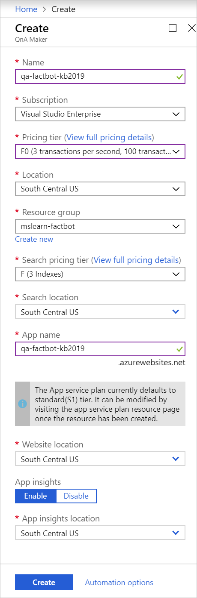
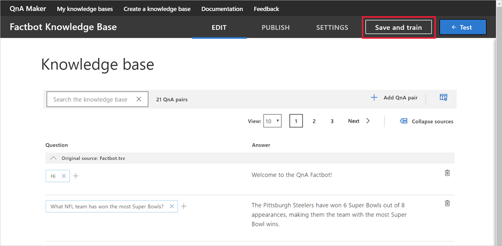

[QnA Maker](https://www.qnamaker.ai/) is part of [Azure Cognitive Services](https://www.microsoft.com/cognitive-services/), which is a suite of services and APIs for building intelligent apps backed by artificial intelligence (AI) and machine learning. Rather than code a bot to anticipate every question a user might ask and provide a response, you can connect it to a knowledge base of questions and answers created with QnA Maker. A common usage scenario is to create a knowledge base from the URL of a FAQ page so the bot can answer domain-specific questions such as "How do I find my Windows product key" or "Where can I download Visual Studio Code?"

In this unit, you will use QnA Maker to create a knowledge base containing questions such as "What NFL teams have won the most Super Bowls" and "What is the largest city in the world?" Then, you will deploy the knowledge base in an Azure web app so that it can be accessed via an HTTPS endpoint.

1. Open the QnA Maker portal by opening https://www.qnamaker.ai in the VM browser, and select **Sign in** to sign in with the same lab account that you used to sign into the Azure portal. 

1. Select the hamburger menu, then **Create a knowledge base**. 

1. Select **Create a QnA service**.

1. In the newly-opened Azure portal tab, enter a name into the **Name** box. This name must be unique within Azure, so make sure a green check mark appears next to it *and* in the **App name** box further down the blade.

1. Select **Use existing** under **Resource group**, then select the exercise resource group pre-created for this exercise.

1. Select a **Location** from the list available in the dropdown. 

1. Select **F0** as the **Management pricing tier**. 

1. Select **F** for the **Search pricing tier**. 

1. Verify the **App name** is unique to Azure.

1. Select the location nearest you in both location drop-downs, then select the **Create** button at the bottom of the blade.

    

1. Select **Resource groups** in the ribbon on the left side of the portal, and open the pre-created exercise resource group. Wait until "Deploying" changes to "Succeeded" at the top of the blade, indicating that the QnA service and the resources associated with it were successfully deployed. If the message disappears, you can select the bell icon in the menu bar to view the status. You can also select **Refresh** at the top of the blade to refresh the deployment status.

1. Return to **Create a knowledge base** by opening https://www.qnamaker.ai/Create in the VM browser and scroll to **Step 2** to connect to our QnA service.

1. Under **Microsoft Azure Directory ID**, choose **Microsoft Learn Hosting**.

1. Select **Microsoft Learn Hosting** from the **Azure subscription name** drop-down list.

1. Under **Azure QnA service**, select the QnA service name you specified previously. If no services are listed, you may need to refresh the page.

1. Then, assign the knowledge base a name, such as "Factbot Knowledge Base".

1. You can enter questions and answers into a QnA Maker knowledge base manually, or you can import them from online FAQs or local files. Supported formats include tab-delimited text files, Microsoft Word documents, Excel spreadsheets, and PDF files.

    To demonstrate, open https://github.com/MicrosoftDocs/mslearn-build-chat-bot-with-azure-bot-service/blob/master/Factbot.tsv.zip in the VM browser, then download the **Factbot.tsv.zip** file. This zip folder contains a text file named **Factbot.tsv**. Extract and copy the file to your computer. Then, scroll down in the QnA Maker portal in the VM browser, select **+ Add file**, and select **Factbot.tsv**. This file contains 20 questions and answers in tab-delimited format.

1. Select **Create your KB** at the bottom of the page, and wait for the knowledge base to be created. It should take less than a minute.

1. Confirm that the questions and answers imported from **Factbot.tsv** appear in the knowledge base. Then, select **Save and train** and wait for training to complete.

    

1. Select the **Test** button to the right of the **Save and train** button. Type "Hi" into the message box and press **Enter**. Confirm that the response is "Welcome to the QnA Factbot," as shown below.

    

1. Type "What book has sold the most copies?" into the message box and press **Enter**. What is the response?

1. Select the **Test** button again to collapse the Test panel. 
1. Select **Publish** in the menu at the top of the page, and select the **Publish** button at the bottom of the page to publish the knowledge base. *Publishing* makes the knowledge base available at an HTTPS endpoint.

Wait for the publication process to complete and confirm that the QnA service has been deployed. With the knowledge base now hosted in an Azure web app of its own, the next step is to deploy a bot that can use it.
