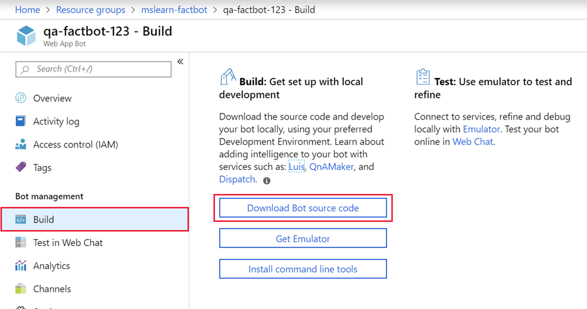
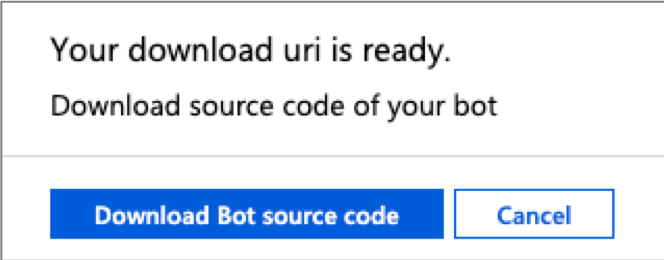
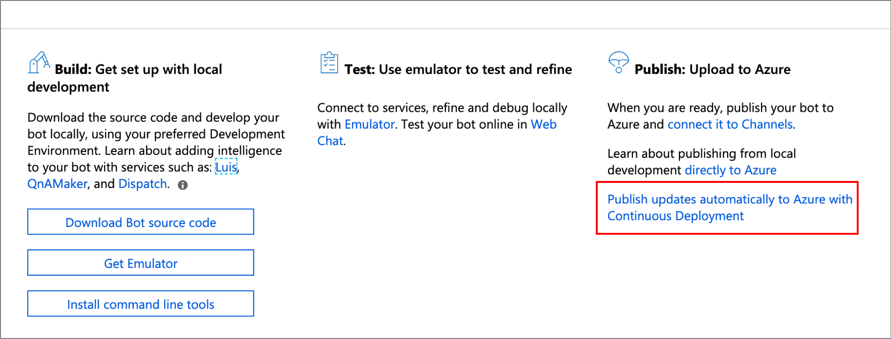
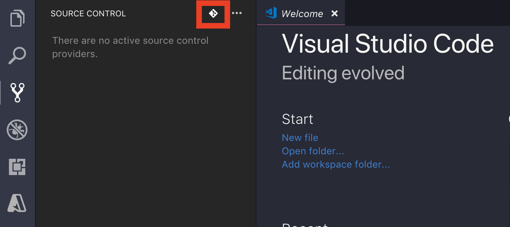

When you created an Azure Web App Bot, an Azure Web App was deployed to host it. But the bot needs to be implemented with code, and it still needs to be deployed to the Azure web app. Fortunately, the code was generated for you by the Azure Bot Service.

In this unit, you'll use Visual Studio Code to place the code in a local Git repository and publish the bot to Azure by pushing changes from the local repository to a remote repository connected to the Azure web app that hosts the bot — a process known as Continuous Integration( **CI**).

## Download the Web App Bot source code

1. Create a folder named **factbot** in the location of your choice on your hard disk to hold the bot's source code.

1. Return to the Azure portal in the browser and find the resource group created using the search box at the top, or the **Resource groups** section in the left-hand sidebar.

1. Locate and select the Web App Bot you created earlier.

1. Select **Build** in the menu on the left, then select **Download Bot source code** to prepare a zip file containing the bot's source code.

    

1. The portal will take a few minutes to zip up the code.
1. When complete, the portal displays a **Download Bot source code** button similar to the following screenshot. 

    

1. Select **Download Bot source code** to download the source as a zip file to your local machine.
1. When the download is complete, extract the contents of the **.zip** file to the **factbot** folder that you created on your local hard disk.

## Setup the bot Git repository using Deployment Center

1. Return to the Azure portal in the browser.

1. In the Web App Bot's Build blade in the Azure portal, select the **Publish updates automatically to Azure with Continuous Deployment** link under the **Publish** area in the main view. This is shown in the following screenshot. 


    

1. In the **Deployment Center** panel, select **Local Git** as the deployment source and click **Continue**.

1. Select the **App Service Kudu build service** option and select **Continue** and then **Finish**.

1. Select **FTP/Credentials** from the top menu area, and then **User Credentials** in the opened view.

1. Enter a username and password (must be 10+ characters) and click **Save Credentials**. Take note of this username and password.

    

1. Navigate back to the web app bot configuration and select **All App service settings** in the menu on the left. This will display the underlying web app your bot is hosted in.

1. Note the **Git clone url** in the Overview pane. This URL is the cloud-based Git repository that Azure has created to manage the project.

## Create a local Git repository

We are going to use Visual Studio Code for this section which has an integrated Git experience, but you can create the Git repo using any other technique you prefer if you are familiar with the steps. If you don't have Visual Studio Code installed, you can download it for free from [here](https://code.visualstudio.com/).

1. Start **Visual Studio Code**, and use the **File** > **Open Folder...** command to open the **factbot** folder where you copied the bot's source code.

1. Select the **Source Control** button in the activity bar on the left side of Visual Studio Code. You can hover over each button if the sidebar is collapsed.

1. Select the **Initialize Repository** icon at the top (on the right side of the **SOURCE CONTROL** title).

   

1. Select the **Initialize Repository** button in the dialog.

1. Type "First commit." into the entry text box.

1. Select the check mark to commit your changes, staging all the files when prompted.

    > [!TIP]
    > If you get a Git error about not having your identity set in Git, launch a Command Prompt and run the following commands, replacing the placeholder email and name values. Then retry the commit button.
    >
    > ```bash
    > git config --global user.email "Your Email"
    > git config --global user.name "Your name"
    > ```

1. Select **Terminal** from Visual Studio Code's **View** menu to open an integrated terminal.

1. Execute the following command in the integrated terminal, replacing `{git-url}` in the following command with the Git clone URL you found in the Azure portal.

    ```bash
    git remote add qna-factbot {git-url}
    ```

1. Return to the **Source Control** section in Visual Studio Code and select the ellipsis (the three dots) at the top of the SOURCE CONTROL panel.

1. Select **Publish Branch** from the menu to push the bot code from the local repository to Azure. If prompted for credentials, enter the username and password you setup in Deployment Center.

Your bot has been published to Azure. But before you test it there, let's run it locally and learn how to debug it in Visual Studio Code.
