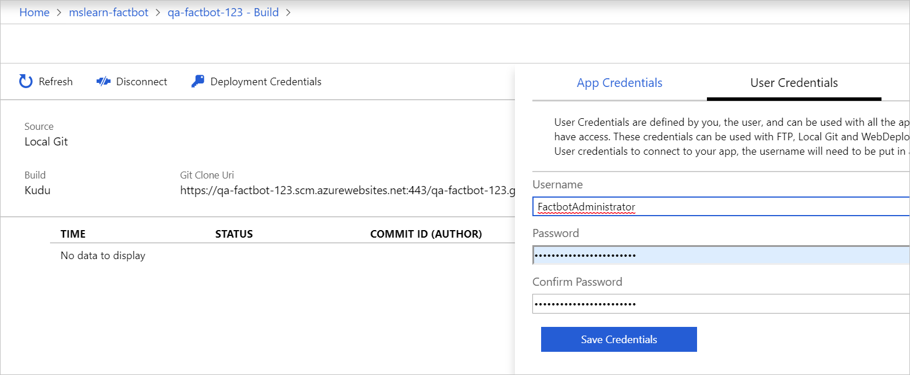

[!INCLUDE [0-vm-note](0-vm-note.md)]

When you created an Azure web app bot, an Azure web app was deployed to host it. But the bot does require some code, and it still needs to be deployed to the Azure web app. Fortunately, the code was generated for you by the Azure Bot Service. In this unit, you will use Visual Studio Code to place the code in a local Git repository and publish the bot to Azure by pushing changes from the local repository to a remote repository connected to the Azure web app that hosts the bot — a process known as [continuous integration](https://wikipedia.org/wiki/Continuous_integration).

1. Create a folder named "Factbot" in the location of your choice on your hard disk to hold the bot's source code.

1. Return to the Azure portal in the VM browser and open the pre-created exercise resource group. Then, select the Web App Bot you created in the prior exercise.

1. Select **Build** in the menu on the left, then select **Download Bot source code** to prepare a zip file containing the bot's source code. Once the zip file is prepared, select the **Download Bot source code** button to download it. When the download is complete, extract the contents of the zip file to the "Factbot" folder that you created earlier.

1. Back in the Web App Bot's Build blade in the Azure portal, select **Configure continuous deployment**.

1. Select **Setup** at the top of the **Deployments** blade, followed by **Choose Source**.

1. Then, select **Local Git Repository** as the deployment source.

1. Next, select **Setup connection** and enter a username and password. You will probably have to enter a user name other than "FactbotAdministrator" because the name must be unique within Azure. Then, select **OK** to return to the **Deployment option** blade and **OK** again to return to the **Deployments** blade.

    

1. While the deployment system is provisioning, close the **Deployments** blade, and select **All App service settings** in the menu on the left.

1. Start **Visual Studio Code**, and use the **File** > **Open Folder...** command to open the "Factbot" folder where you copied the bot's source code.

1. Select the **Source Control** button in the activity bar on the left side of Visual Studio Code.

1. Select the **Initialize Repository** icon at the top.

1. Select the **Initialize Repository** button in the dialog.

1. Type "First commit." into the message box.

1. Select the check mark to commit your changes, staging all the files when prompted.

    > [!NOTE]
    > If you get a Git error about not having your identity set in Git, launch a Command Prompt and run the following commands, replacing the placeholder email and name values if you wish. Then retry the commit button.
    >
    > ```bash
    > git config --global user.email "Lab User"
    > git config --global user.name "LabUser#######@learn"
    > ```

1. Select **Terminal** from Visual Studio Code's **View** menu to open an integrated terminal.

1. Execute the following command in the integrated terminal, replacing BOT_NAME in the following two places with the bot name you entered in Exercise 1.

    > [!NOTE]
    > The full Git remote URL can also be found in the App Service resource's **Overview** section under **Git clone url**.

    ```bash
    git remote add qna-factbot https://BOT_NAME.scm.azurewebsites.net:443/BOT_NAME.git
    ```

1. Return to the **Source Control** panel and select the ellipsis (the three dots) at the top of the SOURCE CONTROL panel, and select **Publish Branch** from the menu to push the bot code from the local repository to Azure. If prompted for credentials, enter the username and password you specified previously in this exercise.

Your bot has been published to Azure. But before you test it there, let's run it locally and learn how to debug it in Visual Studio Code.
