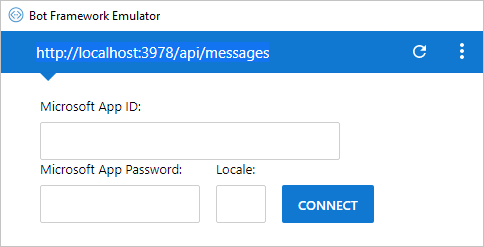

As with any application code that you write, changes to bot code need to be tested and debugged locally before being deployed to production. To help debug bots, Microsoft offers the Bot Framework Emulator. In this unit, you will learn how to use Visual Studio Code and the emulator to debug your bots.

1. Execute the following command in Visual Studio Code's integrated terminal to install [Restify](http://restify.com/), a popular Node.js package for building and consuming RESTful web services:

    ```bash
    npm install restify
    ```

1. Repeat this step for the following commands to install the [Microsoft Bot Framework Bot Builder SDK for Node.js](https://docs.microsoft.com/bot-framework/nodejs/bot-builder-nodejs-quickstart):

    ```bash
    npm install botbuilder
    npm install botbuilder-azure
    npm install botbuilder-cognitiveservices
    ```

1. Select the **Explorer** button in Visual Studio Code's activity bar. 
1. Select **app.js** to open it in the code editor. This file contains the code that drives the bot — code that was generated by the Azure Bot Service and downloaded from the Azure portal.

1. Replace the contents of **app.js** with the following code, then save the file.

    ```JavaScript
    "use strict";
    var builder = require("botbuilder");
    var botbuilder_azure = require("botbuilder-azure");

    var useEmulator = true;
    var userName = "";
    var yearsCoding = "";
    var selectedLanguage = "";

    var connector = useEmulator ? new builder.ChatConnector() : new botbuilder_azure.BotServiceConnector({
        appId: process.env.MicrosoftAppId,
        appPassword: process.env.MicrosoftAppPassword
    });

    var bot = new builder.UniversalBot(connector);

    bot.dialog('/', [

    function (session) {
        builder.Prompts.text(session, "Hello, and welcome to QnA Factbot! What's your name?");
    },

    function (session, results) {
        userName = results.response;
        builder.Prompts.number(session, "Hi " + userName + ", how many years have you been writing code?");
    },

    function (session, results) {
        yearsCoding = results.response;
        builder.Prompts.choice(session, "What language do you love the most?", ["C#", "Python", "Node.js", "Visual FoxPro"]);
    },

    function (session, results) {
        selectedLanguage = results.response.entity;

        session.send("Okay, " + userName + ", I think I've got it:" +
            " You've been writing code for " + yearsCoding + " years," +
            " and prefer to use " + selectedLanguage + ".");
    }]);

    var restify = require('restify');
    var server = restify.createServer();

    server.listen(3978, function() {
        console.log('test bot endpoint at http://localhost:3978/api/messages');
    });

    server.post('/api/messages', connector.listen());
    ```

1. Set breakpoints on lines 20, 25, and 30 (`builder.Prompts...` calls) by selecting in the margin on the left.

1. Select the **Debug** button in the activity bar, then select the green arrow **Start Debugging** button to start a debugging session. Confirm that "test bot endpoint at http://localhost:3978/api/messages" appears in the debug console.

    

    Your bot code is now running locally.

1. Launch the **Bot Framework Emulator** from the Start Menu.

1. Select the **Enter your endpoint URL** field. Enter the bot name and the bot URL displayed in the debug console in the previous step.

1. Leave the Microsoft App ID, Microsoft App Password, and Locale fields empty and select **CONNECT**.

1. Then, select **Save and connect** and save the configuration file in the location of your choice.

    >[!NOTE]
    > In the future, you can reconnect to the bot simply by selecting the bot name under "My Bots".

    

1. Type "hi" into the box at the bottom of the emulator and press **Enter**. Confirm that Visual Studio Code breaks on line 20 of **app.js**. Then, select the **Continue** button in Visual Studio Code's debugging toolbar, and return to the emulator to see the bot's response.

1. The bot will ask you a series of questions. Answer them and select **Continue** in Visual Studio Code each time a breakpoint is hit. When you're done, select the **Stop** button in the debugging toolbar to end the debugging session.

At this point, you have a fully functioning bot and know how to debug it by running it locally in the Microsoft Bot Framework Emulator. The next step is to make the bot more intelligent by connecting it to the knowledge base you published.