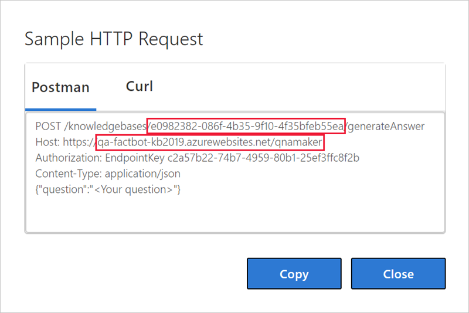
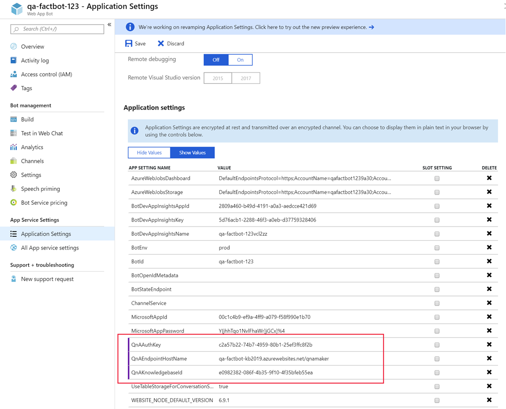

[!INCLUDE [0-vm-note](0-vm-note.md)]

In this unit, you will connect your bot to the QnA Maker knowledge base you built earlier so that the bot can carry on an intelligent conversation. Connecting to the knowledge base involves retrieving some information from the QnA Maker portal, copying it into the Azure portal, updating the bot code, and then redeploying the bot to Azure.

1. Return to the QnA Maker portal at https://www.qnamaker.ai in the VM browser and select the account button in the upper-right corner.
1. Select **Manage endpoint keys** from the menu that drops down.
1. Select **Show** to show the **Primary** endpoint key and **Copy** to copy it to the clipboard. Paste it into a text file, so you can easily retrieve it in a moment.

    > [!NOTE]
    > Depending on your browser settings, you may need to allow third-party cookies to complete this unit.

1. Select **My knowledge bases** in the menu at the top of the page.
1. Then, select **View Code** for the knowledge base that you created earlier.

1. Copy the knowledge base ID from the first line and the host name from the second line. Paste them into a text file, as well. Then, close the dialog. **Do not** include the "https://" prefix in the host name that you copy.

    

1. Return to the Web App Bot in the Azure portal. Select **Application settings** in the menu on the left, and scroll down until you find application settings named "QnAKnowledgebaseId," "QnAAuthKey," and "QnAEndpointHostName." Paste the knowledge base ID and host name you just obtained and the endpoint key obtained previously into these fields. Then, select **Save** at the top.

    

1. Return to **Visual Studio Code** and replace the contents of **app.js** with the code below. Then, save the file.

    ```JavaScript
    var restify = require('restify');
    var builder = require('botbuilder');
    var botbuilder_azure = require("botbuilder-azure");
    var builder_cognitiveservices = require("botbuilder-cognitiveservices");

    // Setup Restify Server
    var server = restify.createServer();
    server.listen(process.env.port || process.env.PORT || 3978, function () {
        console.log('%s listening to %s', server.name, server.url);
    });

    // Create chat connector for communicating with the Bot Framework Service
    var connector = new builder.ChatConnector({
        appId: process.env.MicrosoftAppId,
        appPassword: process.env.MicrosoftAppPassword,
        openIdMetadata: process.env.BotOpenIdMetadata
    });

    // Listen for messages from users
    server.post('/api/messages', connector.listen());

    var tableName = 'botdata';
    var azureTableClient = new botbuilder_azure.AzureTableClient(tableName, process.env['AzureWebJobsStorage']);
    var tableStorage = new botbuilder_azure.AzureBotStorage({ gzipData: false }, azureTableClient);

    // Create your bot with a function to receive messages from the user
    var bot = new builder.UniversalBot(connector);
    bot.set('storage', tableStorage);

    // Recognizer and and Dialog for preview QnAMaker service
    var previewRecognizer = new builder_cognitiveservices.QnAMakerRecognizer({
        knowledgeBaseId: process.env.QnAKnowledgebaseId,
        authKey: process.env.QnAAuthKey || process.env.QnASubscriptionKey
    });

    var basicQnAMakerPreviewDialog = new builder_cognitiveservices.QnAMakerDialog({
        recognizers: [previewRecognizer],
        defaultMessage: 'No match! Try changing the query terms!',
        qnaThreshold: 0.3
    }
    );

    bot.dialog('basicQnAMakerPreviewDialog', basicQnAMakerPreviewDialog);

    // Recognizer and and Dialog for GA QnAMaker service
    var recognizer = new builder_cognitiveservices.QnAMakerRecognizer({
        knowledgeBaseId: process.env.QnAKnowledgebaseId,
        authKey: process.env.QnAAuthKey || process.env.QnASubscriptionKey, // Backward compatibility with QnAMaker (Preview)
        endpointHostName: process.env.QnAEndpointHostName
    });

    var basicQnAMakerDialog = new builder_cognitiveservices.QnAMakerDialog({
        recognizers: [recognizer],
        defaultMessage: "I'm not quite sure what you're asking. Please ask your question again.",
        qnaThreshold: 0.3
    });

    bot.dialog('basicQnAMakerDialog', basicQnAMakerDialog);

    bot.dialog('/', //basicQnAMakerDialog);
        [
            function (session) {
                var qnaKnowledgebaseId = process.env.QnAKnowledgebaseId;
                var qnaAuthKey = process.env.QnAAuthKey || process.env.QnASubscriptionKey;
                var endpointHostName = process.env.QnAEndpointHostName;

                // QnA Subscription Key and KnowledgeBase Id null verification
                if ((qnaAuthKey == null || qnaAuthKey == '') || (qnaKnowledgebaseId == null || qnaKnowledgebaseId == ''))
                    session.send('Please set QnAKnowledgebaseId, QnAAuthKey and QnAEndpointHostName (if applicable) in App Settings. Learn how to get them at https://aka.ms/qnaabssetup.');
                else {
                    if (endpointHostName == null || endpointHostName == '')
                        // Replace with Preview QnAMakerDialog service
                        session.replaceDialog('basicQnAMakerPreviewDialog');
                    else
                        // Replace with GA QnAMakerDialog service
                        session.replaceDialog('basicQnAMakerDialog');
                }
            }
        ]);
    ```

    > [!NOTE]
    > The call to create a `QnAMakerDialog` instance on line 30. This creates a dialog that integrates a bot built with the Azure Bot Service with a knowledge base built via Microsoft QnA Maker.

1. Select the **Source Control** button in the activity bar in Visual Studio Code.
1. Hover over the **app.js** file and select the __+__ button to stage that file's changes for the next commit.
1. Type "Connected to knowledge base" into the message box, and select the check mark to commit your changes.

    > [!Warning]
    > If you see changes to a **package.json** file ensure you do NOT include them in your commit. Your commit should only include your changes to **app.js**.

1. Then, select the ellipsis (__...__) button and use the **Publish Branch** command to push these changes to the remote repository and the Azure Web App.

1. Return to the web app bot in the Azure portal, and select **Test in Web Chat** on the left to open the test console. Type "What's the most popular software programming language in the world?" into the box at the bottom of the chat window and press **Enter**. Confirm that the bot responds.

Congratulations! Your bot is connected to the knowledge base and can respond to questions.
