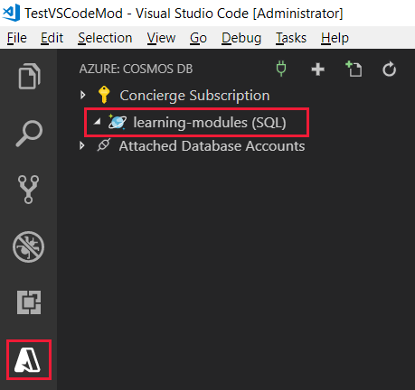

The Azure Cosmos DB extension for Visual Studio Code simplifies account, database, and collection creation by enabling you to create resources using the command window.

In this unit you will install the Azure Cosmos DB extension for Visual Studio, and then use it to create an account, database, and collection.

## Install the Azure Cosmos DB extension for Visual Studio

1. Go to the [Visual Studio Marketplace](https://marketplace.visualstudio.com/items?itemName=ms-azuretools.vscode-cosmosdb&azure-portal=true) and install the **Azure Cosmos DB** extension for Visual Studio Code.

1. When the extension tab loads in Visual Studio Code, click **Install**.

1. After installation is complete, click **Reload**.

    Visual Studio Code displays the  Azure icon on the left side of the screen after the extension is installed and reloaded.

## Create an Azure Cosmos DB account in Visual Studio Code

[!include]

1. In Visual Studio Code, sign in to Azure by clicking **View** > **Command Palette** and typing **Azure: Sign In**. You must have the [Azure Account](https://marketplace.visualstudio.com/items?itemName=ms-vscode.azure-account&azure-portal=true) extension installed to use Azure: Sign In.

    > [!IMPORTANT]
    > Login to Azure using the same account used to create the sandbox. The sandbox provides access to a Concierge Subscription.

    Follow the prompts to copy and paste the code provided in the web browser, which authenticates your Visual Studio Code session.

1. Click the  **Azure** icon on the left menu, and then right-click **Concierge Subscription**, and click **Create Account**.

    > [!NOTE]
    > If you do not see the Concierge Subscription listed, ensure you logged into Azure in Visual Studio Code using the same account used to create the sandbox. Additionally, if you have filtered your Azure subscriptions in the Azure Account extension, verify the Concierge Subscription is checked in the `> Azure: Select Subscriptions` command.

1. Click the __+__ button to start creating a Cosmos DB account. You will be asked to select the subscription if you have more than one.

1. In the text box at the top of the screen, enter a unique name for your Azure Cosmos DB account, and then press enter. The account name can contain only lowercase letters, numbers and the '-' character, and must be between 3 and 31 characters.

1. Next, select **SQL (DocumentDB)**, then select **<rgn>[sandbox resource group name]</rgn>**, and then select a location.

    [!include]

    The output tab in Visual Studio Code displays the progress of the account creation. It takes a few minutes to complete.

1. After the account is created, expand your Azure subscription in the **Azure: Cosmos DB** pane and the extension displays the new Azure Cosmos DB account. In the following image, the new account is named **learning-modules**.

    

## Create an Azure Cosmos DB database and collection in Visual Studio Code

Now let's create a new database and collection for your customers.

1. In the Azure: Cosmos DB pane, right-click your new account, and then click **Create Database**.
1. In the input palette at the top of the screen, type `Users` for the database name and press Enter.
1. Enter `WebCustomers` for the collection name and press Enter.
1. Enter `userId` for the partition key and press Enter.
1. Finally, confirm `1000` for the initial throughput capacity and press Enter.
1. Expand the account in the **Azure: Cosmos DB** pane, and the new **Users** database and **WebCustomers** collection are displayed.

    

Now that you have your Azure Cosmos DB account, lets get to work in Visual Studio Code!
