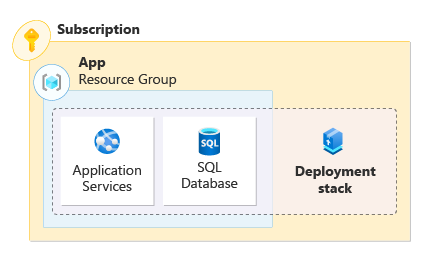
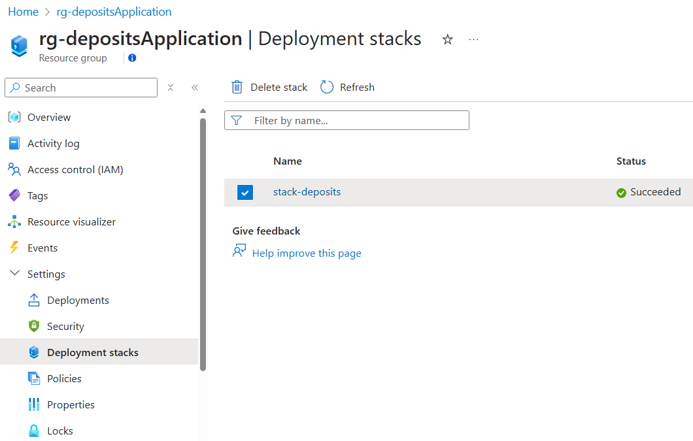
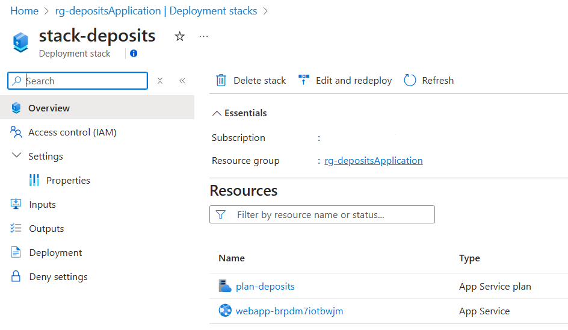

An Azure deployment stack is a collection of Azure resources that can be managed as a single unit even if they span multiple resource groups or subscriptions.

You're planning for the deployment of the test version of the new deposits application. You need to learn more about how to create a deployment stack and verify its managed resources.

In this unit, you learn how to create a deployment stack, verify its deployment, and list all deployment stacks in your environment.

[!INCLUDE [Note - don't run commands](../../../includes/dont-run-commands.md)]

## Deployment stacks revisited

Deployment stacks change how you think about resource organization across resource groups and subscriptions. A deployment stack allows you to group all the resources that make up your application, regardless of where they're in your Azure resource organizational hierarchy. You can manage them as a single unit. With deployment stacks, you're able to perform lifecycle operations on the collection of resources that make up the stack.



Think of deployment stacks as a series of pointers that groups your application's resources into a single unit. Deployment stacks can be created at different scopes, such as resource groups, subscriptions, and management groups.

## Define resources

Deployment stacks support the use of Bicep files, ARM JSON templates, or template specs for defining resources in a stack. When creating a deployment stack using the Azure CLI or Azure PowerShell, you're able to point to the specific template file (Bicep file or ARM JSON template) or template spec. It isn't necessary to change how you define your resources.

We use the following bicep file for our first deployment stack. The file defines an app service plan and a web app. These resources become managed resources when we create the deployment stack.

:::code language="bicep" source="code/1-template.bicep" range="1-4, 18-42":::

> [!NOTE]
> You may notice the `${uniqueString(resourceGroup().id)}` syntax on the `webApplicationName` parameter. The uniqueString function creates a string based on the id of the resource group and adds it as a suffix to `webapp-deposits`. Many Azure services require unique names. This function helps generate a unique name.

## Creating a deployment stack

Creating and deploying a deployment stack and its resources is nearly identical to a standard Azure deployment. Whether you're using Azure CLI, Azure PowerShell, or an infrastructure as code pipeline, the process feels the same. For example:

::: zone pivot="cli"

The Azure CLI command to deploy a bicep file to a resource group is:

```azurecli
az deployment group create \
    --resource-group rg-depositsApplication \
    --template-file ./main.bicep
```

The Azure CLI command to create a deployment stack at the resource group scope is:

```azurecli
az stack group create \
    --name stack-deposits \
    --resource-group rg-depositsApplication \
    --template-file ./main.bicep \
    --action-on-unmanage deleteAll \
    --deny-settings-mode none
```

Notice that the only changes in the command are the words `deployment` and `stack`, and differences in the parameters used. The same is true for deployments to subscriptions and management groups.

> [!NOTE]
> In later modules, we explore how to manage a deployment stack's resources using `--action-on-unmanage` and how to prevent unwanted changes using `--deny-settings-mode`.

::: zone-end

::: zone pivot="powershell"

The Azure PowerShell command to deploy a bicep file to a resource group is:

```azurepowershell
New-AzResourceGroupDeployment `
    -ResourceGroupName rg-depositsApplication `
    --TemplateFile eastus
```

The Azure PowerShell command to create a deployment stack at the resource group scope is:

```azurepowershell
New-AzResourceGroupDeploymentStack `
    -Name stack-deposits `
    -ResourceGroupName rg-depositsApplication `
    -TemplateFile ./main.bicep `
    -ActionOnUnmanage DeleteAll `
    -DenySettingsMode None
```

Notice that the only change in the command is the word `stack`, and differences in the parameters used. The same is true for deployments to subscriptions and management groups.

> [!NOTE]
> In later modules, we explore how to manage a deployment stack's resources using `-ActionOnUnmanage` and how to prevent unwanted changes using `-DenySettingsMode`.

::: zone-end

Now, lets take a look at creating a deployment stack at the resource group scope.

::: zone pivot="cli"

To create a deployment stack using Azure CLI, use the `az stack group create` command. The following commands first create a resource group called `rg-depositsApplication` then creates the deployment stack at the scope of the resource group.

```azurecli
az group create \
    --name rg-depositsApplication \
    --location eastus
```

```azurecli
az stack group create \
    --name stack-deposits \
    --resource-group rg-depositsApplication \
    --template-file ./main.bicep \
    --action-on-unmanage deleteAll \
    --deny-settings-mode none
```

::: zone-end

::: zone pivot="powershell"

To create a deployment stack using Azure PowerShell, use the `New-AzResourceGroupDeploymentStack` command. The following commands first create a resource group called `rg-depositsApplication` then creates the deployment stack at the scope of the resource group.

```azurepowershell
New-AzResourceGroup `
    -Name rg-depositsApplication `
    -Location eastus
```

```azurepowershell
New-AzResourceGroupDeploymentStack `
    -Name stack-deposits `
    -ResourceGroupName rg-depositsApplication `
    -TemplateFile ./main.bicep `
    -ActionOnUnmanage DeleteAll `
    -DenySettingsMode None
```

::: zone-end

## Showing deployment stacks

Resource groups may have multiple deployment stacks scoped to them. You can show details about a specific deployment stack scoped to a resource group.

::: zone pivot="cli"

To show a specific deployment stack resource scoped to a resource group using Azure CLI, use the `az stack group show` command, specifying the name of the deployment stack and the target resource group.

```azurecli
az stack group show \
    --resource-group rg-depositsApplication \
    --name stack-deposits
```

The results include the properties of the deployment stack and the status of the managed resources. The output should appear familiar to the following section:

:::code language="json" source="code/2-json.json" range="1-39, 52-77":::

Take notice of the resources section of the output. For each resource, it shows its status as `managed`, its resource group, its resource id, and its deny settings.

::: zone-end

::: zone pivot="powershell"

To show a specific deployment stack resource scoped to a resource group using Azure PowerShell, use the `Get-AzResourceGroupDeploymentStack` command, specifying the name of the deployment stack and the target resource group.

```azurepowershell
Get-AzResourceGroupDeploymentStack `
    -ResourceGroupName rg-depositsApplication `
    -Name stack-deposits
```

The results include the properties of the deployment stack and the status of the managed resources. The output should appear familiar to the following section:

:::code language="powershell" source="code/3-powershell.ps1" range="1-10":::

Take notice of the resources section of the output. It defines the resources managed by the deployment stack. You see the full resource ID of each resource.

::: zone-end

You can also view deployment stacks in the Azure portal. They're available at their respective scopes. For a resource group, navigate to the resource group where the deployment stack is scoped. Under settings, you see an option for deployment stacks.



When you click on deployment stacks, it lists any stacks scoped to the resource group. Clicking on a deployment stack takes you to the property page of the deployment stacks.



## Listing deployment stacks

You can also list all deployment stacks scoped to a specific resource group.

::: zone pivot="cli"

To list all deployment stack resources scoped to a resource group using Azure CLI, use the `az stack group list` command, specifying the target resource group.

```azurecli
az stack group list \
    --resource-group rg-depositsApplication
```

::: zone-end

::: zone pivot="powershell"

To list all deployment stack resources scoped to a resource group using Azure PowerShell, use the `Get-AzResourceGroupDeploymentStack` command, specifying the target resource group.

```azurepowershell
Get-AzResourceGroupDeploymentStack `
    -ResourceGroupName rg-depositsApplication
```

> [!NOTE]
> Azure PowerShell uses the same command, `Get-AzResourceGroupDeploymentStack` for both the show and list operations.

::: zone-end
