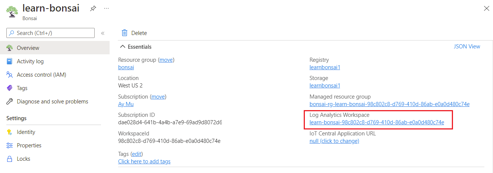
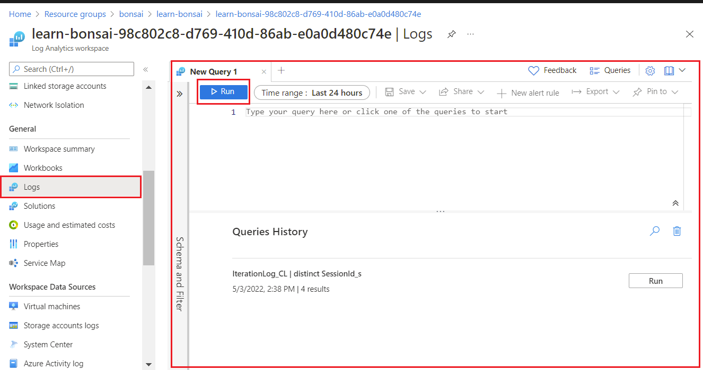

In this unit, you'll access to the assessment data and evaluate the model performance.

## Query episode logs

You can collect episode, iteration, and simulation data during training and assessment. Bonsai provisions an Azure Log Analytics workspace whenever you create a new Bonsai workspace and writes log data to Azure Log Analytics so you can query the information alongside any other log data you may be collecting.

After running the custom assessment, you can access the assessment data. Logging data isn't saved for automatic assessments. There are two ways to collect and access your custom assessment logs:

1. Query data in Azure Log Analytics interface and save results to CSV.
2. Export data to Jupyter through API querying to Azure Log Analytics.

## Install the Bonsai CLI and SDK for Python

To query assessment data, you'll need to install the Bonsai SDK and packages needed.

### Step 1: Download Bonsai API Samples for Python

The Microsoft Bonsai API (MBA) provides Bonsai integration packages for Simulations in Python, Java, TypeScript, and C#. Follow the instructions to get the API into your local device:

1. Download the GitHub repository: https://github.com/microsoft/microsoft-bonsai-api.
2. Save and unzip the repo to a directory of your choice, such as C:\bonsai\microsoft-bonsai-api-main.

## Step 2: Install Miniconda and create a virtual environment

To use Bonsai commands from your local computer, you need to install the Bonsai SDK and CLI. Yet, to make installation simpler for you, we have put together a YML file with all the packages you'll need to install, and their respective compatible versions.

1. If you're using Miniconda or Anaconda, go ahead to the next step. If not, you follow the link install Miniconda. Miniconda will help you handle your virtual environments. A virtual environment helps isolate your package installations, helping minimize dependency mismatches and other conflicts across environments. If you would rather use the CLI or Anaconda to handle your virtual environments, that is okay too.
    a. For Windows, double click on the downloaded executable to install Miniconda.
    b. For Mac, use the bash command to get it installed (instructions here).
2. Download the following environment yml file to your local device (Click on the Raw button before downloading). The yml file indicates the Python version to be installed (v3.7), as well as the relevant python libraries needed. Among these libraries, we include the bonsai-cli, microsoft-bonsai-api, and azure-cli.
3. Next, open the Miniconda/Anaconda Prompt and traverse to the location where you downloaded the YML file. Then, run the following command to install the virtual environment. This command will create a new virtual environment named bonsai-preview. This virtual environment should always be activated prior to running any other Bonsai commands.
4. Now, you need to activate your virtual environment. Every time you open a new Anaconda/Miniconda Prompt, enter the following command to activate the virtual environment:
5. The name in between the parenthesis reflects the current active environment. After running the command, you should see the tag change to the selected environment as follows:

## Query data in Azure Log Analytics

Querying assessment data in Azure Log Analytics is a good choice if you're unfamiliar with Python or already know KQL.

1. Sign into the [Azure portal](https://portal.azure.com/).
2. Navigate to Bonsai workspace resource group and list [Bonsai workspaces](https://aka.ms/portal-bonsai-workspaces) associated with your account.
3. Click on the workspace you want to query logs for.
4. Select the Log Analytics Workspace.

    

5. Select Logs from the General section of the portal navigation and you'll see the query panel.

    

6. Paste the KQL query into the query panel.
7. Replace the following in the KQL query into the query panel and set:
    - BRAIN_NAME with the object name of the brain you assessed as a lowercase string. For example, hive mind. You can find the object name by right clicking the brain and selecting Brain info.
    - BRAIN_VERSION with the numeric version of the brain you assessed. For example, 2.
    - ASSESSMENT_NAME with the object name of your custom assessment as a lowercase string. For example, common case. You can find the object name by right clicking the assessment record in the UI and selecting Assessment info.
8. Click Export and select Export to CSV - all columns to export up to 64 MB of log data to CSV. If you want to export more than 64 MB, you'll need to paginate the query and run it multiple times.

## Export data to Jupyter

Exporting custom assessment data to Jupyter is a good choice if you're familiar with Python or you want to further analyze the data with custom tools and templates. The Bonsai Log Tools repo in GitHub provides a collection of useful Jupyter templates for common data analysis tasks with Bonsai data that will import data directly into Jupyter.

1. Clone the Bonsai Log Tools repo, microsoft/bonsai-log-tools. The Bonsai Log Tools repo in GitHub is a collection of useful Jupyter templates for common data analysis tasks with Bonsai data.
2. From the cloned directory, make sure you have all the requirements installed:
3. Open the custom_assessment_logs.ipynb notebook template in Jupyter and set the configuration variables for the training data you want to analyze:
    a. In [2], set LOG_ANALYTICS_WORKSPACE_ID to the Azure object ID of your Log Analytics Workspace. You can select the Log Analytics Workspace from Azure portal.

            

    1. In [9], set brain_name with the object name of the brain you assessed as a lowercase string. You can find the object name by right clicking the brain and selecting Brain info.
    1. In [9], set brain_version with the numeric version of the brain you assessed. For example, 2.
    1. In [9], set assessment_name with the object name of your custom assessment as a lowercase string. You can find the object name by right clicking the assessment record in the UI and selecting Assessment info.
4. Run the notebook.

After training the brain, the next step is to export and deploy the brain. In this module, we don't have a physical device and deployment option isn't available.
