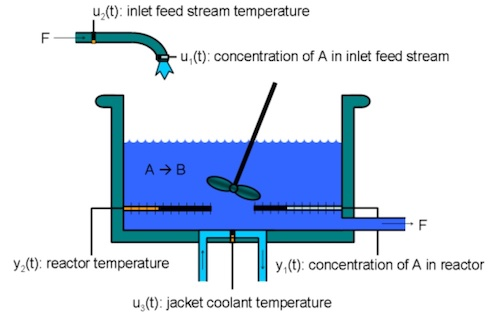

Continuous Stirred Tank Reactor (CSTR) transitions from low to high conversion rate (high to low residual concentration). The chemical reaction is exothermic, and the reactor temperature is controlled with a cooling jacket filled with coolant.

An exothermic reaction produces heat; thus, the reactor temperature must be controlled to prevent thermal runaway. When the reactor becomes too hot, it could melt.

The objective is to train a brain to control the reactor temperature for CSTR to prevent thermal runaway during both steady-state control, as well as for transient control into new desired values of residual concentration.

Based on conversations with Subject Matter Experts (SMEs), we extracted the following information about both the steady state and transient conditions for the CSTR problem:

- When the reactor is running in continuous production, it is in continuous **steady-state** operation and there isn't much change. CSTR produces a specified product.
- When the CSTR is transitioning to produce different output concentrations, it is in a **transient operation**. The transient operation is difficult to manage. Minor deviations in the transient of coolant temperature can result in unstable conditions, hitting thermal runaway.

