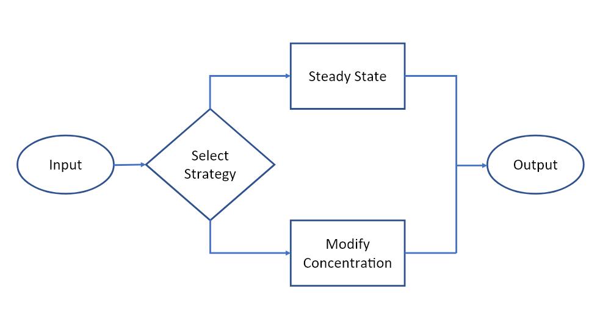

Let's take a look at how this brain is designed. You can see the full AI specification document [here](https://github.com/MicrosoftDocs/mslearn-machine-teaching-for-autonomous-ai/blob/main/Bonsai%20Brain,%20AI%20Solution%20Spec%20-%20Chemical%20Process%20Optimization.docx?raw=true).

## Understand a modular brain

Modular brains are much more complex for real industrial processes. These brains require decomposition of the task into skills, training or programming multiple skills, and experimentation to get the orchestration and the training right.

## Brain design

First, we start by defining input/states.

- The labels for our input states are Cr, Tr, Cref, Tref and Tc.
    - **Cr**: The measured residual concentration of our product at the reactor's outlet.
    - **Tr**: The measured temperature of our product at the reactor's outlet.
    - **Cref**: The reference residual concentration, which identifies the desired concentration at every timestep (for both steady-state and transient operation).
    - **Tref**: The reference reactor temperature, which identifies the desired reactor temperature at every timestep (for both steady-state and transient operation).
    - **Tc**: The coolant temperature of the reactor cooling jacket. The coolant is the controlling agent of the reactor’s output concentration and temperature.

Then, we define the output of our brain, the control variable(s) of our reactor.

- The label for our output action is dTc
    - **dTc**: The increment (or decrement) of coolant temperature to be applied at any time with respect to the initial coolant temperature at steady-state conditions.

Finally, based on the scenarios our brain needs to be able to generalize to, we define a modular brain with the concepts/skills to be taught to the Autonomous AI brain.

- **Learned Concept 1**: **Steady State** - The brain is exposed to the steady-state scenario. It must learn to operate the reactor under continuous steady-state conditions.
- **Learned Concept 2**: **Modify Concentration** - The brain is exposed to transient scenarios. It must learn to operate the reactor under transient conditions by modifying the coolant concentration following the concentration reference (Cref).
- **Selector Concept**: **Select Strategy** - The brain is exposed to both steady-state and transient operation. We train a selector to learn under which conditions to apply each skill. It must learn the fuzzy boundary between steady-state control and transient operation.

