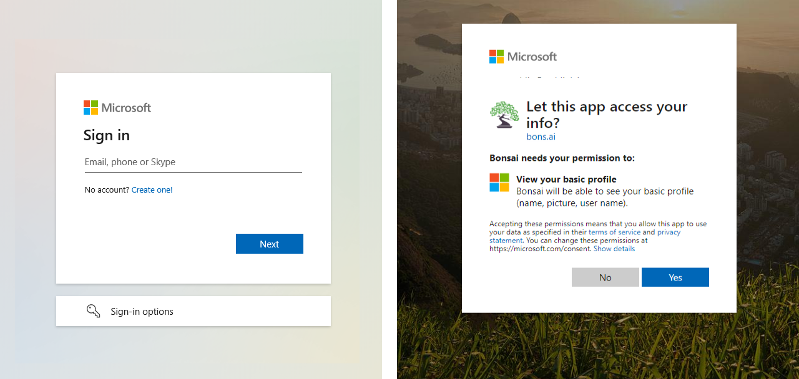
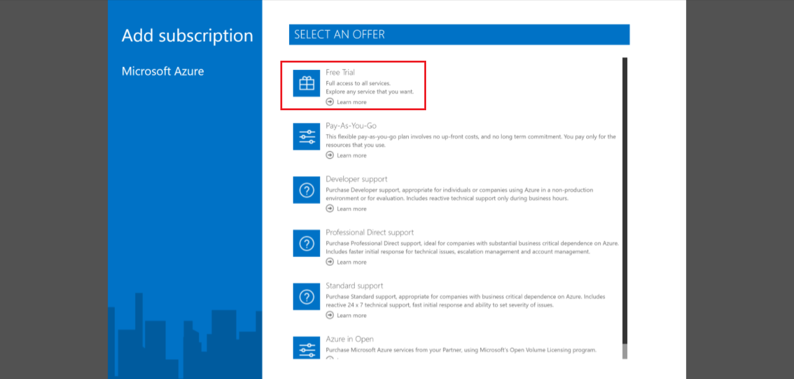
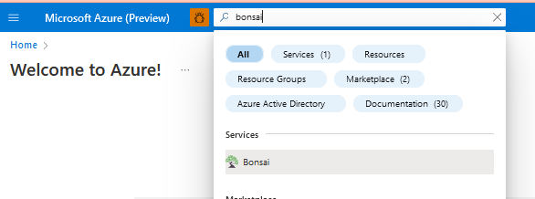
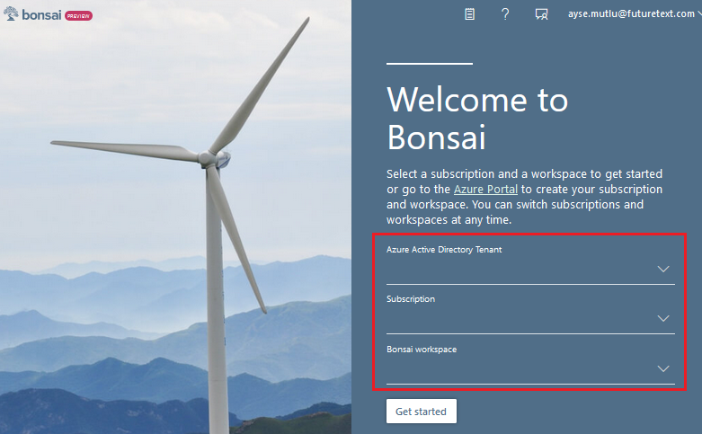

In this unit, you'll go through the instructions to set up your account for Project Bonsai.

## Sign into Bonsai

1. Open the [Bonsai UI](https://preview.bons.ai/). You're automatically directed to sign in to your Microsoft account. Click on "Sign in or Sign up."

   

2. Then, sign in to your account or click "Create one!" if you need to create an account.

   

3. Grant Bonsai access to your account if prompted.

## Enable Azure cloud services

1. When you sign in for the first time, the Bonsai UI looks for a valid Azure subscription. If you need an Azure services subscription, click the Go to [Azure portal](https://portal.azure.com/) button and follow the prompts to sign up for an Azure free trial. You can use the free trial for 12 months.

   

2. If you already have a valid Azure subscription but haven't created a Bonsai workspace, the UI will prompt you to visit the Azure portal and create a workspace. Otherwise, you'll be automatically directed to the Azure portal after subscription sign-up.

   

## Provision of a Bonsai workspace

After signing in to the Azure portal, you must provision a Bonsai workspace as a resource.

1. Search for "Bonsai" in the Marketplace and click on Bonsai service.

   

2. Click Create Bonsai to open the Create Bonsai page and provide the following information.

   - **Subscription**: Select your subscription.
   - **Resource group**: Select your resource group or create a new resource group if you don't have one.
   - **Name**: Enter a name for the Bonsai workspace
   - **Location**: Select your location.

   

3. Click Review + create and confirm the listed information is correct to complete your deployment. Note that Bonsai will provision the following resources:

   - **Azure Container Registry** (basic tier) for storing exported brains and instanced simulations.
   - **Azure Container Instances** for running simulations.
   - **Azure Storage** for storing uploaded simulators as zip files.

4. When provisioning completes, open the Bonsai UI and select your subscription and workspace from the available dropdowns to complete setup.

   
