In this unit, you'll create a modular brain for CSTR example.

## Create a brain

To build a new brain for the continuous stirred-tank reactor (CSTR) problem:

1. Open the Bonsai Web UI.
2. Click "Create brain".
3. Select "Get New Sample" to go to the Azure Marketplace.

    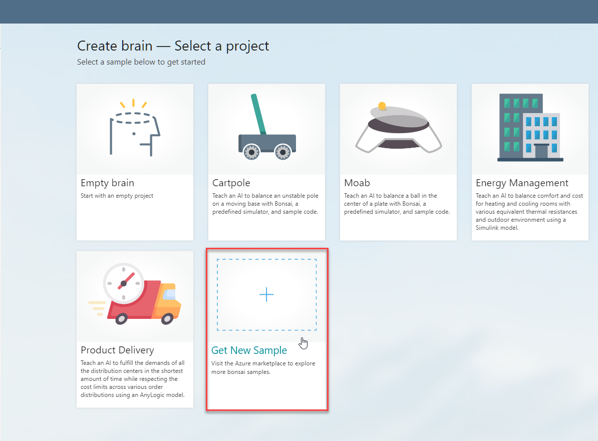

## Load sample modular brain

1. Select "Bonsai Continuous Stirred Tank Reactor Sample".

    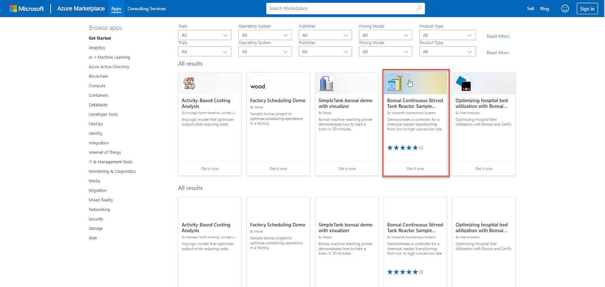

    > [!NOTE]
    > If you don’t see the CSTR sample in the list, you can click on the following link to open it up directly: [CSTR Sample – Microsoft Azure Marketplace](https://azuremarketplace.microsoft.com/en-us/marketplace/apps/microsoftcorporation1638560120339.bonsai_cstr_sample?tab=Overview)

2. In the "Sign in to Microsoft Azure Marketplace", enter your email associated with your Azure Account and then click "Sign in".

    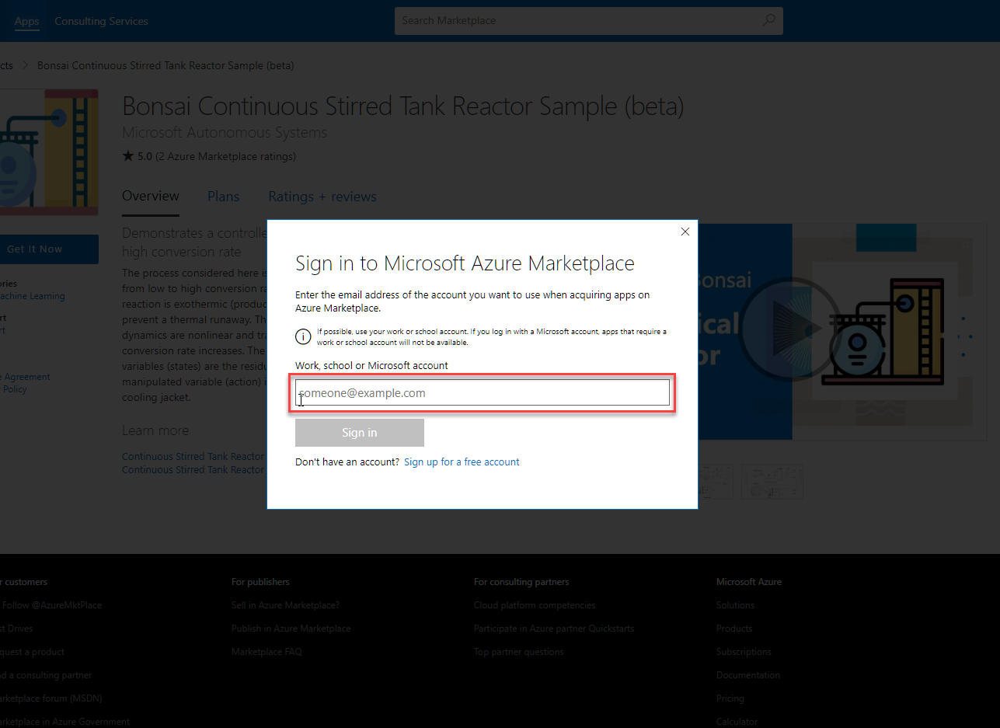

3. In the "One more thing…" dialog, review the text, click the checkbox, and then click "Continue" if you want to proceed.

    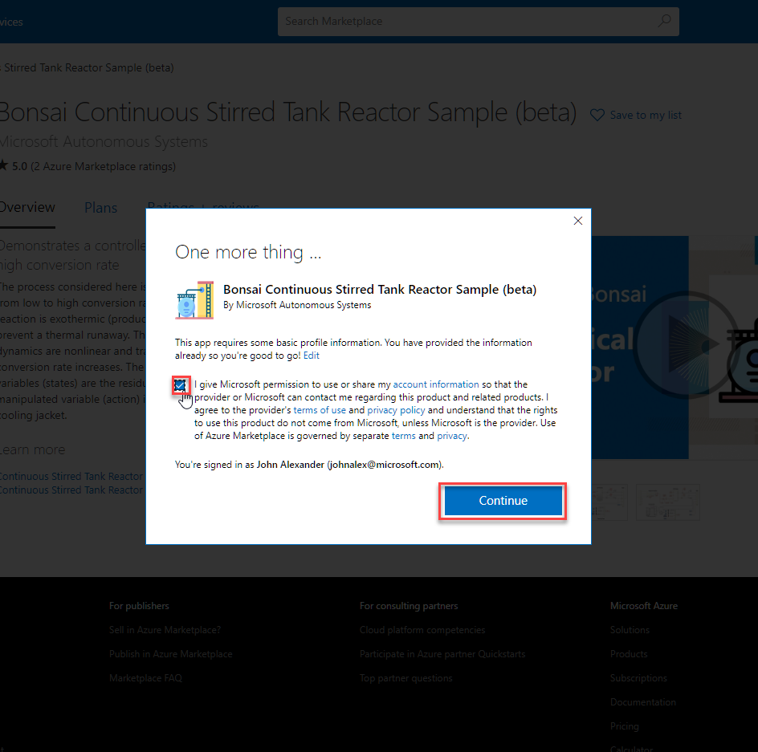

4. Click on "Get it now" to load the CSTR sample into your Bonsai workspace.

    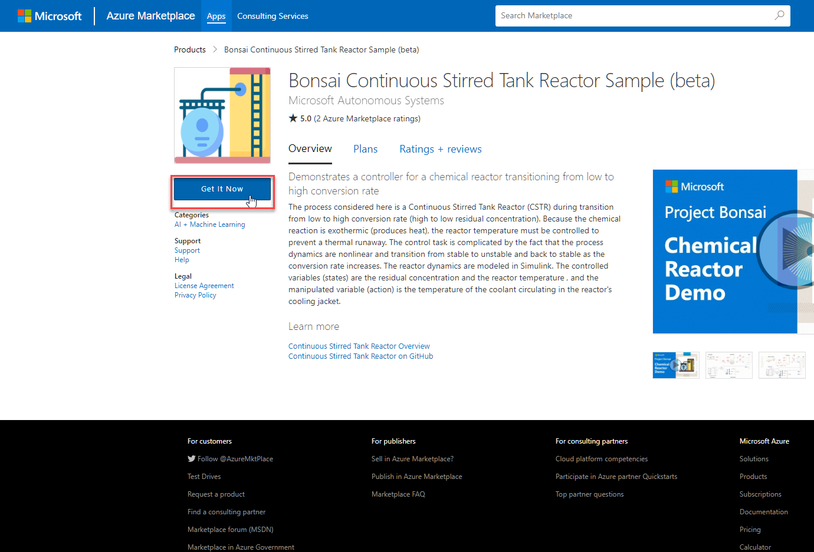

## Activate Chemical Reactor

1. Select "Chemical Reactor".

    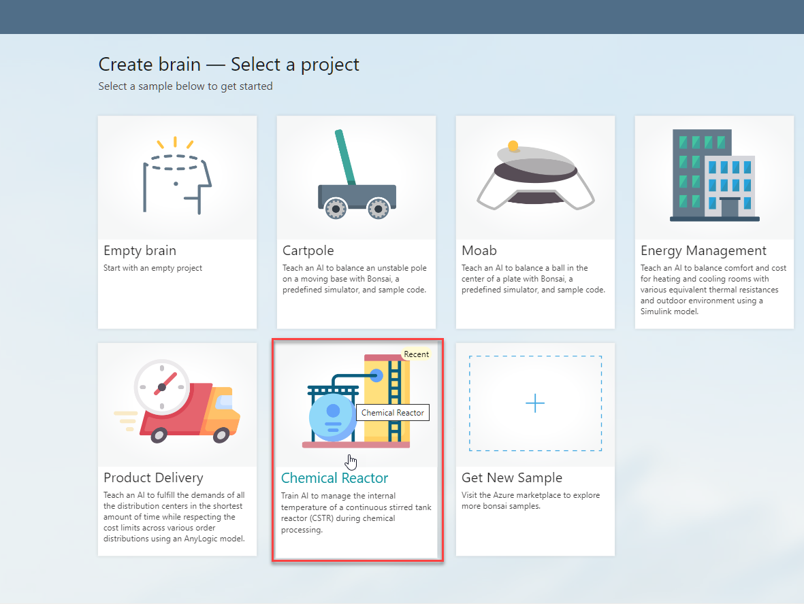

1. Name your new brain (for example, "CSTR sample").

## Navigate to the Visual Authoring

To turn on Visual Authoring, toggle the switch at the top right of the Bonsai UI on the Teach tab.

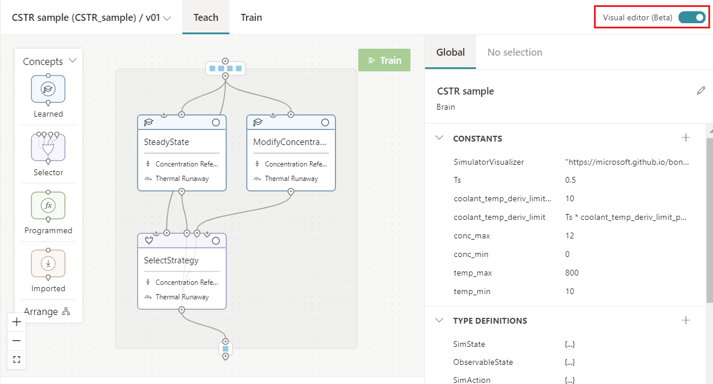

## Translating CSTR AI Spec into the Bonsai brain

The trained AI for the Chemical Reactor will adjust the coolant temperature to prevent thermal runaway. Here's the link for CSTR AI Specification document.

### Concept

This problem consists of the three concepts we defined earlier during our overview of the AI Specification document. The concepts are defined as "**Steady State**", "**Modify Concentration**", "**Selector Strategy**". The concepts will receive environment states and respond with control actions.

**Concept 1**: Steady State

- This concept learns to maintain reactor temperature while the reactor produces a constant residual concentration of 8.57 kmol/m3.

**Concept 2**: Modify Concentration

- This concept learns to regulate the reactor temperature during transition.

**Selector Concept**: Select Strategy

- This concept chooses which strategy to apply based on the conditions of the environment.

### Environment State

The environment state defines the current situation of the simulation. This includes the measured status of the reactor, the residual concentration (Cr) and the reactor temperature (Tr); the references desired, the concentration reference (Cref) and the temperature reference (Tref); as well as the absolute temperature of the coolant (Tc).

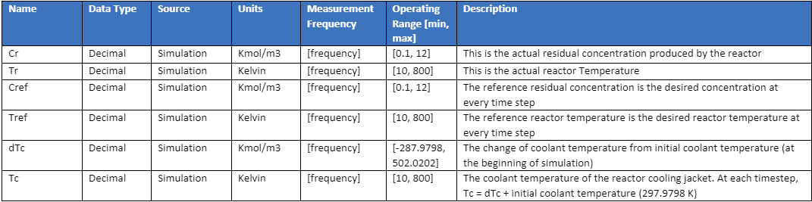

The environment state can be accessed by clicking on the collection of boxes on top of our concept graph, as shown below:

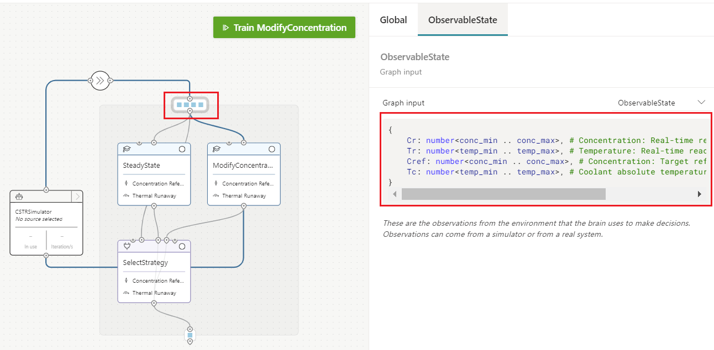

The Inkling associated with the definition of the environment state is:

```Inkling
type ObservableState {
    Cr: number<conc_min .. conc_max>,         # Concentration: Real-time reactor read
    Tr: number<temp_min .. temp_max>,         # Temperature: Real-time reactor read
    Cref: number<conc_min .. conc_max>,       # Concentration: Target reference to follow
    Tc: number<temp_min .. temp_max>,         # Coolant absolute temperature as input to the simulation
}
```

The steady-state conditions in the reactor can be uniquely identified by either concentration or temperature. In other words, the steady state reference temperature is unique for a given reference concentration, and vice versa. That is the reason why we only have the reference value for concentration on our ObservableState (without the need for a temperature reference value).

### Control Actions

Control action is what the brain outputs after observing a new environment state. Given the environment state (Cr Tr, Cref, Tc), the brain will change the coolant temperature to meet the defined goals.

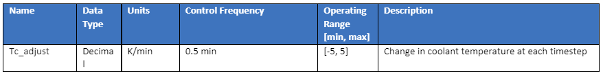

During machine teaching experimentation, our brain trainer realized that the system learns better when asked to provide the adjustment of temperature from previous absolute value. Thus, our brain action won't be dTc, but Tc_adjust.

- Transformation on simulation at each time step: dTc = previous_dTc + Tc_adjust

The brain action can be accessed by clicking on the box at the bottom of our graph. As shown below, the control action is an output from the brain and input to the simulation.

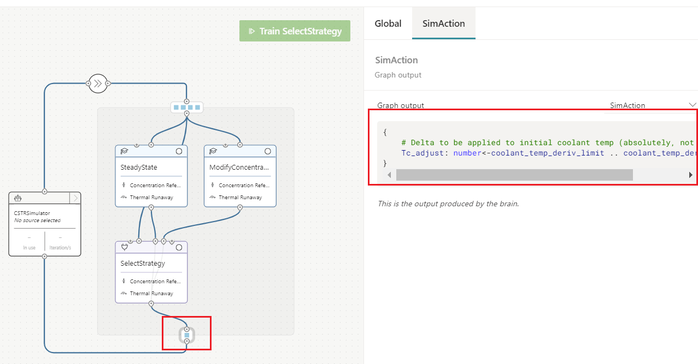

```Inkling
type SimAction {
    # Delta to be applied to initial coolant temp (absolutely, not per-iteration)
    Tc_adjust: number<-coolant_temp_deriv_limit .. coolant_temp_deriv_limit>
}
```

### Goals/Rewards

Goals consist of the learning objectives that any successful control strategy must meet. Goals are found in the CSTR AI Specification document and summarized as:

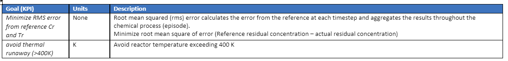

The goal is expressed with two goal objectives, same for both concepts.

1. Keep the concentration as close to the target as possible: **minimize** the difference between the current concentration (Cr) and the target concentration (Cref).
2. Don't let the reactor temperature exceed 400 K: **avoid** the current temperature of the reactor (Tr) exceed 400 K.

You can see in the figures below the goals for the three concepts we have in our modular brain: each one of the two concepts, and the selector. Additionally, we've highlighted the lessons (scenarios) each concept is presented with.


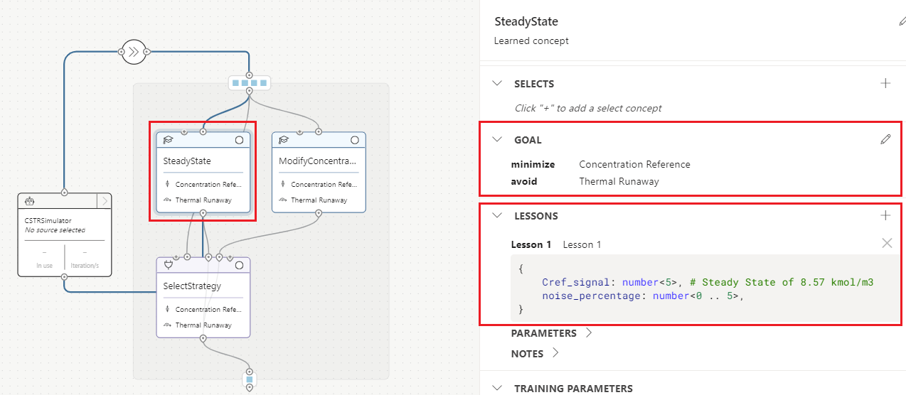

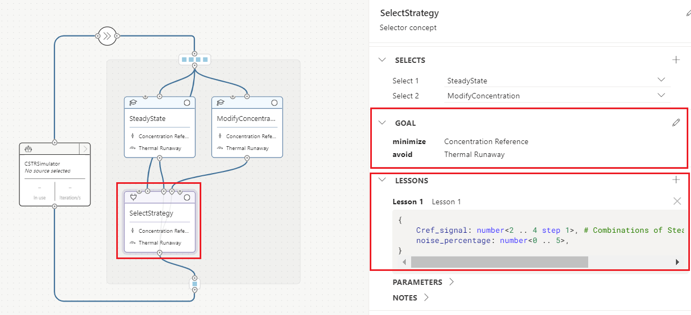

The inkling code associated with this is:

```Inkling
goal (State: SimState) {
                minimize `Concentration Reference` weight 1:
                    Math.Abs(State.Cref - State.Cr)
                    in Goal.RangeBelow(0.25)
                avoid `Thermal Runaway` weight 4:
                    Math.Abs(State.Tr)
                    in Goal.RangeAbove(400)
            }
```

You can see the ranges defined for each goal by clicking on the EDIT (pencil) button on any of the concepts.

Note that available goal objectives in Inkling include:

- [avoid](/bonsai/inkling/keywords/goal?tabs=avoid): Avoid a defined region.
- [drive](/bonsai/inkling/keywords/goal?tabs=drive): Get to a target as quickly as possible and stay near the target.
- [maximize](/bonsai/inkling/keywords/goal?tabs=max): Push a target value as high as possible within a given range.
- [minimize](/bonsai/inkling/keywords/goal?tabs=min): Push a target value as low as possible within a given range.
- [reach](/bonsai/inkling/keywords/goal?tabs=reach): Get to a target as quickly as possible.

### Simulation

The simulation models the real-world process and updates the environment states as the brain applies the control actions. Our simulation needs to have an initializer method to instance the simulation, a stepping method where the actions of the brain are applied to the system, and an episode reset method to allow the sim to stop the current episode and start a new one.

Episodes may end naturally once they reach the max episode length. Others might have to be abruptly interrupted after hitting a terminal condition such as thermal runaway. In both cases, we need to be able to reset into new episodes based on the scenario that the brain is being trained in. Thus, the simulation reset method must allow us to define the set of desired initial conditions for the concept being trained.

In Bonsai, the parameters that allow a brain to perform custom initialization of the conditions of the system are called configuration variables. The CSTR simulation has the following config parameters that can be used to customize the reset of the simulation for each concept:

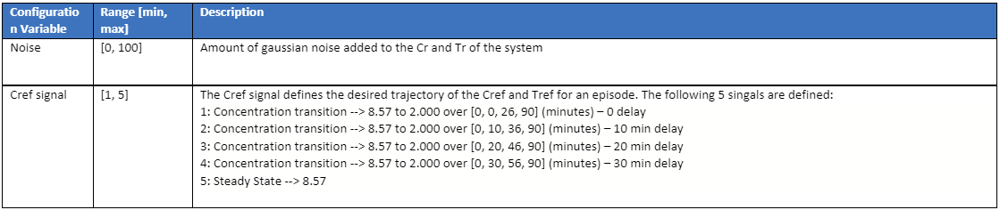

The simulation configuration is defined as shown below:

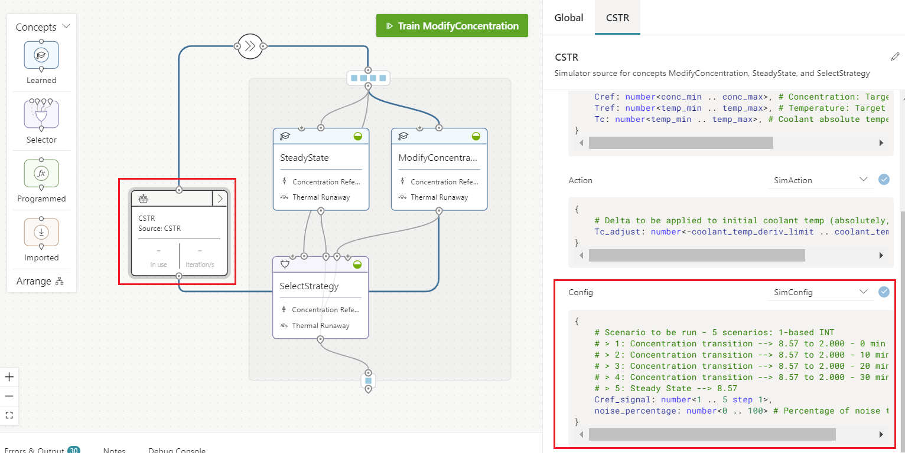

This is defined in Inkling as:

```Inkling
type SimConfig {
    # Scenario to be run - 5 scenarios: 1-based INT
    # > 1: Concentration transition --> 8.57 to 2.000 - 0 min delay
    # > 2: Concentration transition --> 8.57 to 2.000 - 10 min delay 
    # > 3: Concentration transition --> 8.57 to 2.000 - 20 min delay
    # > 4: Concentration transition --> 8.57 to 2.000 - 30 min delay
    # > 5: Steady State --> 8.57
    Cref_signal: number<1 .. 5 step 1>,
    noise_percentage: number<0 .. 100>  # Percentage of noise to include
}
```

- **noise_percentage**: the amount of gaussian noise added to the Tr and Cr states.
- **Cref_signal**: an episode start index that sets up the Cref setpoint evolution throughout the episode. Five signals are specified in the simulation to represent the different operation conditions of the reactor.
        - For example, a Cref_signal value of 5 is the steady state operating condition where Cref remains at 8.57 kmol/m^3 throughout the entire episode.
