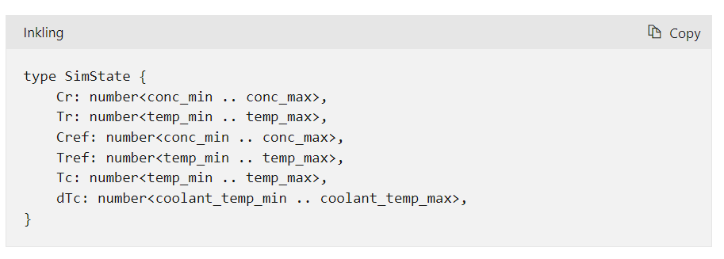
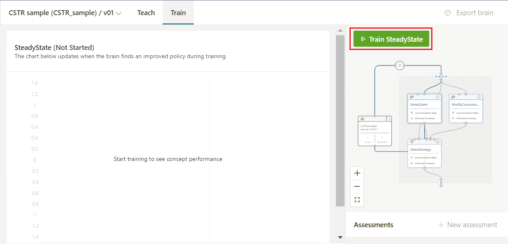
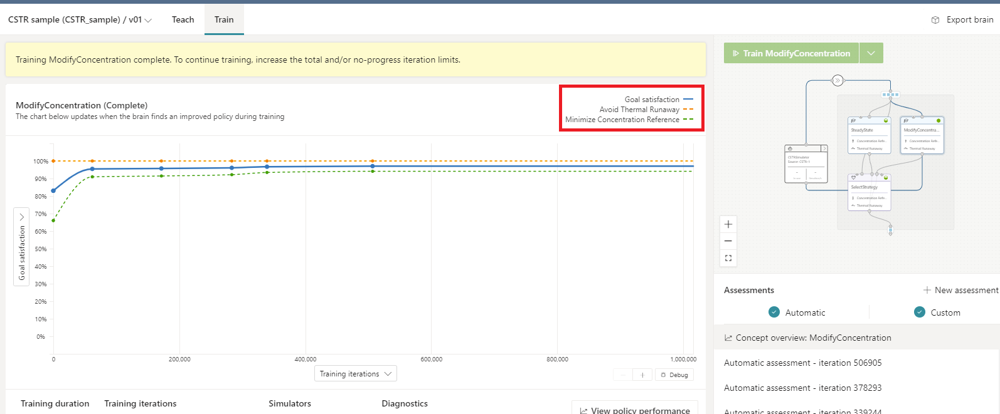
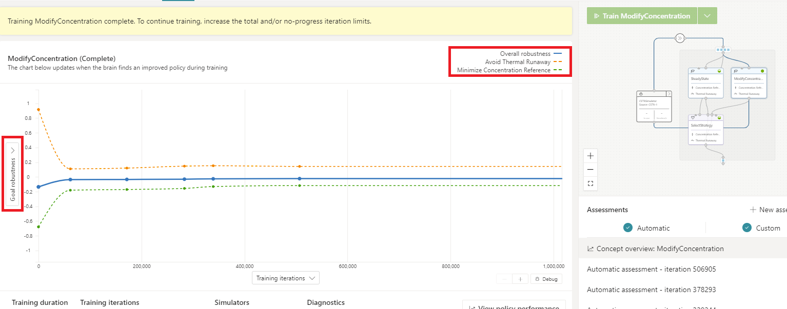

## Training environment

To prevent a thermal runaway, the brain manages the temperature of the coolant in the cooling jacket by raising or lowering the temperature in 30-second intervals (**d**). For the model, thermal runaway is defined as the reactor reaching or exceeding a temperature of 400 degrees Kelvin.

The model simulates the nonlinear process dynamics in 30-second time steps with formulas derived from Reynolds Transport Theorem for unsteady energy balance. Coolant temperature (**Tc**) must be rate limited to 10 degrees Kelvin per minute (5 degrees Kelvin per time step). As a result, the coolant temperature adjustment (**ΔT**, or **Tc_adjust**) is similarly rate limited such that the total change in coolant temperature across any two time steps doesn't exceed 5 degrees Kelvin.

To simplify the sample, the simulation also makes the following assumptions:

- The CSTR is perfectly mixed.
- The mass densities (**ρ**) of the feed and product streams are equal and constant.
- The liquid volume in the reactor (**V**) is kept constant with an overflow line.
- The thermal capacities of the coolant and cooling oil are negligible compared to the thermal capacitance of the liquid in the tank.
- The heat of mixing is negligible compared to the heat of the reaction.
- Shaft work and heat losses to the environment are negligible.
- The initial equilibrium of the coolant is 297.88 degrees Kelvin (**TcEQ(1) = 297.88** degrees Kelvin).

On every training iteration, Bonsai receives a SimState object from the simulation with the following state information:

- **Cr**: current effluent concentration in kmol/m^3 as indicated by reactor readings
- **Tr**: current internal temperature in Kelvin as indicated by reactor readings
- **Cref**: target concentration for the chemical reaction in kmol/m^3
- **Tref**: target temperature for the chemical reaction in Kelvin
- **Tc**: current absolute temperature of the coolant (**Tc = TcEQ + dTc**)
- **dTc**: current coolant temperature adjustment relative to coolant equilibrium (**dTc = dTc_prev + ΔTc**)

Note that the SimState is larger than the ObservableState described above. SimState often contains all the states a simulation computes during episode step based on the brain suggested action. Yet not all the states might be needed (or helpful) to learn how to control the environment. For the CSTR problem, we performed several training experiments until we tested that Tref & dTc weren't needed for effective brain training across the three concepts: Steady State, Modify Concentration, and Select Strategy.

## Training the Bonsai brain

After defining environment states, control actions, and simulation configurations and confirming that the training goals are correct, you can start to train your Brain. First, click on "**Train**” in the Bonsai UI.

Start to train each one of the concepts of the brain Modify Concentration, Steady State, Select Strategy, sequentially, one after the other. To train each concept will take some time. You won't be able to train SelectStrategy until both ModifyConcentration and SteadyState concepts have been fully trained.

If you expected the selector to be first, and not last, you aren't alone. Note, Bonsai displays selectors at the bottom mainly to mimic the training workflow. You can't train the selector if you haven’t first trained each of the concepts the selector depends on.

Moreover, by having the selector after each trained concept, we can add the actions computed by each selected concept as further states to the selector. Although this is commonly not needed/useful, it's good to have the option in case the upstream concepts are adding information or transformations to the input states.

When the brain is training, DRL algorithms practice over and over in simulation to learn what actions lead to achieve specific goals based on system conditions/states. You might have noticed that we didn’t define an AI (RL) algorithm to use for brain training. The Bonsai platform automatically chooses the ideal reinforcement learning algorithms based on how the problem is defined. Your job is to bring subject matter expertise and domain knowledge to teach the AI by decomposing the problem into tasks or modules and providing the appropriate lessons for the system to learn to perform optimally in any scenario.

During training, the chart will display the average performance of the brain from the automatic assessments (test episodes) that are run regularly. Automatic assessments evaluate brain performance without the exploratory actions used during training needed to fully explore the state-action space.

In the performance chart, you'll see the goal satisfaction increasing with the number of iterations.

Moreover, by clicking on the left label of the Goal Satisfaction graph, you can switch to the Goal Robustness plot. The chart shows how robust the learned policy is to the deviating values of the defined objectives. Goal robustness is a better criterion to evaluate brain training once you consistently meet 100% goal satisfaction for some of your objectives.

Goal robustness is an ever-increasing metric of continuous success. Even after reaching the desired target region of the environment state, the brain will try to continue improving by making the control more robust. Robustness is measured by having the brain learn to get further away from the boundaries of each goal objective.

