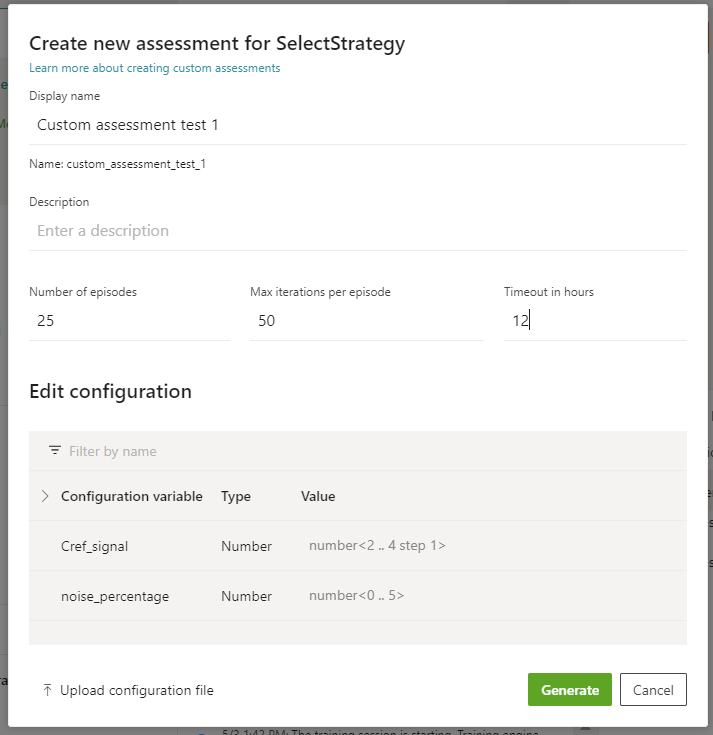
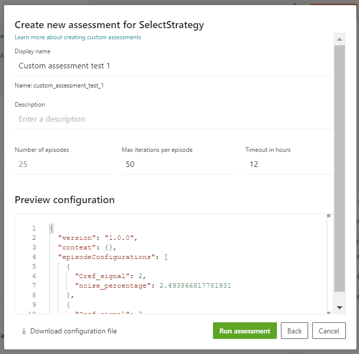
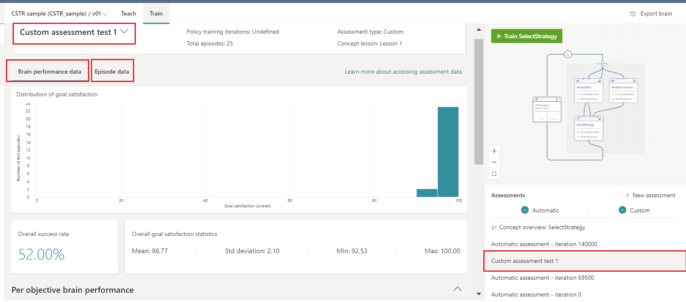
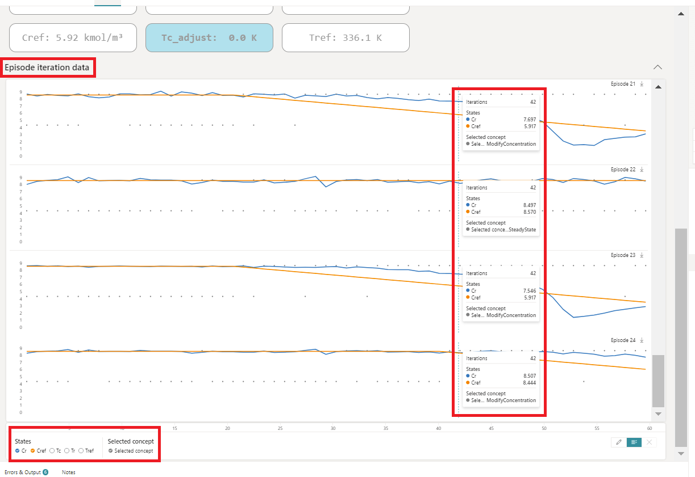

To see how the trained brain performs, we run assessments. An assessment will run a specified number of simulated operating conditions. 

## Start an assessment with Bonsai UI

### Step 1: Generate an assessment configuration file

Use the Bonsai UI to create an assessment configuration file.

1. Select the concept that you want to evaluate, for example Select Strategy concept.
2. Select the **+ New assessment** button in the assessment panel in Bonsai Train UI.
3. Set the number of episodes for your assessment, for example 25.
4. Specify a value, set of values, or value range for any configurable variables you want to constrain using Inkling syntax.
5. Select **Generate** to create an assessment configuration file.

    

6. It will generate a random configuration file for you. Review the generated JSON assessment episode configurations.

### Step 2: Run assessment with the Bonsai UI

When the JSON file looks correct, click **Run assessment** to start the assessment. Assessment automatically starts with the simulator package defined in your Inkling file.

# Evaluate assessment results

After your assessment run has completed, you can review a variety of metrics in assessment UI.

While the assessment episodes are running, you can view the real time results. The picture below displays the concentration, reactor temperature, and selected concept. The episodic data displayed below can be found within the “Episode Data” tab, after clicking on the Custom Assessment you just run.

From the episode data iteration, you view the selected concept that gives you transparency into the decisions the brain is making. You can see that during the steady states, when the concentration is constant, the brain selects the **SteadyState** concept. During the transient conditions, the brain selects the **ModifyConcentration** concept.

