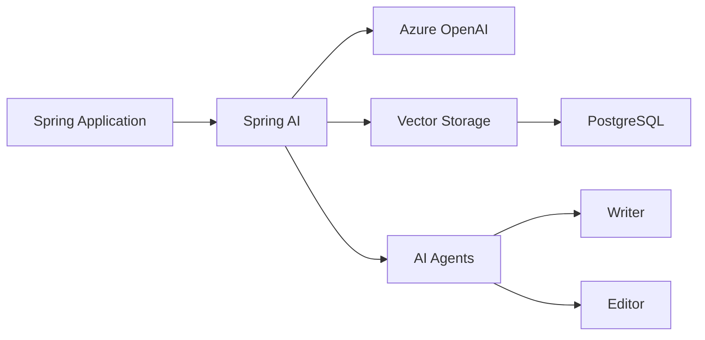

# Introduction to Spring AI and Azure OpenAI

Spring AI is a powerful framework that simplifies the integration of AI capabilities into Java applications. In this module, you'll learn how to build an AI-powered application using Spring AI with Azure OpenAI and deploy it to Azure Container Apps.

## What is Spring AI?

Spring AI provides a set of abstractions and tools that make it easy to work with various AI models and services:

- **ChatClient**: Core abstraction for interacting with Large Language Models (LLMs)
- **EmbeddingClient**: Generate vector embeddings for semantic search
- **Multi-provider support**: Works with various AI providers, including Azure OpenAI
- **Vector storage integration**: Built-in support for vector databases
- **AI Agent Patterns**: Advanced patterns like evaluator-optimizer for content refinement
  - Writer agents for content generation
  - Editor agents for quality evaluation
  - Iterative feedback loops for improvement

## Sample Use Cases

### RAG Implementation
We'll build a Retrieval Augmented Generation (RAG) application that:
1. Converts user questions into vector embeddings
2. Finds similar previous Q&As using vector similarity search
3. Uses found Q&As as context for generating responses
4. Stores interactions for future reference

### AI Agent Patterns
We'll also explore advanced AI agent patterns like evaluator-optimizer that:
1. Uses multiple AI roles (writer and editor)
2. Implements feedback loops for content improvement
3. Demonstrates quality-driven content generation
4. Shows practical Azure OpenAI integration

## Why Azure OpenAI and Container Apps?

- **Azure OpenAI**: Secure, scalable AI model deployment with enterprise features
- **Azure Container Apps**: Serverless container hosting with auto-scaling
- **Azure PostgreSQL**: Managed database service with vector search capabilities

## Learning Objectives

After completing this module, you'll be able to:
- Understand Spring AI's core abstractions and Azure OpenAI integration
- Create and configure Azure PostgreSQL for vector storage
- Implement an end-to-end AI application with Spring AI
- Deploy and scale your application on Azure Container Apps

## Prerequisites

Before starting this module, you should have:
- Basic familiarity with Java and Spring Boot
- Experience with Git and Maven/Gradle
- An active Azure subscription
- Java 17 or later installed

Let's get started by setting up our development environment! 🚀
