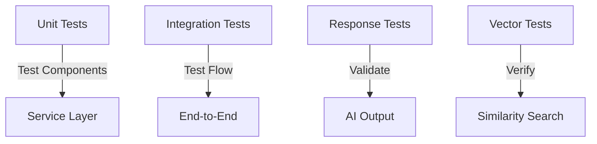

# Testing AI Responses

Learn how to test and evaluate your Spring AI application's responses for accuracy and reliability.

## Testing Strategy Overview



## Unit Testing Components

1. **Testing EmbeddingService**:
```java
@SpringBootTest
class EmbeddingServiceTest {
    @Autowired
    private EmbeddingService embeddingService;
    
    @Test
    void testEmbeddingGeneration() {
        String text = "Test input";
        double[] embedding = embeddingService.generateEmbedding(text);
        
        assertNotNull(embedding);
        assertEquals(1536, embedding.length);
    }
}
```

2. **Testing Vector Storage**:
```java
@SpringBootTest
class ChatHistoryRepositoryTest {
    @Autowired
    private ChatHistoryRepository repository;
    
    @Test
    void testSimilaritySearch() {
        double[] testEmbedding = new double[1536];
        List<ChatHistory> results = 
            repository.findNearestNeighbors(testEmbedding, 3);
            
        assertNotNull(results);
        assertTrue(results.size() <= 3);
    }
}
```

## Integration Testing

1. **Testing RAG Flow**:
```java
@SpringBootTest
class RagServiceIntegrationTest {
    @Autowired
    private RagService ragService;
    
    @Test
    void testCompleteRagFlow() {
        String query = "What is Spring AI?";
        String response = ragService.processQuery(query);
        
        assertNotNull(response);
        assertTrue(response.contains("Spring AI"));
    }
}
```

## Testing AI Agent Patterns

When testing multi-agent patterns like evaluator-optimizer:

1. **Mock Agent Responses**:
```java
@Test
void testBlogWriterService() {
    when(chatClient.call(any()))
        .thenReturn(new ChatResponse("Initial draft"))
        .thenReturn(new ChatResponse("NEEDS_IMPROVEMENT"))
        .thenReturn(new ChatResponse("Improved draft"));
        
    String result = blogWriterService.generateBlogPost("Test");
    assertEquals("Improved draft", result);
}
```

2. **Verify Agent Interactions**:
- Check writer generates initial content
- Verify editor provides feedback
- Ensure feedback loop completes
- Test maximum iterations limit

3. **Test Error Scenarios**:
```java
@Test
void testBlogWriterError() {
    when(chatClient.call(any()))
        .thenThrow(new RuntimeException("API Error"));
        
    assertThrows(RuntimeException.class, () ->
        blogWriterService.generateBlogPost("Test"));
}
```

4. **Test Maximum Iterations**:
```java
@Test
void testMaxIterations() {
    // Mock continuous improvement needed
    when(chatClient.call(any()))
        .thenReturn(new ChatResponse("Draft"))
        .thenReturn(new ChatResponse("NEEDS_IMPROVEMENT"))
        .thenReturn(new ChatResponse("Better Draft"))
        .thenReturn(new ChatResponse("NEEDS_IMPROVEMENT"))
        .thenReturn(new ChatResponse("Final Draft"));
        
    String result = blogWriterService.generateBlogPost("Test");
    
    // Verify we don't exceed MAX_ITERATIONS (3)
    verify(chatClient, times(5)).call(any());
    assertNotNull(result);
}
```

## Response Evaluation

1. **Content Validation**:
```java
@Test
void testResponseQuality() {
    String query = "Explain Spring AI";
    String response = ragService.processQuery(query);
    
    // Check for key concepts
    assertTrue(response.contains("framework"));
    assertTrue(response.contains("AI"));
    assertTrue(response.contains("integration"));
}
```

2. **Structure Validation**:
```java
@Test
void testJsonResponse() {
    String query = "List Spring AI features in JSON";
    String response = ragService.processQuery(query);
    
    // Verify JSON structure
    ObjectMapper mapper = new ObjectMapper();
    JsonNode json = mapper.readTree(response);
    assertTrue(json.has("features"));
}
```

## Performance Testing

1. **Response Time**:
```java
@Test
void testResponseTime() {
    String query = "Quick test";
    long start = System.currentTimeMillis();
    
    ragService.processQuery(query);
    
    long duration = System.currentTimeMillis() - start;
    assertTrue(duration < 5000); // 5s threshold
}
```

2. **Concurrent Requests**:
```java
@Test
void testConcurrentRequeries() {
    int threadCount = 10;
    ExecutorService executor = 
        Executors.newFixedThreadPool(threadCount);
        
    List<Future<String>> futures = new ArrayList<>();
    
    for (int i = 0; i < threadCount; i++) {
        futures.add(executor.submit(() -> 
            ragService.processQuery("Test query")));
    }
    
    // Verify all requests complete successfully
    futures.forEach(f -> assertNotNull(f.get()));
}
```

## Best Practices

1. **Test Data Management**
   - Use consistent test data
   - Clean up after tests
   - Mock external services when appropriate

2. **Response Validation**
   - Check for expected content
   - Validate response structure
   - Monitor response times

3. **Error Handling**
   - Test error scenarios
   - Verify error messages
   - Check recovery behavior

## Monitoring Test Results

1. **Test Reports**:
```xml
<plugin>
    <groupId>org.apache.maven.plugins</groupId>
    <artifactId>maven-surefire-report-plugin</artifactId>
    <version>3.2.1</version>
</plugin>
```

2. **Coverage Reports**:
```xml
<plugin>
    <groupId>org.jacoco</groupId>
    <artifactId>jacoco-maven-plugin</artifactId>
    <version>0.8.11</version>
</plugin>
```

## Next Steps

After implementing tests:
1. Set up continuous integration
2. Configure test automation
3. Monitor test metrics

🧪 Pro tip: Always test edge cases and error scenarios!
