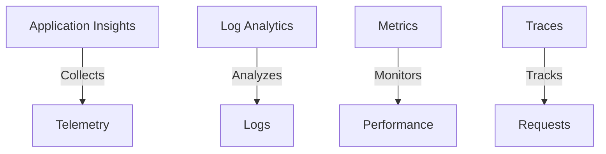

# Implementing Observability

Learn how to monitor and troubleshoot your Spring AI application using Azure's observability tools.

## Observability Components



## Application Insights Setup

1. **Add Dependencies**:
```xml
<dependency>
    <groupId>org.springframework.boot</groupId>
    <artifactId>spring-boot-starter-actuator</artifactId>
</dependency>
<dependency>
    <groupId>com.microsoft.azure</groupId>
    <artifactId>applicationinsights-spring-boot-starter</artifactId>
    <version>2.6.4</version>
</dependency>
```

2. **Configure Properties**:
```properties
# Application Insights
applicationinsights.connection.string=${APPLICATIONINSIGHTS_CONNECTION_STRING}
management.endpoints.web.exposure.include=health,metrics,prometheus
```

## Logging Configuration

1. **Structured Logging**:
```java
@Slf4j
public class RagService {
    public String processQuery(String query) {
        MDC.put("queryId", UUID.randomUUID().toString());
        log.info("Processing query: {}", query);
        try {
            // Process query
            return result;
        } finally {
            MDC.clear();
        }
    }
}
```

2. **Log Analytics Setup**:
```bash
az monitor log-analytics workspace create \
  --resource-group spring-ai-demo \
  --workspace-name spring-ai-logs
```

## Metrics Collection

1. **Custom Metrics**:
```java
@Component
public class AiMetrics {
    private final MeterRegistry registry;
    
    private final Counter queryCounter;
    private final Timer processingTime;
    
    public AiMetrics(MeterRegistry registry) {
        this.registry = registry;
        this.queryCounter = Counter.builder("ai.queries")
            .description("Number of AI queries")
            .register(registry);
        this.processingTime = Timer.builder("ai.processing.time")
            .description("Query processing time")
            .register(registry);
    }
}
```

2. **Usage in Service**:
```java
@Service
public class RagService {
    private final AiMetrics metrics;
    
    public String processQuery(String query) {
        return metrics.processingTime.record(() -> {
            metrics.queryCounter.increment();
            return processQueryInternal(query);
        });
    }
}
```

## Distributed Tracing

1. **Enable Tracing**:
```java
@Configuration
public class TracingConfig {
    @Bean
    public OpenTelemetry openTelemetry() {
        return OpenTelemetrySdk.builder()
            .setTracerProvider(tracerProvider())
            .buildAndRegisterGlobal();
    }
}
```

2. **Add Trace Context**:
```java
@Aspect
@Component
public class TracingAspect {
    @Around("execution(* com.example.*.service.*.*(..))")
    public Object traceMethod(ProceedingJoinPoint jp) 
        throws Throwable {
        Span span = tracer.spanBuilder(jp.getSignature().getName())
            .startSpan();
        try (Scope scope = span.makeCurrent()) {
            return jp.proceed();
        } finally {
            span.end();
        }
    }
}
```

## Monitoring Dashboards

Create custom dashboards in Azure Portal:
```json
{
  "properties": {
    "lenses": {
      "0": {
        "order": 0,
        "parts": {
          "0": {
            "position": {
              "x": 0,
              "y": 0,
              "colSpan": 6,
              "rowSpan": 4
            },
            "metadata": {
              "inputs": [
                {
                  "name": "metrics",
                  "value": "ai.queries,ai.processing.time"
                }
              ],
              "type": "Extension/Microsoft_OperationsManagementSuite_Workspace/PartType/LogsDashboardPart"
            }
          }
        }
      }
    }
  }
}
```

## Best Practices

1. **Logging**
   - Use structured logging
   - Include correlation IDs
   - Log appropriate levels

2. **Metrics**
   - Monitor key indicators
   - Set up alerts
   - Track SLOs

3. **Tracing**
   - Implement distributed tracing
   - Track external calls
   - Monitor latency

## Next Steps

After implementing observability:
1. Set up alerts
2. Create dashboards
3. Monitor application health

📊 Pro tip: Use correlation IDs to track requests across services!
