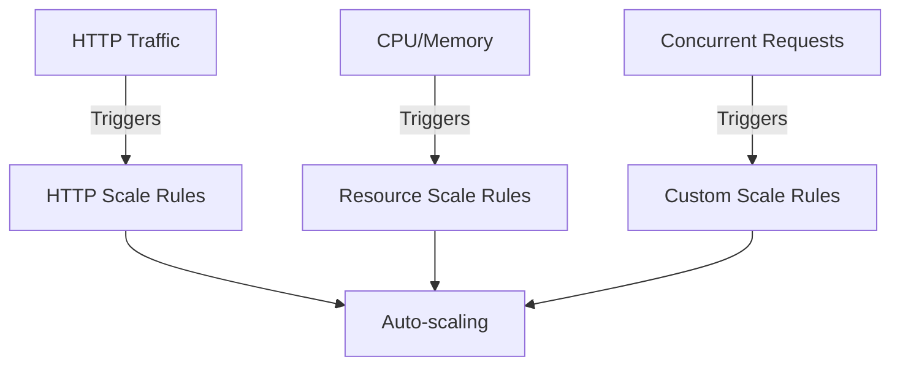

# Scaling Your Spring AI Application

Learn how to configure scaling rules and optimize performance in Azure Container Apps.

## Scaling Overview



## HTTP-based Scaling

1. **Configure HTTP Scaling**:
```bash
az containerapp update \
  --name spring-ai-app \
  --resource-group spring-ai-demo \
  --min-replicas 1 \
  --max-replicas 10 \
  --scale-rule-name http-rule \
  --scale-rule-type http \
  --scale-rule-http-concurrency 50
```

## Resource-based Scaling

1. **CPU/Memory Scaling**:
```bash
az containerapp update \
  --name spring-ai-app \
  --resource-group spring-ai-demo \
  --scale-rule-name cpu-rule \
  --scale-rule-type cpu \
  --scale-rule-cpu-threshold 70
```

## Application Configuration

1. **Resource Limits**:
```yaml
resources:
  requests:
    cpu: 0.5
    memory: 1Gi
  limits:
    cpu: 2.0
    memory: 4Gi
```

2. **Connection Pool Settings**:
```properties
# Database Connection Pool
spring.datasource.hikari.maximum-pool-size=20
spring.datasource.hikari.minimum-idle=5

# Azure OpenAI Client Configuration
spring.ai.azure.openai.client.max-connections=50
```

## Load Testing

1. **JMeter Test Plan**:
```xml
<?xml version="1.0" encoding="UTF-8"?>
<jmeterTestPlan version="1.2">
  <hashTree>
    <ThreadGroup>
      <elementProp name="ThreadGroup.main_controller">
        <stringProp name="LoopController.loops">100</stringProp>
        <stringProp name="ThreadGroup.num_threads">50</stringProp>
      </elementProp>
    </ThreadGroup>
  </hashTree>
</jmeterTestPlan>
```

## Performance Optimization

1. **Caching Configuration**:
```java
@Configuration
@EnableCaching
public class CacheConfig {
    @Bean
    public CacheManager cacheManager() {
        return new ConcurrentMapCacheManager("embeddings");
    }
}
```

2. **Service Implementation**:
```java
@Service
public class EmbeddingService {
    @Cacheable(value = "embeddings", key = "#text.hashCode()")
    public double[] generateEmbedding(String text) {
        // Embedding generation
    }
}
```

## Monitoring Scale Events

1. **Log Scale Events**:
```java
@Component
public class ScaleMonitor {
    private final Counter scaleEventCounter;
    
    public ScaleMonitor(MeterRegistry registry) {
        this.scaleEventCounter = Counter.builder("scale.events")
            .description("Number of scale events")
            .register(registry);
    }
}
```

## Best Practices

1. **Resource Management**
   - Set appropriate limits
   - Monitor resource usage
   - Configure graceful shutdown

2. **Connection Management**
   - Use connection pooling
   - Implement retry policies
   - Handle connection failures

3. **Performance Tuning**
   - Enable caching
   - Optimize queries
   - Monitor bottlenecks

## Scale Testing Scenarios

1. **Burst Traffic**:
```bash
hey -n 1000 -c 100 \
  -m POST -d '{"query":"test"}' \
  https://spring-ai-app.xxx.azurecontainerapps.io/ask
```

2. **Sustained Load**:
```bash
ab -n 10000 -c 20 \
  -p payload.json \
  https://spring-ai-app.xxx.azurecontainerapps.io/ask
```

## Next Steps

After configuring scaling:
1. Monitor performance
2. Adjust scale rules
3. Optimize resource usage

⚡ Pro tip: Always test scaling behavior before production deployment!
