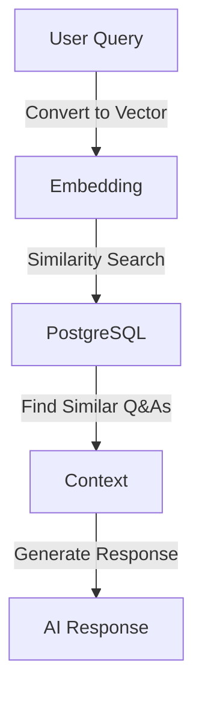

## What is Vector Search Similarity?

Vector Search Similarity is a technique used to find similar items in a dataset by comparing their vector representations. Vector similarity is commonly calculated using distance metrics, such as Euclidean distance or `cosine` similarity. In the context of AI and machine learning, vector representations (or embeddings) are numerical representations of data points, such as words, images, or user queries. These vectors capture the semantic meaning of the data points, allowing for efficient similarity searches.

For example, in a question-answering system, user queries can be converted into vector embeddings. These embeddings can then be compared to a database of precomputed embeddings of previous Q&As to find the most similar ones. This process is known as vector similarity search.

## What is the PGVector Extension?

**PGVector** is an extension for PostgreSQL that adds support for vector data types and operations. It allows you to store and query vector embeddings directly within a PostgreSQL database. With PGVector, you can perform efficient similarity searches using vector operations, making it an ideal choice for applications that require semantic search capabilities.

Key features of PGVector include:

- Support for vector data types
- Efficient indexing and querying of vector data
- Integration with PostgreSQL's existing features and extensions

## PGVector Extension in Azure PostgreSQL

The `pgvector` extension adds an open-source vector similarity search to PostgreSQL.

Before you can enable `pgvector` on your Azure Database for PostgreSQL flexible server instance, you need to add it to your allowlist as described in [how to use PostgreSQL extensions](https://learn.microsoft.com/azure/postgresql/extensions/how-to-allow-extensions#allow-extensions), and check if correctly added by running `SHOW azure.extensions;`.

> [!Important]
> Notice that although all PostgreSQL community tends to refer to this extension as `pgvector`, the name of the binary and the extension itself is simply `vector`. That is the name you must use to `allowlist` it or to create it PostgreSQL via the `CREATE EXTENSION` command.

Once the extension is whitelisted, you can install the extension by running the following SQL command:

   ```sql
   CREATE EXTENSION IF NOT EXISTS vector;
   ```

### PGVector Operations

The `pgvector` extension enables efficient similarity search:

```sql
SELECT id, prompt, response
FROM chat_history
ORDER BY embedding <-> '[0.1,0.2,...]'::vector
LIMIT 3;
```



## Implementing PGVector with Spring AI

Spring AI include an abstraction of `pvector` named `VectorStore`. This implementation requires 2 additional PostgreSQL extensions: `hstore` and `uuid-ossp`.

On startup Spring Boot will install the required extensions and create the required `vector_store` table with an index if not existing.

## Unit Summary

Vector Search Similarity and the PGVector extension provide powerful capabilities for building AI-powered applications that require semantic search functionality. By leveraging these tools in Azure PostgreSQL, you can efficiently store, index, and query vector embeddings, enabling advanced search and retrieval features in your applications.

In the next unit, you will perform the steps to create and configure a PosgreSQL database, enable the `pgvector` extension and create required tables for use with Spring AI.
