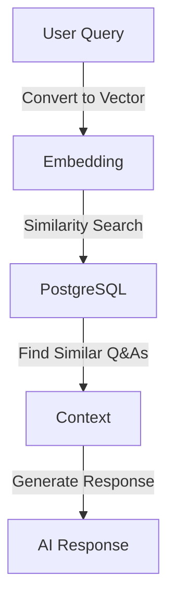

# Setting Up Azure PostgreSQL with Vector Support

Azure Database for PostgreSQL Flexible Server provides a managed database service that we'll use for vector storage in our RAG application.

## Creating a PostgreSQL Flexible Server

1. **Create the Server**
   ```bash
   az postgres flexible-server create \
     --name spring-ai-db \
     --resource-group spring-ai-demo \
     --location eastus \
     --admin-user springadmin \
     --admin-password "YourSecurePassword123!" \
     --sku-name Standard_B1ms \
     --version 15
   ```

2. **Enable Public Access** (for development)
   ```bash
   az postgres flexible-server firewall-rule create \
     --name allip \
     --resource-group spring-ai-demo \
     --server-name spring-ai-db \
     --start-ip-address 0.0.0.0 \
     --end-ip-address 255.255.255.255
   ```

## Installing pgvector Extension

1. **Connect to your database**
   ```bash
   psql "host=spring-ai-db.postgres.database.azure.com \
         port=5432 \
         dbname=postgres \
         user=springadmin \
         password=YourSecurePassword123! \
         sslmode=require"
   ```

2. **Create pgvector extension**
   ```sql
   CREATE EXTENSION IF NOT EXISTS vector;
   ```

## Creating Database Schema

Our application needs a table to store chat history with vector embeddings:

```sql
CREATE TABLE IF NOT EXISTS chat_history (
    id SERIAL PRIMARY KEY,
    prompt TEXT NOT NULL,
    response TEXT NOT NULL,
    embedding TEXT NOT NULL,
    created_at TIMESTAMP WITH TIME ZONE DEFAULT CURRENT_TIMESTAMP
);
```

## Spring Configuration

Configure your application.properties:

```properties
# Database Configuration
spring.datasource.url=jdbc:postgresql://spring-ai-db.postgres.database.azure.com:5432/postgres
spring.datasource.username=springadmin
spring.datasource.password=YourSecurePassword123!
spring.datasource.driver-class-name=org.postgresql.Driver

# Initialize schema
spring.sql.init.mode=always
spring.sql.init.schema-locations=classpath:schema.sql
```

## Vector Operations

The pgvector extension enables efficient similarity search:

```sql
-- Example: Find similar vectors
SELECT id, prompt, response
FROM chat_history
ORDER BY embedding <-> '[0.1,0.2,...]'::vector
LIMIT 3;
```



## Security Best Practices

1. **Use Azure Key Vault** for storing credentials
2. **Enable SSL/TLS** for database connections
3. **Implement network security rules**
4. **Regular backup and monitoring**

## Next Steps

With our vector-enabled database ready, we can:
1. Implement vector storage in our Spring application
2. Test similarity search functionality
3. Build our RAG implementation

💡 Remember: Vector similarity search is crucial for finding relevant context in our RAG application!
