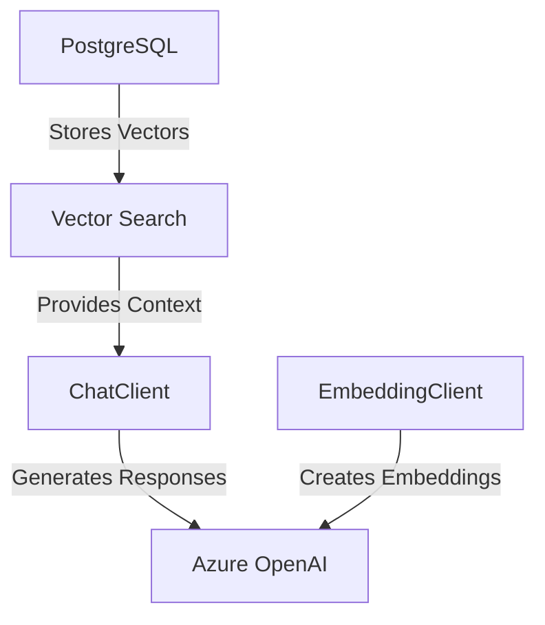

In this unit we will build a RAG (Retrieval Augmented Generation) application using Spring AI, Azure OpenAI and PGVectorStore.

## Core Components Overview



## Setting Up Your Development Environment

Before we start building our AI-powered application, let's set up our development environment and required Azure resources.

## Local Development Setup

1. Confirm **Java Development Kit (JDK) 17** (or greater) is installed:

   ```bash
   java -version  # Verify Java installation
   ```

2. Confirm **Maven** is installed:

   ```bash
   mvn -version  # Verify Maven installation
   ```

3. Login to **Azure** using `az`:

   ```azurecli
   az login  # Log in to Azure
   ```

## Install Spring Boot CLI

We will need the Spring Boot CLI to create a starter project. You can install the cli using any of the options listed [here](https://docs.spring.io/spring-boot/installing.html#getting-started.installing.cli). We will install it using the `SDKMAN` option.

Install `SDKMAN` using:

```bash
curl -s "https://get.sdkman.io" | bash
```

Install Spring Boot CLI using this command:

```bash
sdk install springboot
```

Type `spring` to verify it installed successfully:

```bash
spring
```

## Environment Variables Setup

For this exercise we will need to some environment variables from the prior exercise. Ensure these variables are still available, and if not, recreate them from the values used previously:

```bash
echo RESOURCE_GROUP: $RESOURCE_GROUP
echo LOCATION: $LOCATION
```

Additionally, export the following new variables needed for this lab:

```bash
OPENAI_RESOURCE_NAME=OpenAISpringAI
```

## Deploy Azure OpenAI Models

For our application, we first need to deploy one chat model (gpt-4o) and one embedding model (text-embedding-ada-002).
To deploy these models we first need to create an Azure OpenAI resource.

### Create Azure OpenAI Resource

We will create the Azure OpenAI resource using this Azure CLI commands:

```azurecli
az cognitiveservices account create \
  --name $OPENAI_RESOURCE_NAME \
  --resource-group $RESOURCE_GROUP \
  --kind OpenAI \
  --sku S0 \
  --location $LOCATION \
  --yes
```

### Deploy Azure OpenAI Chat Model

We will then deploy a chat model named `gpt-4o` using this command:

```azurecli
az cognitiveservices account deployment create \
  --name $OPENAI_RESOURCE_NAME \
  --resource-group $RESOURCE_GROUP \
  --deployment-name gpt-4o \
  --model-name gpt-4o \
  --model-version 2024-11-20 \
  --model-format OpenAI \
  --sku-capacity "15" \
  --sku-name GlobalStandard
```

### Deploy Azure OpenAI Embedding model

We will now deploy embedding model named `text-embedding-ada-002` using this command:

```azurecli
az cognitiveservices account deployment create \
  --name $OPENAI_RESOURCE_NAME \
  --resource-group $RESOURCE_GROUP \
  --deployment-name text-embedding-ada-002 \
  --model-name text-embedding-ada-002 \
  --model-version 2 \
  --model-format OpenAI \
  --sku-capacity 120 \
  --sku-name Standard
```

## Create Spring AI Application

Use the following maven command to generate a new Spring Boot starter project with all of the dependencies needed:

```bash
spring init \
    --groupId=com.example \
    --artifactId=spring-ai-app \
    --name=spring-ai-app \
    --description="Spring AI Azure Integration" \
    --version=0.0.1-SNAPSHOT \
    --boot-version=3.4.3 \
    --java-version=17 \
    --dependencies=web,jdbc,spring-shell,spring-ai-azure-openai,spring-ai-vectordb-pgvector,postgresql \
    --build=maven \
    --package-name=com.example.springaiapp \
    spring-ai-app
```

If successful, the command output should show:

```bash
Using service at https://start.spring.io
Project extracted to '/mnt/c/Users/user/source/repos/spring-ai-app'
```

Switch directory to this path:

```bash
cd spring-ai-app
```

You can compile the application, but only skipping tests using this command:

```bash
mvn clean package -DskipTests
```

Expect to see a successful build output:

```bash
[INFO] ------------------------------------------------------------------------
[INFO] BUILD SUCCESS
[INFO] ------------------------------------------------------------------------
[INFO] Total time:  25.392 s
[INFO] Finished at: 2025-03-02T15:53:07-05:00
[INFO] ------------------------------------------------------------------------
```

### Project Structure

From the `spring-ai-app` directory run these commands to create new directories for new source files to be added:

```bash
mkdir -p src/mainjava/com/example/springaiapp/config
mkdir -p src/mainjava/com/example/springaiapp/controller
mkdir -p src/main/java/com/example/springaiapp/service
mkdir -p src/main/java/com/example/springaiapp/shell
```

Inspect the code using Visual Studio Code or your favorite IDE. The starter code will include the following structure:

```txt
src/
├── main/
│   ├── java/
│   │   └── com/example/springaiapp/
│   │       ├── config/
│   │       ├── controller/
│   │       ├── service/
│   │       ├── shell/
│   │       └── SpringAiAppApplication.java
│   └── resources/
│       ├── application.properties
├── test/
│   ├── java/
│   │   └── com/example/springaiapp/
│   │       └── SpringAiAppApplicationTests.java
```

### Spring AI Configuration

Before we can run the application successfully, we need to add required configuration:

* Azure OpenAI Endpoint
* Azure OpenAI API Key
* PostgreSql URL

Retrieve the **Azure OpenAI Resource Endpoint** using this command:

```azcli
az cognitiveservices account show \
  --name $OPENAI_RESOURCE_NAME \
  --resource-group $RESOURCE_GROUP \
  --query "properties.endpoint" \
  --output tsv
```

Retrieve the **Azure OpenAI Resource Key** using this command:

```azcli
az cognitiveservices account keys list \
  --name $OPENAI_RESOURCE_NAME \
  --resource-group $RESOURCE_GROUP \
  --query "key1" \
  --output tsv
```

Additionally we need to provide the **PostgreSql URL**, which you can retrieve using command from prior exercise:

```azcli
az postgres flexible-server show --resource-group $RESOURCE_GROUP --name $DB_SERVER_NAME \
 --query fullyQualifiedDomainName --output tsv
```

### Update Azure OpenAI in application.properties

Locate and open the `application.properties` file in the `src/main/resources` directory and add the following properties replacing the values retrieved above:

```properties
# Azure OpenAI Configuration
spring.ai.azure.openai.api-key=<Azure OpenAI Key>
spring.ai.azure.openai.endpoint=<Azure OpenAI Endpoint>
spring.ai.azure.openai.chat.model=gpt-4o
spring.ai.azure.openai.embedding.model=text-embedding-ada-002

# Database Configuration
spring.datasource.url=jdbc:postgresql://<PostgreSql URL>/postgres
spring.datasource.username=AzureAdmin
spring.ai.vectorstore.pgvector.initialize-schema=true
spring.shell.interactive.enabled=true
spring.main.web-application-type=none
```

Once this is updated, you can now run unit tests to confirm that they are passing successfully:

```bash
mvn package
```

Expect to see unit tests passing and build success:

```bash
[INFO] Tests run: 1, Failures: 0, Errors: 0, Skipped: 0, Time elapsed: 45.23 s -- in com.example.springaiapp.SpringAiAppApplicationTests
[INFO]
[INFO] Results:
[INFO]
[INFO] Tests run: 1, Failures: 0, Errors: 0, Skipped: 0
```

### Implementing RAG Service

Within the `service` directory, create a new file name `RagService.java` with the following content:

```java
package com.example.springaiapp.service;

import org.slf4j.Logger;
import org.slf4j.LoggerFactory;
import org.springframework.ai.chat.client.ChatClient;
import org.springframework.ai.chat.model.ChatResponse;
import org.springframework.ai.vectorstore.VectorStore;
import org.springframework.ai.chat.messages.SystemMessage;
import org.springframework.ai.chat.messages.UserMessage;
import org.springframework.ai.vectorstore.SearchRequest;
import org.springframework.beans.factory.annotation.Autowired;
import org.springframework.stereotype.Service;
import org.springframework.ai.document.Document;
import java.util.List;
import java.util.Map;
import java.util.stream.Collectors;

/**
 * RAG (Retrieval Augmented Generation) Service
 */
@Service
public class RagService {
    private static final Logger logger = LoggerFactory.getLogger(RagService.class);
    
    private final ChatClient chatClient;

    @Autowired
    VectorStore vectorStore;
    
    public RagService(ChatClient.Builder chatClientBuilder) {
        this.chatClient = chatClientBuilder.build();
    }
    
    public String processQuery(String query) {
        try {
            logger.debug("Processing query: {}", query);
            // Step 1: Find similar previous Q&As
            List<Document> similarContexts = vectorStore.similaritySearch(
                SearchRequest.builder().query(query)
                    .similarityThreshold(0.8)
                    .topK(3).build());
            logger.debug("Found {} similar contexts", similarContexts.size());
            
            // Step 2: Build prompt with context from similar Q&As
            String context = similarContexts.stream()
                .map(ch -> String.format("Q: %s\nA: %s", 
                    ch.getMetadata().get("prompt"), ch.getText()))
                .collect(Collectors.joining("\n\n"));

            String promptText = String.format("""
                Use these previous Q&A pairs as context for answering the new question:
                
                Previous interactions:
                %s
                
                New question: %s
                
                Please provide a clear and educational response.""",
                context,
                query
            );

            // Step 3: Generate AI response with system context
            SystemMessage systemMessage = new SystemMessage(
                "You are a helpful AI assistant that provides clear and educational responses."
            );
            UserMessage userMessage = new UserMessage(promptText);
            
            logger.debug("Sending prompt to Azure OpenAI");
            ChatResponse response = chatClient.prompt().messages(List.of(systemMessage, userMessage)).call().chatResponse();
            String answer = response.getResult().getOutput().getText();
            logger.debug("Received response of {} characters", answer.length());
            
            // Step 4: Save interaction for future context
            logger.debug("Saving interaction to vector store");
            vectorStore.add(List.of(new Document(answer, Map.of("prompt", query))));
            logger.debug("Successfully saved interaction");
            
            return answer;
        } catch (Exception e) {
            logger.error("Error processing query: {}", query, e);
            String errorMessage = String.format(
                "Error processing query: %s",
                e.getMessage()
            );
            return errorMessage;
        }
    }
}
```

Within the `config` directory, create a new file name `DataSourceConfig.java` with the following content:

```java
package com.example.springaiapp.config;

import com.azure.identity.DefaultAzureCredentialBuilder;
import com.azure.identity.DefaultAzureCredential;
import org.springframework.beans.factory.annotation.Value;
import com.azure.core.credential.TokenRequestContext;
import org.springframework.context.annotation.Bean;
import org.springframework.context.annotation.Configuration;
import org.springframework.jdbc.datasource.DriverManagerDataSource;

import javax.sql.DataSource;

@Configuration
public class DataSourceConfig {

    @Value("${spring.datasource.url}")
    private String dbUrl;

    @Value("${spring.datasource.username}")
    private String dbUsername;

    @Bean
    public DataSource dataSource() {
        DefaultAzureCredential credential = new DefaultAzureCredentialBuilder().build();
        String accessToken = credential.getToken(new TokenRequestContext().addScopes("https://ossrdbms-aad.database.windows.net")).block().getToken();
        DriverManagerDataSource dataSource = new DriverManagerDataSource();
        dataSource.setDriverClassName("org.postgresql.Driver");
        dataSource.setUrl(dbUrl);
        dataSource.setUsername(dbUsername);
        dataSource.setPassword(accessToken);
        return dataSource;
    }
}
```

Within the `shell` directory, create a new file name `RagDemoCommands.java` with the following content:

```java
package com.example.springaiapp.shell;

import com.example.springaiapp.service.RagService;

import org.springframework.beans.factory.annotation.Autowired;
import org.springframework.shell.standard.ShellComponent;
import org.springframework.shell.standard.ShellMethod;
import org.springframework.shell.standard.ShellOption;

/**
 * Console commands for the RAG (Retrieval Augmented Generation) demo.
 */
@ShellComponent
public class RagDemoCommands {
    @Autowired
    private RagService ragService;
    /**
     * Main command to ask questions using RAG.
     * Example: ask "What is Spring AI?"
     */
    @ShellMethod(key = "ask", value = "Ask a question using RAG")
    public String ask(@ShellOption(help = "Your question") String question) {
        return ragService.processQuery(question);
    }
}
```

With these changes we are now ready to test the implementation by running:

```bash
mvn spring-boot:run
```

When prompted ask a question using the ask command about `PGVector`:

```bash
shell:>ask "What is PGVector?"
PGVector is an open-source PostgreSQL extension that enables efficient storage, indexing, and querying of vector embeddings within a PostgreSQL database. 
```

Next, use the ask command to ask this question: `ask "How does QuestionAnswerAdvisor work in Apring AI?"`:

```bash
shell:>ask "How does QuestionAnswerAdvisor work in Spring AI?"
"QuestionAnswerAdvisor" does not appear to be an officially recognized or widely known term or feature within the Spring Framework or AI ecosystem (as of my knowledge cutoff in 2023).
```

Notice how it does not know about the `QuestionAnswerAdvisor` in Spring AI yet.

We will now provide additional knowledge by providing the following documents to be stored using our vector store:

```java

```


## Unit Summary

With our Spring AI implementation complete, we can next:
1. Deploy to Azure Container Apps
2. Set up monitoring and logging
3. Configure auto-scaling

🚀 Pro tip: Test your implementation thoroughly with various query types before deployment!
