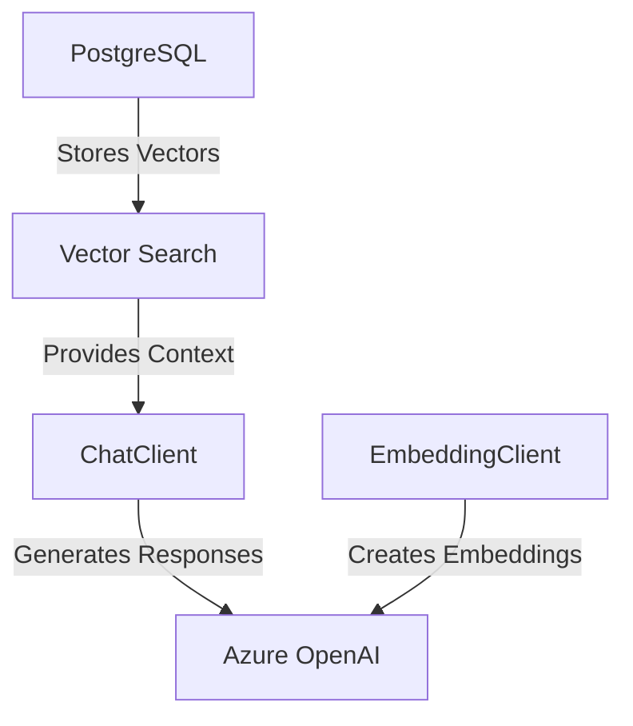
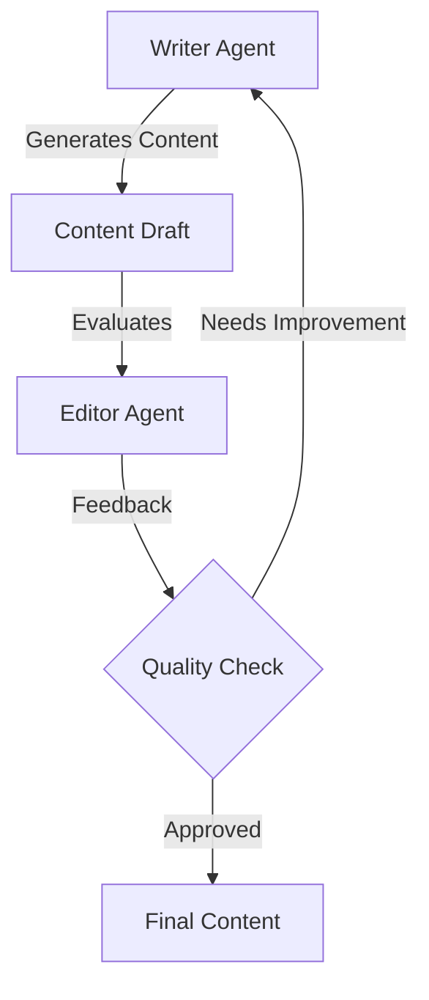

In this unit we will build a RAG (Retrieval Augmented Generation) application using Spring AI, Azure OpenAI and PGVectorStore.

## Core Components Overview



## Setting Up Your Development Environment

Before we start building our AI-powered application, let's set up our development environment and required Azure resources.

## Local Development Setup

1. Confirm **Java Development Kit (JDK) 17** (or greater) is installed:

   ```bash
   java -version  # Verify Java installation
   ```

2. Confirm **Maven** is installed:

   ```bash
   mvn -version  # Verify Maven installation
   ```

3. Login to **Azure** using `az`:

   ```bash
   az login  # Log in to Azure
   ```

## Deploy Azure OpenAI Models

1. **Deploy Azure OpenAI Models**
   - Deploy a chat model (e.g., gpt-35-turbo)
   - Deploy an embedding model (e.g., text-embedding-ada-002)

## Spring AI Configuration

1. **Configure Azure OpenAI in application.properties**:

```properties
spring.ai.azure.openai.api-key=${AZURE_OPENAI_API_KEY}
spring.ai.azure.openai.endpoint=${AZURE_OPENAI_ENDPOINT}
spring.ai.azure.openai.chat.model=gpt-35-turbo
spring.ai.azure.openai.embedding.model=text-embedding-ada-002
```

2. **Create ChatClient Bean**:
```java
@Configuration
public class AiConfig {
    @Bean
    public ChatClient azureOpenAiChatClient(
            AzureOpenAiChatProperties properties) {
        return new AzureOpenAiChatClient(properties);
    }
}
```

## Implementing RAG Service

1. **EmbeddingService for Vector Generation**:
```java
@Service
public class EmbeddingService {
    private final EmbeddingClient embeddingClient;
    
    public double[] generateEmbedding(String text) {
        Document document = new Document(text);
        List<Double> embedding = embeddingClient.embed(document);
        return embedding.stream()
                       .mapToDouble(Double::doubleValue)
                       .toArray();
    }
}
```

2. **ChatHistory Model**:
```java
public class ChatHistory {
    private Long id;
    private String prompt;
    private String response;
    private double[] embedding;
    
    // Getters, setters, and constructors
}
```

3. **RagService Implementation**:
```java
@Service
public class RagService {
    private final ChatClient chatClient;
    private final EmbeddingService embeddingService;
    private final ChatHistoryRepository repository;
    
    public String processQuery(String query) {
        // 1. Generate embedding
        double[] queryEmbedding = 
            embeddingService.generateEmbedding(query);
        
        // 2. Find similar contexts
        List<ChatHistory> similarContexts = 
            repository.findNearestNeighbors(queryEmbedding, 3);
        
        // 3. Build prompt with context
        String context = buildContext(similarContexts);
        
        // 4. Generate AI response
        ChatResponse response = chatClient.call(
            buildPrompt(query, context));
        
        // 5. Save interaction
        repository.save(new ChatHistory(
            query, 
            response.getResult().getOutput().getContent(), 
            queryEmbedding));
            
        return response.getResult().getOutput().getContent();
    }
}
```

## Testing the Implementation

1. **Create a Test Query**:
```java
@SpringBootTest
class RagServiceTest {
    @Autowired
    private RagService ragService;
    
    @Test
    void testQueryProcessing() {
        String response = ragService.processQuery(
            "What is Spring AI?");
        assertNotNull(response);
    }
}
```

## Error Handling and Logging

Add comprehensive error handling:
```java
try {
    // AI operations
} catch (Exception e) {
    log.error("Error in AI processing: {}", e.getMessage());
    throw new AiProcessingException(
        "Failed to process query", e);
}
```

## Advanced AI Agent Patterns

Spring AI supports sophisticated AI agent patterns like the evaluator-optimizer pattern, which uses multiple AI roles to improve content quality through iterative feedback loops.



### Evaluator-Optimizer Implementation

The pattern uses two AI roles:
1. Writer: Generates and refines content
2. Editor: Evaluates quality and provides feedback

Example implementation:
```java
@Service
public class BlogWriterService {
    private final ChatClient chatClient;
    private static final int MAX_ITERATIONS = 3;
    
    public String generateBlogPost(String topic) {
        // Writer: Generate initial draft
        String initialPrompt = String.format(
            "Write a blog post about \"%s\"", topic);
        String draft = chatClient.call(new Prompt(initialPrompt))
            .getResult().getOutput().getContent();
            
        // Enter evaluator-optimizer loop
        int iteration = 1;
        boolean approved = false;
        
        while (!approved && iteration <= MAX_ITERATIONS) {
            // Editor: Evaluate the draft
            String evalPrompt = String.format(
                "Evaluate this blog post and respond with PASS " +
                "or NEEDS_IMPROVEMENT with feedback:\n%s", draft);
            String evaluation = chatClient.call(new Prompt(evalPrompt))
                .getResult().getOutput().getContent();
                
            if (evaluation.contains("PASS")) {
                approved = true;
            } else {
                // Writer: Refine based on feedback
                String refinePrompt = String.format(
                    "Improve this post using feedback:\n%s\n\n%s",
                    evaluation, draft);
                draft = chatClient.call(new Prompt(refinePrompt))
                    .getResult().getOutput().getContent();
            }
            iteration++;
        }
        return draft;
    }
}
```

### Shell Command Interface

Access the pattern through Spring Shell:
```java
@ShellComponent
public class BlogWriterCommand {
    @ShellMethod(key = "write-blog",
        value = "Generate a blog post using AI writer-editor feedback loop")
    public String writeBlog(String topic) {
        return blogWriterService.generateBlogPost(topic);
    }
}
```

### Configuration

Configure Azure OpenAI settings in `application.properties`:
```properties
spring.ai.azure.openai.api-key=${AZURE_OPENAI_API_KEY}
spring.ai.azure.openai.endpoint=${AZURE_OPENAI_ENDPOINT}
spring.ai.azure.openai.chat.model=gpt-35-turbo
```
```

## Best Practices

1. **Prompt Engineering**
   - Use clear system messages
   - Include relevant context
   - Structure prompts consistently

2. **Vector Operations**
   - Cache embeddings when possible
   - Use appropriate vector dimensions
   - Implement similarity thresholds

3. **Performance Optimization**
   - Configure connection pooling
   - Implement caching strategies
   - Monitor API usage

## Next Steps

With our Spring AI implementation complete, we can:
1. Deploy to Azure Container Apps
2. Set up monitoring and logging
3. Configure auto-scaling

🚀 Pro tip: Test your implementation thoroughly with various query types before deployment!
