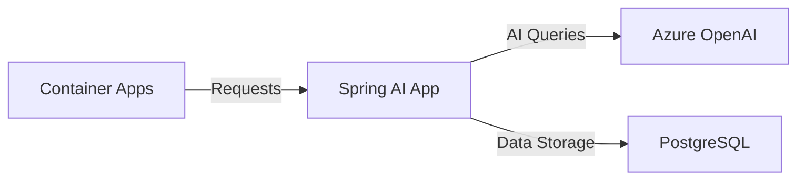

In this unit we deploy our Spring AI application to Azure Container Apps for scalable and serverless container hosting.

## Azure Container Apps Setup

Before we can deploy the Azure Container App, we need to run some `az` CLI commands to prepare the environment for deployment.

1. Because the option to deploy via artifact is currently in preview, you need to install the Container Apps extension with `--allow-preview true` (this command may take a few minutes to complete):

  ```azurecli
  az extension add --name containerapp --upgrade --allow-preview true
  ```

1. For this exercise, we need to some environment variables from the prior exercise. Ensure these variables are still available in your terminal session, and if not, recreate them from the values used previously:

  ```bash
  echo "RESOURCE_GROUP: $RESOURCE_GROUP LOCATION: $LOCATION"
  ```

1. Next we need some new variables specific to the Container App environment, API name and the Subscription value:

  ```bash
  ENVIRONMENT="env-spring-ai-containerapps"
  API_NAME="rag-api"
  SUBSCRIPTION=$(az account show --query 'id' --output tsv)
  echo "SUBSCRIPTION: $SUBSCRIPTION"
  ```

## Deploy Azure Container Application

Rebuild the application to generate the deployable JAR (Java Archive) file:

```bash
mvn clean package -DskipTests
```

The `jar` file will be created within the `target` directory with this name: `spring-ai-app-0.0.1-SNAPSHOT.jar`. Take a note of that file path, proceed to deploy the application using this command:

```azurecli
az containerapp up --name $API_NAME \
  --resource-group $RESOURCE_GROUP \
  --location $LOCATION \
  --environment $ENVIRONMENT \
  --artifact ./target/spring-ai-app-0.0.1-SNAPSHOT.jar --ingress external --target-port 8080 --subscription $SUBSCRIPTION
```

1. **Create Container Apps Environment**:
```bash
az containerapp env create \
  --name spring-ai-env \
  --resource-group spring-ai-demo \
  --location eastus
```

2. **Deploy Application**:
```bash
az containerapp up \
  --name spring-ai-app \
  --resource-group spring-ai-demo \
  --environment spring-ai-env \
  --source . \
  --target-port 8080 \
  --ingress external
```

## Environment Configuration

Set environment variables:
```bash
az containerapp secret set \
  --name spring-ai-app \
  --resource-group spring-ai-demo \
  --secrets \
    openai-key=$AZURE_OPENAI_API_KEY \
    db-password="YourSecurePassword123!"

az containerapp update \
  --name spring-ai-app \
  --resource-group spring-ai-demo \
  --set-env-vars \
    AZURE_OPENAI_API_KEY=secretref:openai-key \
    SPRING_DATASOURCE_PASSWORD=secretref:db-password
```

## Deployment Architecture



## Verify Deployment

1. **Get Application URL**:
```bash
az containerapp show \
  --name spring-ai-app \
  --resource-group spring-ai-demo \
  --query properties.configuration.ingress.fqdn
```

2. **Test Endpoint**:
```bash
curl -X POST https://spring-ai-app.xxx.azurecontainerapps.io/ask \
  -H "Content-Type: application/json" \
  -d '{"query":"What is Spring AI?"}'
```

## Cleanup

Remove resources when done:
```bash
az group delete \
  --name spring-ai-demo \
  --yes --no-wait
```

## Best Practices

1. **Security**
   - Use managed identities
   - Store secrets in Key Vault
   - Enable HTTPS only

2. **Monitoring**
   - Set up Application Insights
   - Configure logging
   - Monitor resource usage

3. **Scaling**
   - Configure auto-scaling rules
   - Set resource limits
   - Monitor performance

🔐 Remember: Always use secure secrets management in production!

## Next Steps

Now that your application is deployed, let's:
1. Set up monitoring and observability
2. Configure scaling rules
3. Implement security best practices
