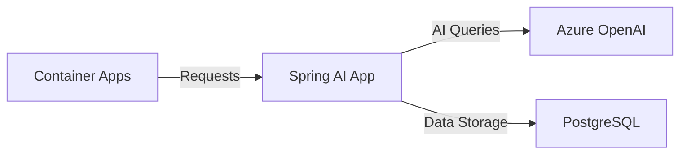

In this unit we deploy our Spring AI application to Azure Container Apps for scalable and serverless container hosting.

## Containerization

1. **Create Dockerfile**:
```dockerfile
FROM eclipse-temurin:17-jre
WORKDIR /app
COPY target/*.jar app.jar
ENTRYPOINT ["java", "-jar", "app.jar"]
```

2. **Build Application**:
```bash
mvn clean package
```

## Azure Container Apps Setup

1. **Create Container Apps Environment**:
```bash
az containerapp env create \
  --name spring-ai-env \
  --resource-group spring-ai-demo \
  --location eastus
```

2. **Deploy Application**:
```bash
az containerapp up \
  --name spring-ai-app \
  --resource-group spring-ai-demo \
  --environment spring-ai-env \
  --source . \
  --target-port 8080 \
  --ingress external
```

## Environment Configuration

Set environment variables:
```bash
az containerapp secret set \
  --name spring-ai-app \
  --resource-group spring-ai-demo \
  --secrets \
    openai-key=$AZURE_OPENAI_API_KEY \
    db-password="YourSecurePassword123!"

az containerapp update \
  --name spring-ai-app \
  --resource-group spring-ai-demo \
  --set-env-vars \
    AZURE_OPENAI_API_KEY=secretref:openai-key \
    SPRING_DATASOURCE_PASSWORD=secretref:db-password
```

## Deployment Architecture



## Verify Deployment

1. **Get Application URL**:
```bash
az containerapp show \
  --name spring-ai-app \
  --resource-group spring-ai-demo \
  --query properties.configuration.ingress.fqdn
```

2. **Test Endpoint**:
```bash
curl -X POST https://spring-ai-app.xxx.azurecontainerapps.io/ask \
  -H "Content-Type: application/json" \
  -d '{"query":"What is Spring AI?"}'
```

## Cleanup

Remove resources when done:
```bash
az group delete \
  --name spring-ai-demo \
  --yes --no-wait
```

## Best Practices

1. **Security**
   - Use managed identities
   - Store secrets in Key Vault
   - Enable HTTPS only

2. **Monitoring**
   - Set up Application Insights
   - Configure logging
   - Monitor resource usage

3. **Scaling**
   - Configure auto-scaling rules
   - Set resource limits
   - Monitor performance

🔐 Remember: Always use secure secrets management in production!

## Next Steps

Now that your application is deployed, let's:
1. Set up monitoring and observability
2. Configure scaling rules
3. Implement security best practices
