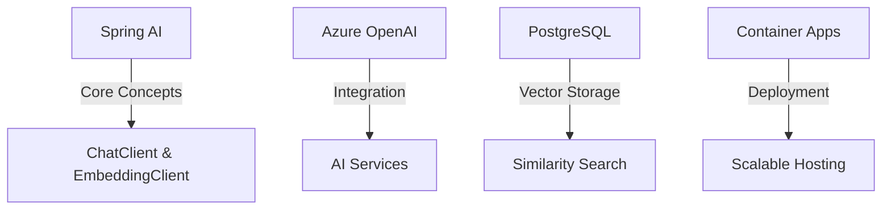

# Summary

Congratulations! You've completed this comprehensive module on building AI-powered applications with Spring AI and Azure. Let's review what you've learned.

## Key Takeaways



## What You've Learned

1. **Spring AI Fundamentals**
   - Core abstractions and components
   - Azure OpenAI integration
   - Vector operations and storage

2. **Azure Integration**
   - OpenAI service configuration
   - PostgreSQL with pgvector
   - Container Apps deployment

3. **Development Best Practices**
   - Testing strategies
   - Observability setup
   - Scaling configuration

## Next Steps

To continue your learning journey:

1. **Explore Advanced Topics**
   - Function calling with Spring AI
   - Advanced prompt engineering
   - Custom model deployment

2. **Build Real Applications**
   - Implement your own RAG system
   - Create AI-powered services
   - Deploy to production

3. **Join the Community**
   - Spring AI GitHub repository
   - Azure AI community
   - Developer forums

## Additional Resources

- [Spring AI Documentation](https://docs.spring.io/spring-ai/reference/)
- [Azure OpenAI Service](https://learn.microsoft.com/azure/cognitive-services/openai/)
- [Azure Container Apps](https://learn.microsoft.com/azure/container-apps/)
- [PostgreSQL Documentation](https://www.postgresql.org/docs/)

## Cleanup

Remember to clean up your Azure resources:
```bash
az group delete --name spring-ai-demo --yes --no-wait
```

🎉 Congratulations on completing this module! You're now ready to build sophisticated AI applications using Spring AI and Azure! 🚀
