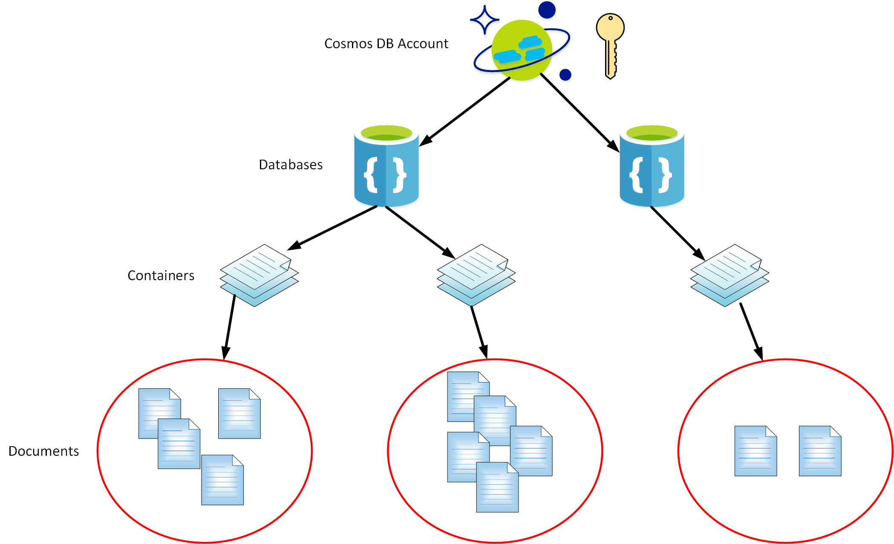
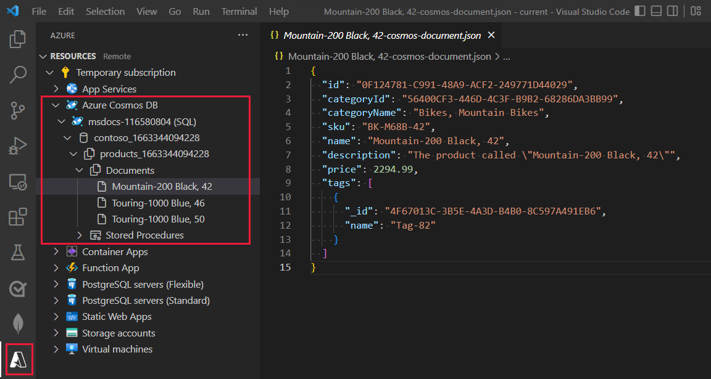

Cosmos DB is a multi-model, globally distributed, NoSQL based database service. It stores data as collections of schemaless documents. Cosmos DB enables you to distribute data globally, scale performance horizontally, and apply varying levels of consistency according to your organization's requirements. You can create and manage Cosmos DB databases using the Azure portal from a web browser, by writing your own applications, and from within tools such as Visual Studio Code.

In this unit, you'll learn more about how Cosmos DB organizes data, and how you can use Visual Studio Code to create and maintain Cosmos DB databases and collections.

## What is Cosmos DB?

Cosmos DB is a service that implements document databases. The data in a document must conform to JSON syntax. A JSON document can contain properties, subdocuments, and arrays of documents. The following example shows a JSON document that stores customer information, as part of a retail application. The **registeredAddress** property is an example of a subdocument:

```JSON
{
    customer: 103248,
    ccNumber: "**** **** **** 1234",
    registeredAddress: {
        number: 4444,
        street: "Some Street",
        city: "Some City",
        state: "Some state"
    },
    expiryDate: "03/31/2020"
}
```

Unlike a table in relational database, documents in a Cosmos DB don't follow any defined schema. This means that the same database can hold a variety of documents with different *shapes* and sizes. For example, you could store varying information about different customers in the same database, perhaps recording a complete address history as an array for a customer, or additional information such as their credit worthiness.

Cosmos DB database canCosmos DB provides APIs that enable you to create, update, delete, and query documents.

The Cosmos DB service is organized as a hierarchy. At the top, is a Cosmos DB account. The Cosmos DB account is the unit of security for a set of databases. The Cosmos DB account specifies the location of the databases together with the security information required to access those databases.

Inside an account, you create one or more databases, and inside each database you create one or more collections. You store documents in collections. The image below illustrates this hierarchy:



Each collection is organized as a series of partitions. Partitions *roughly* correspond to the physical files on disk. A large partition might have its own file, but several small partitions might be combined into a single file. Each document has a partition key, which defines the partition to which is belongs. Partitioning enables you to store related documents together, and helps to optimize the way in which data is accessed. For example, in a retail database, if you store customer documents and the documents describing their orders in a collection, you could consider partitioning the documents by customer ID. In this way, if you need to fetch customer and order information together for a specific customer, you can fetch the data from the same partition.

## Cosmos DB APIs

Cosmos DB supports several programmatic APIs. These APIs conform as closely as possible to the APIs used by other common NoSQL databases. The intention is to provide an easy migration pathway to Cosmos DB from these databases, without requiring that developers have to learn a whole new paradigm or make significant changes to their applications. The APIs currently supported are:

- MongoDB
- Cassandra
- Gremlin (a common graph DB API)
- Azure Table Storage
- SQL

The SQL API is a variant of the SQL language used by most relational database management systems, but with restrictions and adaptations for handling collections of schemaless documents rather than tables.

## Cosmos DB throughput

Cosmos DB uses the concept of Request Units per second (RU/s) to manage the performance and cost of databases. This measure abstracts the underlying physical resources that need to be provisioned to support the required performance. When you create a database or collection, you can specify how many RU/s to allocate, and you'll incur charges accordingly.

A request unit can be thought of as a normalized value based on the amount of computation required to satisfy a simple read request made to the database. Microsoft gives a measure of approximately 1 RU = Reading 1 KB document with 10 properties.  So 1 RU will support an application that reads 1 x 1-KB documents a second. If you underprovision (by specifying too few RUs), Cosmos DB will start throttling performance. Once throttling begins, requests will be asked to retry later when hopefully there are available resources to satisfy it. If an application makes too many attempts to retry a throttled request, the request could be aborted. However, overprovisioning can lead to higher costs for underused resources.

You can change the RU/s for a collection at any time, either up or down. This means that during periods of low activity you can reduce costs, but then increase the RU/s at peak times to maintain performance.

## Use Visual Studio Code to manage Cosmos DB

If you're using Visual Studio Code as your development environment for building Cosmos DB databases and applications, you can install the Azure Cosmos DB extension.

You install the extension from the Extensions Marketplace for Visual Studio Code.

The Cosmos DB extension provides a graphical user interface that is integrated with VIsual Studio Code. Using the extension, you can:

- Sign in to your Azure account, or create a new one.
- Create, delete, and manage a Cosmos DB account.
- Create and delete databases in the Cosmos DB account.
- Create, and delete document collections in a database.
- Add, edit, and delete documents in a collection.
- View the documents in a collection.



> [!NOTE]
> Cosmos DB also supports stored procedures. You can use them to perform bulk processing operations over documents in a single partition. They are run by the Cosmos DB service rather than on the client-side. You write stored procedures using JavaScript code. 
>
> You will learn more about stored procedures later in this module.
