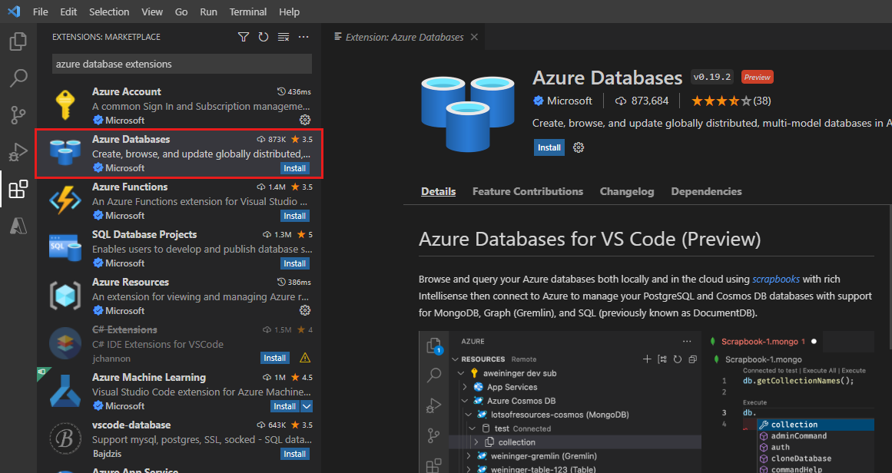
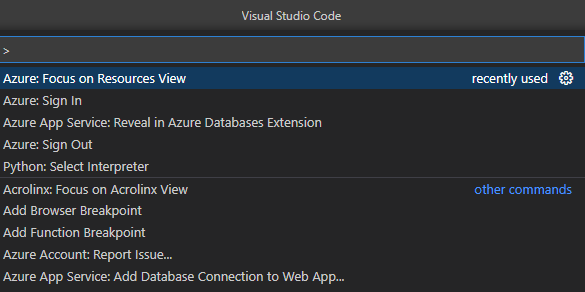
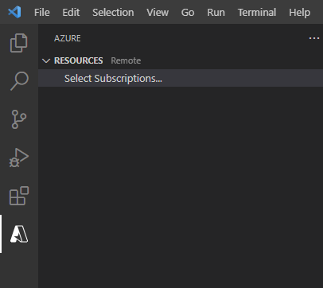
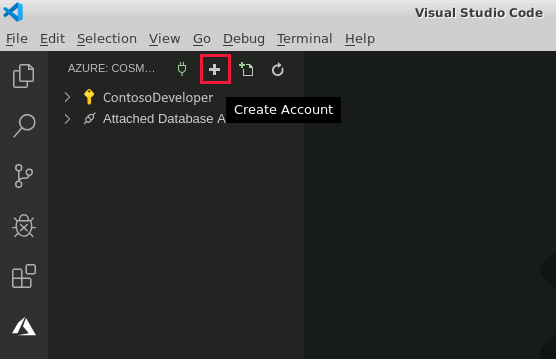
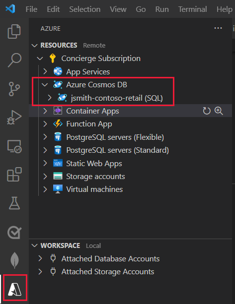
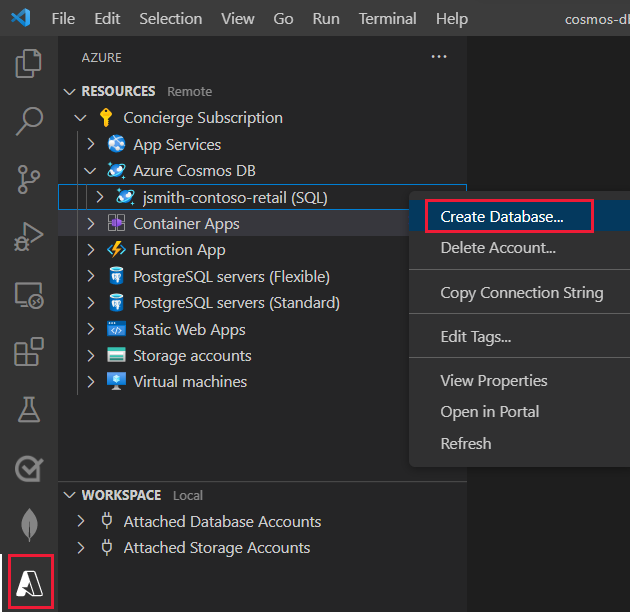
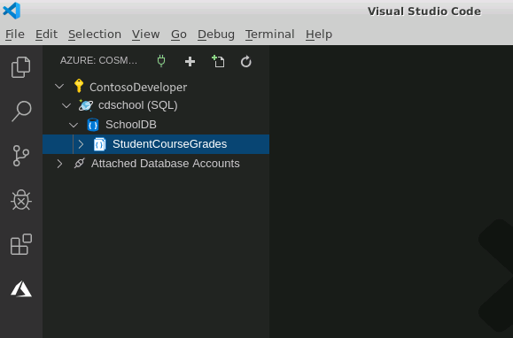
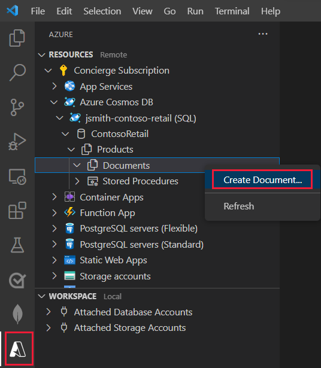
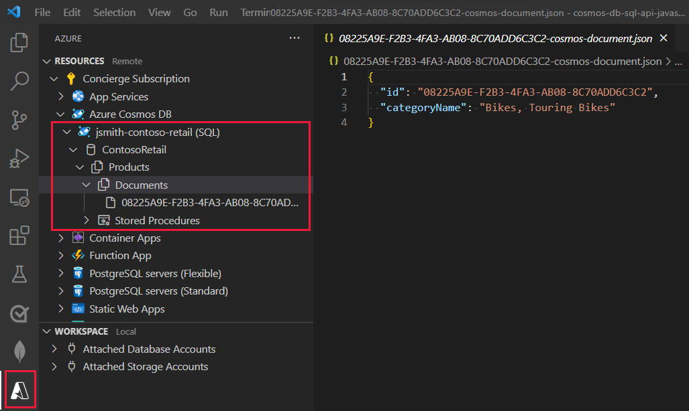
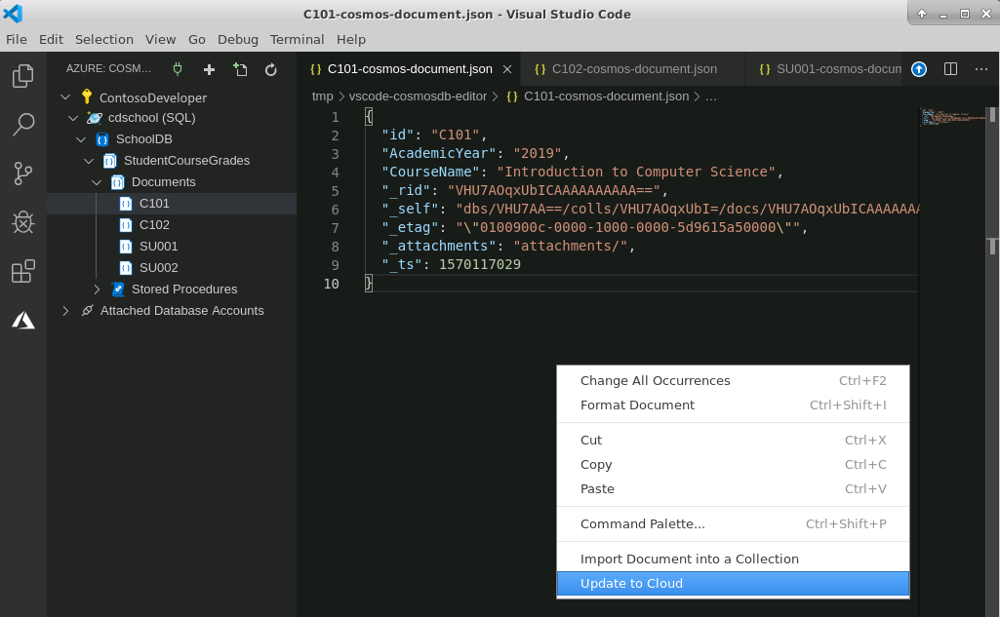

The Azure Cosmos DB extension enables you to create and manage Cosmos DB databases, collections, and documents from within Visual Studio Code.

In the sample scenario, you want to be able to work within Visual Studio Code, both as a development environment for building applications, and also as a tool for managing your Cosmos DB databases.

In this exercise, you'll install the Cosmos DB extension for Visual Studio Code. Then, you'll use the extension to connect to your Azure account and create a Cosmos DB account. You'll add a database and collection for holding student's course grade information to the Cosmos DB account. Finally, you'll create some test documents in the collection, view them, and update them.

This exercises runs on your desktop computer.

## Install the Cosmos DB extension for Visual Studio Code

1. Start Visual Studio Code.

2. On the **View** menu, select **Extensions** to open the extensions pane.

3. In the **Search Extensions in Marketplace** box, type **Cosmos DB**, and press Enter.

4. In the list of extensions, select the **Azure Cosmos DB** extension published by Microsoft, and click **Install**.

    

5. Wait while the extension is installed.

## Create a Cosmos DB account

1. On the **View** menu, select **Command Palette**.

2. In the command palette, type **Azure**, and then select **Azure: Focus on Cosmos DB View**.

    

    The Azure Cosmos DB pane will appear.

    

3. In the Cosmos DB pane, click **Sign in to Azure**.

    A web browser window will open. Follow the instructions and sign in to your Azure account. When you've signed in, close the browser window and return to Visual Studio Code.

4. In the Cosmos DB pane, in Visual Studio Code, in the toolbar, click **Create Account** (the **+** sign)

    

    A wizard will start that prompts you for the details of the new account.

    > [!NOTE]
    > The Cosmos DB account must have a unique name. We suggest using something like **\<*your name or initials*\>school**. Use this name wherever you see *\<your-cosmos-db-account-name\>* in this exercise.

5. In the **Account name** box, type ***\<your-cosmos-db-account-name\>***, and then press Enter.

6. In the **Select an API for your Cosmos DB account** list, select **SQL (DocumentDB)**.

7. In the **Select a resource group for new resources** list, click **+ Create new resource group**.

8. In the resource group name box, type **cosmosdbrg**, and then press Enter.

9. In the **Select a location for new resources** list, select your nearest location.

10. Wait while the Cosmos DB account is created.

11. When the account has been created, in the Cosmos DB pane, expand your Azure account, and verify that the new Cosmos DB account appears:

    

## Create a database and collection

1. In the Cosmos DB pane, right-click *\<your-cosmos-db-account-name\>*, and then click **Create Database**.

    

2. In the **Database Name** box, type **SchoolDB**, and then press Enter.

3. In the **Enter an id for your Collection** box, enter **StudentCourseGrades**, and then press Enter.

4. In the **Enter the partition key for the collection** box, type **AcademicYear**, and then press Enter.

    This collection will hold `Course` and `Student` documents. Course grades will be held as an array of subdocuments with each student. The data will be partitioned by academic year.

    > [!NOTE]
    > Academic year might not seem to be the best partition key for a real world example as it could lead to hot partitions when inserting and modifying data. Information for the current year is likely to attract the most traffic. It is used in this module to keep the example code simple. In a production system, you might partition the data by some other key that distributes inserts across multiple partitions. Student ID might appear to be a good example of such a key initially. However, you also have to consider other factors, especially if you are running queries that fetch data by academic year, or are using stored procedures as described later in this unit. If you want to query course grades by academic year, the fastest way is to perform single partition queries. Similarly, if you want to process course grade documents for a single year as an atomic unit using a stored procedure, the documents must all reside in the same partition. You must be prepared to consider the balance between different workloads and their frequency when determining the most optimal partition key.

5. In the **Initial throughput capacity** box, accept the default value of **1000**, and then press Enter.

6. Verify that the **SchoolDB** database, containing the **StudentCourseGrades** collection, appears.

    

## Create and view documents

1. In the Cosmos DB pane, expand the **StudentCourseGrades** collection. Two subfolders should appear, named **Documents** and **Stored Procedures**.

2. Right-click the **Documents** folder, and then click **Create Document**.

    

3. In the **Enter a document ID** box, type **C101**, and then press Enter. This will be the ID of a course.

4. In the **Enter a value for the partition key** box, type the current year (for example, **2019**), and then press Enter.

    The document will be created and will be displayed in Visual Studio Code, in JSON format. The **id** and **AcademicYear** fields will be populated with the values you specified. The document will also contain other fields that are added automatically by Cosmos DB for its own internal use.

    

5. In the Cosmos DB pane, right-click the **Documents** folder again, and then click **Create Document**.

6. In the **Enter a document ID** box, type **C102**, and then press Enter. This will be the ID of another course.

7. In the **Enter a value for the partition key** box, type the same year as before, and then press Enter.

    The new document will appear.

8. Add another document with ID **SU001** and the same year as before. This document will represent the details of a student.

9. Add a final document with ID **SU002** (another student), and the same year.

10. In the **Documents** list in the Cosmos DB pane, click each document in turn, to view the data.

## Edit documents

1. In the **Documents** list, select the **C101** document.

2. In the JSON document that appears, move to the end of the **AcademicYear** line, and press Enter.

3. Add the following field to the document. Don't forget to add a comma at the end of the line:

    ```text
    "CourseName": "Introduction to Computer Science",
    ```

4. Right-click anywhere in the document pane, and then click **Update to Cloud**.

    

    The document will be written back to Cosmos DB. The Visual Studio Code log window will appear. The final message in the log should be similar to the following example:

    ```text
    3:37:09 PM: Updated entity "cdschool (SQL)/SchoolDB/StudentCourseGrades/Documents/C101"
    ```

5. In the **Documents** list, select the **C102** document.

6. Add the following field to the document after the **AcademicYear** field, and the save it:

    ```text
    "CourseName": "Applied Mathematics",
    ```

7. In the **Documents** list, select the **SU001** document.

8. Add the following field to the document, after the **AcademicYear** field:

    ```text
    "Name": {
            "Forename" : "Aaaa",
            "Lastname" : "Bbbb"
    },
    ```

    This is a compound field, or subdocument. This is a useful approach to adopt if you have related fields that are typically used together.

9. Add another field, after the new **Name** field:

    ```text
    "CourseGrades": [
            {
                    "Course": "C101",
                    "Grade": "A"
            },
            {
                    "Course": "C102",
                    "Grade": "B"
            }
    ],
    ```

    This is an array field that contains the grades for each course that the student has taken. Using an array makes it possible to record the details of a variable number of courses for each student.

10. Save the document.

11. Edit the **SU002** document, add the following fields, and save the changes:

    ```text
    "Name": {
            "Forename" : "Cccc",
            "Lastname" : "Dddd"
    },
    "CourseGrades": [
            {
                    "Course": "C101",
                    "Grade": "C"
            }
    ],
    ```

    This student has only taken the Introduction to Computer Science course.

You've now used the Cosmos DB extension in Visual Studio Code to create a Cosmos DB database and collection. You've added and viewed documents, and you've edited these documents.
