Visual Studio Code makes it easy to write JavaScript code and run it using Node.js. The Visual Studio Code editor has built-in support for JavaScript and JSON. You can utilize the IntelliSense features of the editor to help you check syntax. IntelliSense also offers code-completion, helping to minimize any syntactic and semantic errors in your applications. You can using the integrated debugging tools to help test and verify your code.

In this unit, you'll learn how to create a JavaScript application using Visual Studio Code. You'll see how to run the application using Node.js from within Visual Studio Code. Finally, you'll learn how to use the debugger to step through your code and examine variables as your code runs.

## Create a JavaScript application for Node.js

To create a new JavaScript application for Node.js from within Visual Studio Code, perform the following steps:

1. Open a new terminal window. You can do this from the **Terminal** menu. A new terminal window will appear, as shown in the following image:

    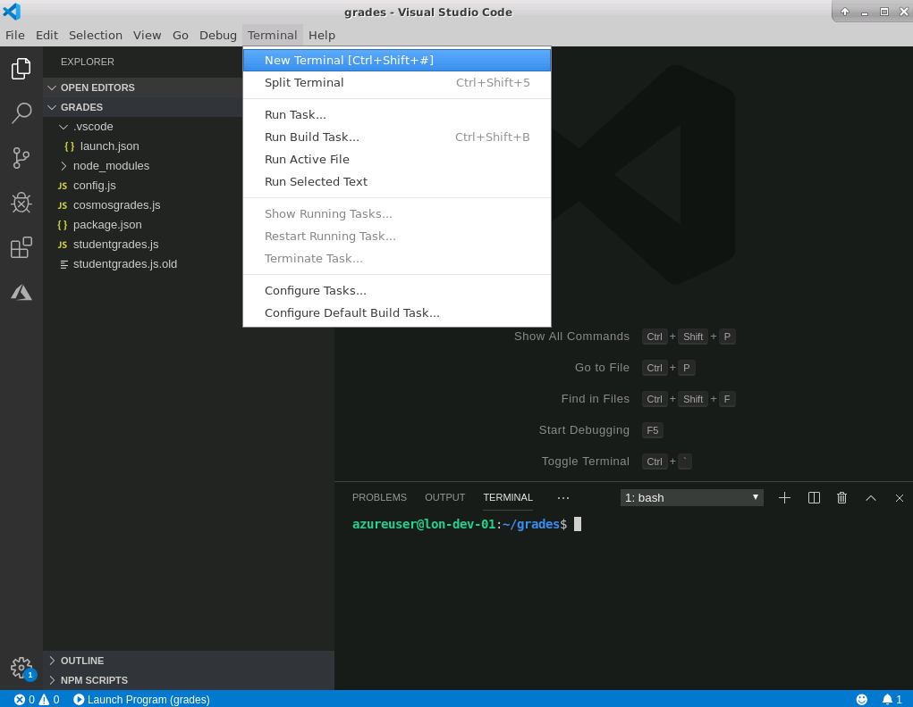

2. In the terminal window, create a new folder for your application. Use the `mkdir` command. The following example creates a folder named **appfolder**:

    ```bash
    mkdir appfolder
    ```

3. Move to the application folder, and use the `npm init -y` command to create a new Node.js application:

    ```bash
    cd appfolder
    npm init -y
    ```

    This command creates a new file, named **package.json** in the application folder. This file contains metadata, which you use to describe your application to the Node.js runtime.

4. On the **File** menu, click **Open Folder**, and select your application folder.

5. In the **Explorer** window, expand your application folder, and select the **package.json** file. It will open in the editor.

    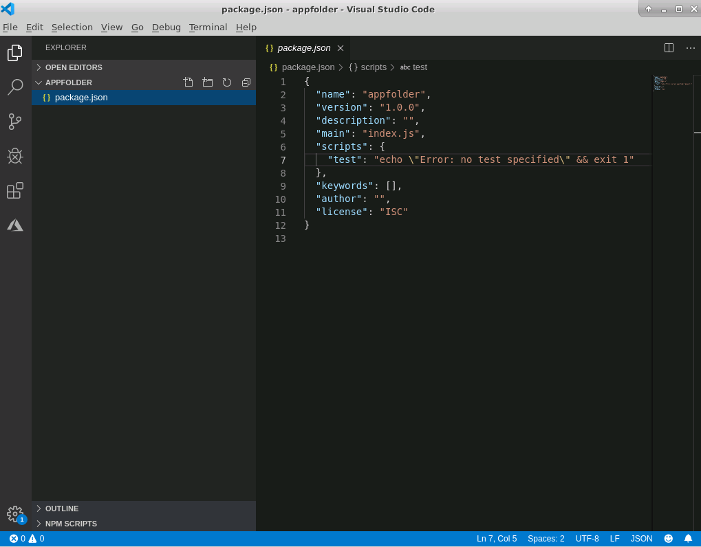

6. Add a description to the **description** property. You should also replace the text **main.js** in the **main** property with the name of the JavaScript file that will hold your application code.

7. Save the file before continuing.

8. On the **File** menu, click **New File**, and create a new file for your application code. Save the file with the same name as the file that you specified in the **package.json** file. Make sure you give the file a **.js** extension (for JavaScript)

You're now ready to start writing your JavaScript code.

## Enable advanced type checking

Visual Studio Code provides a basic level of JavaScript syntax checking. However, you can extend the support implemented by Visual Studio Code IntelliSense by installing additional JavaScript type information. This information is supplied in the form of TypeScript *typings*. TypeScript typings are provided with many JavaScript modules, and are automatically included when you install a module with the **npm install** command. For modules that don't include typings, Visual Studio Code IntelliSense implements *Automatic Type Acquisition*, which will automatically install community-maintained typings.

You should also install the **@types/node** module. This module contains additional typings for Node.js:

```bash
npm install @types/node
```

To enable advanced type checking, add the following statement at the top of your application code file:

```javascript
//@ts-check
```

If you want to use ECMAScript 6 (ES 6) or later syntax and features in your JavaScript code, you should also install the **esm** package. In the terminal window, run the following command:

```
npm install esm
```

> [!NOTE]
> ECMAScript 6 adds features such selective `import` statements, and classes, to JavaScript.

## Use IntelliSense to help write your code

Once you import a module into a JavaScript file, the types for that module become available in that file, and IntelliSense can provide code completion and type checking. You import a module either using the `requires` statement, or the `import` statement (if you're using ES 6 or later). For example, if you've installed the **readline-sync** module using **npm**, you can import the functions and types in this module into your JavaScript code with either of the following statements, depending on which version of JavaScript you're using:

```javascript
var readlinesync = require("readline-sync"); // JavaScript prior to ES 6
import * as readlinesync from "readline-sync"; // ES 6 and later
```

Add your JavaScript code to the application code file. As you type, IntelliSense will use a combination of type checking and type inference to show suggestions appropriate to the current context. For example, type inference enables IntelliSense to present valid code completion suggestions as you write your code:

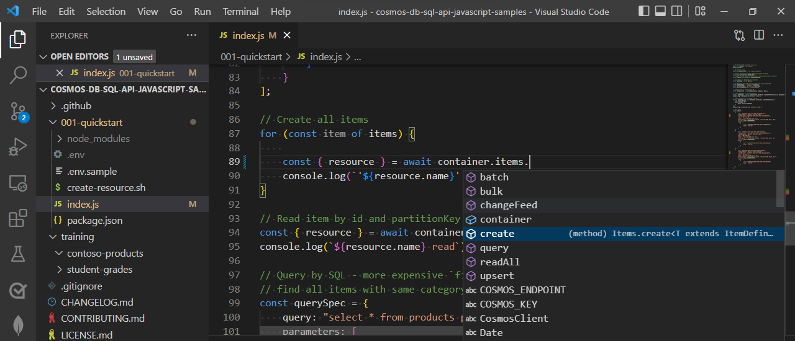

Type checking enables IntelliSense to show the parameters that a function call can take, and will type-check the expressions that you provide for each function:

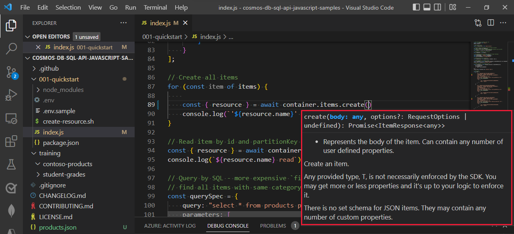

IntelliSense can also suggest possible refactoring of your code. An ellipsis (...) under an item indicates areas where IntelliSense has one or more suggestions. Click the ellipsis to view the suggestions. Select **Quick Fix** to implement the suggestion.


In the example shown in the image above, the *Quick Fix* changes the `require` statement to a more specific ES 6 `import` statement, as follows:

```javascript
import { question } from "readline-sync";
```

This modification selectively imports only the functions used in your code from the **readline-sync** module. This can help to declutter your application, and reduces the chances of bugs caused by accidental name clashes in your code.

Other IntelliSense features available in Visual Studio Code include:

- Detecting unreachable code and unused variables. Statements that can never be run, and variables that are never used, are shown faded out in the editor.
- Organizing imports. IntelliSense can quickly sort the imports that occur in a code file, and remove imports that aren't used.
- Peeking definitions and references. The peek facility enables you to quickly view the definition of an object or function, even if it's in another file. Right-click a variable or function, and select **Peek Definition** or **Peek References**. The definition or references appear in a pop-up window:

    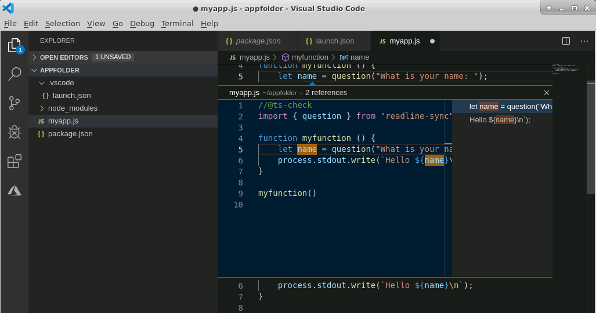

- Navigate to a variable, function, or type definition. This feature enables you to move directly to the definition of a variable, function, or type in your code. This is useful if you need to change the definition of an item, or modify a function. Right-click the code the references your variable or type, or that calls your function, and select **Go To Definition**, or **Go To Type Definition**.

## Run and debug a Node.js application

The simplest way to run a Node.js application from Visual Studio Code is to use the `node` command from a terminal window. For example, to run the code in a file named **myapp.js**, use the following command:

```bash
node myapp
```

The `node` command can take several arguments. Use `node --help` to see the options available. A common argument is `-r *module*`, which loads the specified Node module when the application runs. For example, or you are running an application written using ES 6, you might need to load the **esm** module (depending on which version of Node.js you are using). For example:

```bash
node -r esm myapp
```

You can use the native Node.js debugger (for example, `node inspect myapp`) from a terminal window, but Visual Studio Code provides an enhanced environment for stepping through and debugging Node.js applications.

Before you use the Visual Studio Code debugger, you should configure it. For example, the  Visual Studio Code debugger displays output in its own **Output** window in the IDE. However, this window can't handle terminal input. If your app expects to receive keyboard input, you must configure the debugger to use an external terminal. Additionally, if your run your node app with any options (such as `-r esm`), you must add these options to the debugger configuration.

To edit the debugger configuration settings, on the **Debug** menu, click **Open Configurations**.

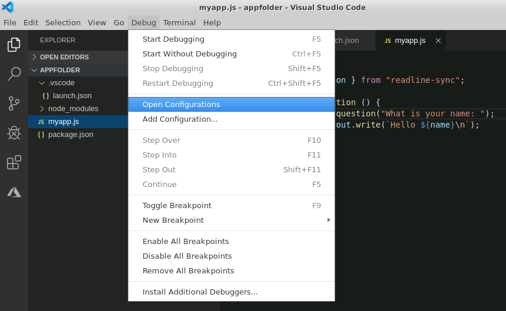

The configuration file contains a JSON object named **configurations**. To debug the application using an external terminal, add the **console** property and set it to **externalTerminal**. Add the **runtimeArgs** property to specify arguments to the Node.js runtime. You provide these arguments as an array, as shown in the example below. Save the file before continuing:

```json
{
    // Use IntelliSense to learn about possible attributes.
    // Hover to view descriptions of existing attributes.
    // For more information, visit: https://go.microsoft.com/fwlink/?linkid=830387
    "version": "0.2.0",
    "configurations": [
        {
            "type": "node",
            "request": "launch",
            "name": "Launch Program",
            "program": "${workspaceFolder}/myapp.js",
            "console": "externalTerminal",
            "runtimeArgs": ["-r", "esm"]
        }
    ]
}
```

To begin a debug session, first set one or more breakpoints in your application code. To do this, click in the left-hand margin by the statement at which you want to pause execution. A red dot will appear. In the image below, the user has set a breakpoint at the statement that calls the **myfunction** function.

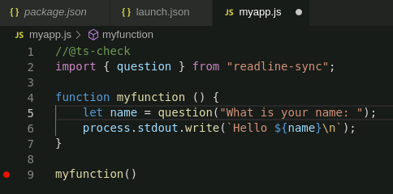

Next, select **Start Debugging** on the **Debug** menu:

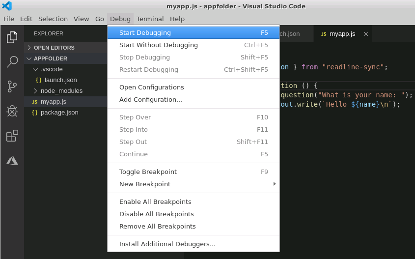

If you're using an external terminal, a new terminal window will appear. If your application expects any input, you enter it into this window. Any messages output by your application will appear in this window:

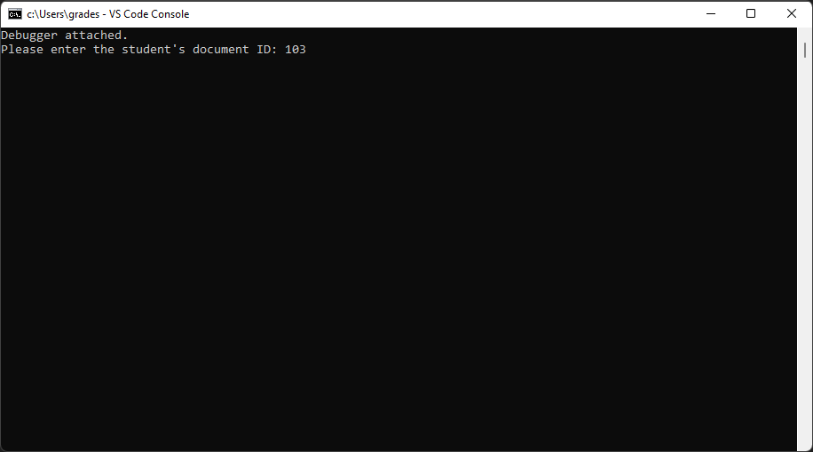

If you aren't using an external terminal, debugger output will appear in the **Output** window in Visual Studio Code.

When the debugger reaches a breakpoint in your application, execution will pause, and the breakpoint statement will be highlighted. On the left-hand side, you'll see windows that enable you to examine and set the values of local and global variables, and the call stack. You can also add **Watch** expressions, which are evaluated and displayed as execution proceeds:

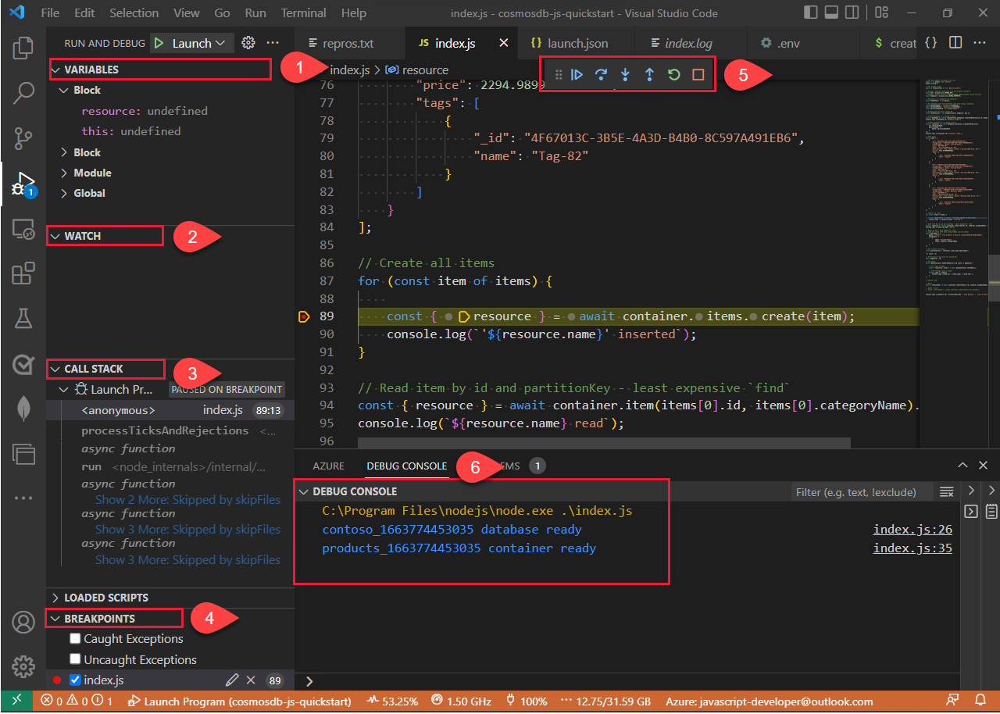

> [!NOTE]
> The **Debug Console** window that appears in Visual Studio Code when you start a debug session also enables you to examine and modify variables and expressions. You can also use this window to perform ad-hoc testing of functions.

The **Debug** toolbar appears above the editor window. This toolbar contains commands that enable you to single step through your code. If a statement contains a function call, you can step into that function, or you can step over it. The step out command continues execution until the function finishes. You can also continue running the application, either until the debugger reaches another breakpoint, or the application finishes. The other two commands enable you to restart the application from the beginning, or terminate the application:

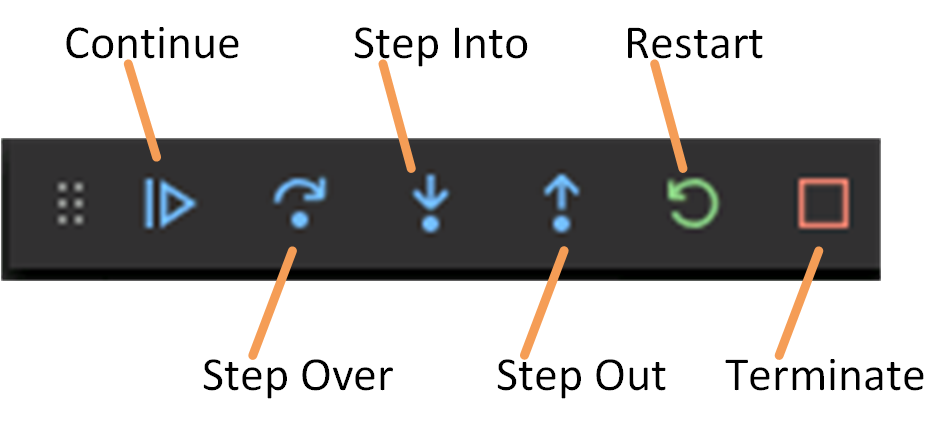

Most JavaScript engines (including Node.js) implement just-in-time compilation. You can make changes to the application code while the debugger is running, and this changes become effective immediately. You don't need to stop and restart the debugger.
