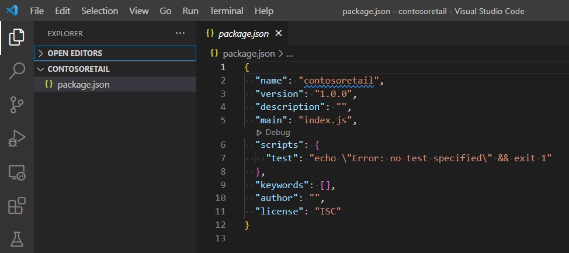
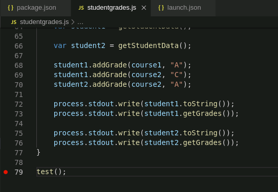
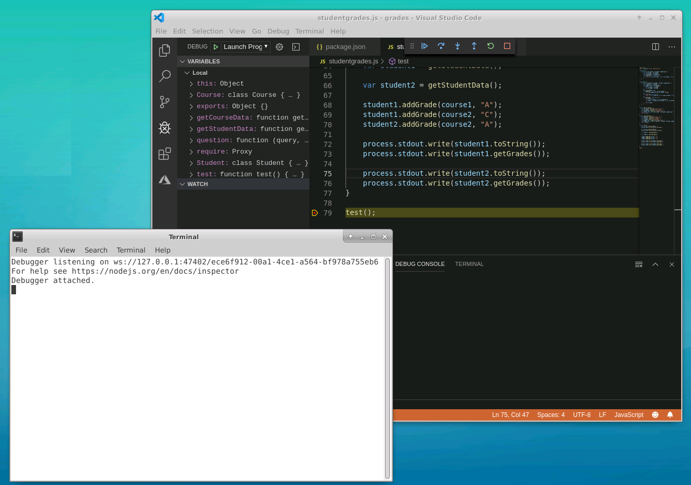
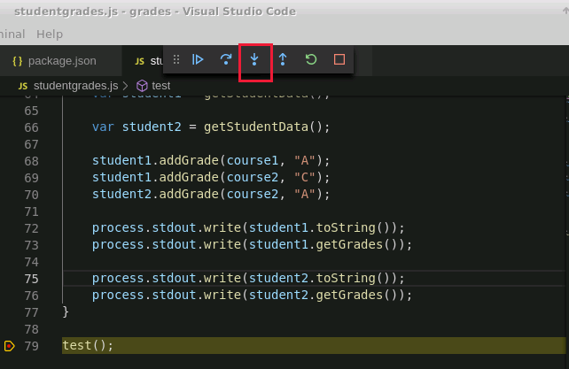
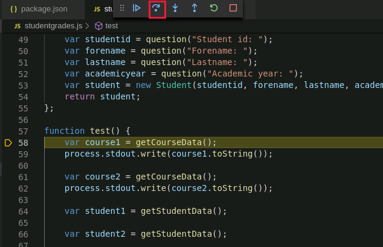
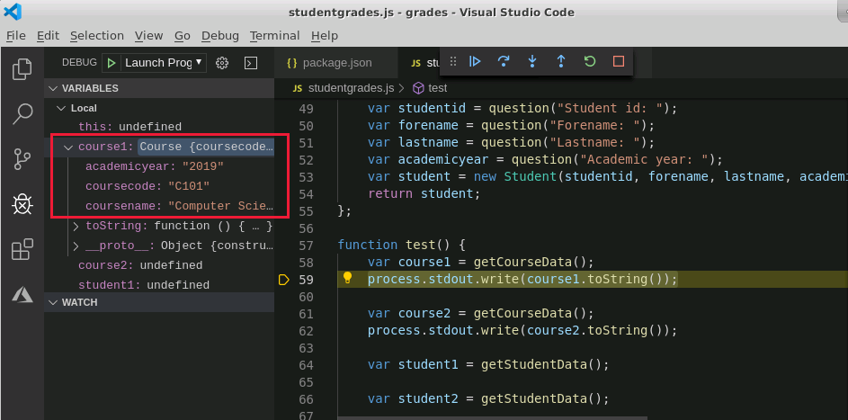
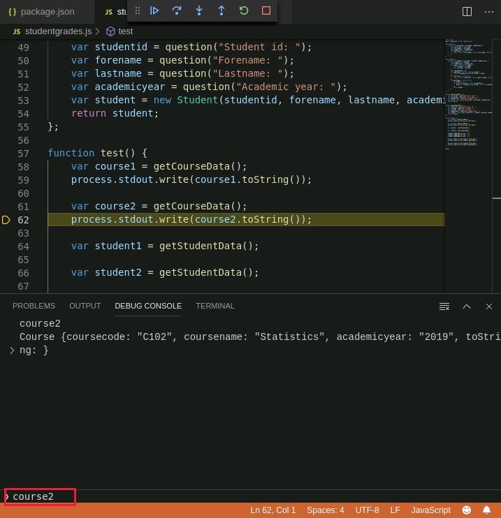
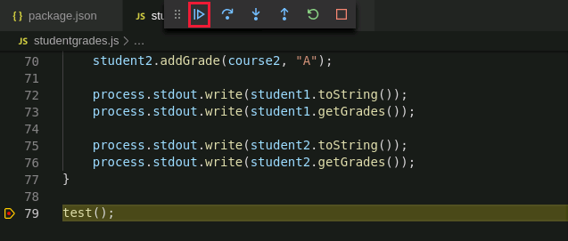

Visual Studio Code provides a customizable IDE that enables you to build, test, and run Node.js applications.

In the sample scenario, you want to use Visual Studio Code as the development environment for creating and testing your Node.js applications.

In this exercise, you'll install node packages that enable you to configure Node.js for use in Visual Studio Code. You'll use this environment to write an application that prompts the user for details of courses, students, and grades, and creates JavaScript objects that capture this information (in the next exercise, you'll see how to save these objects to a collection in Cosmos DB). You'll learn how to use the debugger provided with Visual Studio Code to step through the code and verify that it is working correctly.

This exercises runs on your desktop computer.

> [!NOTE]
> This exercise assumes that you've already installed **Node.js** and **npm** on your desktop computer.

## Configure Node.js

1. Start Start Visual Studio Code if it isn't already running.

2. On the **Terminal** menu, click **New Terminal**.

3. In the **Terminal** window, run the following command to create a new folder named **greds** for the Node application.
  
    ```bash
    mkdir grades
    ```

4. Type the following commands to move to the **grades** folder, and initializes a new Node application:

    ```bash
    cd grades
    npm init -y
    ```

    The **npm init** command creates a **package.json** file and displays its contents. This file contains the initial metadata for the application, containing a default name, description, and entry point.

5. On the **File** menu in Visual Studio Code, select **Open Folder**, and open the **grades** folder.

6. In the **Explorer** window, click the **package.json** file.

    

7. In the editor pane, change the **description** property to **Student and course grades maintenance**, and change the **main** property to **studentgrades.js**. The file should look like this:

    ```text
    {
        "name": "grades",
        "version": "1.0.0",
        "description": "Student and course grades maintenance",
        "main": "studentgrades.js",
        "scripts": {
            "test": "echo \"Error: no test specified\" && exit 1"
        },
        "keywords": [],
        "author": "",
        "license": "ISC"
    }
    ```

8. On the **File** menu, click **Save**.

9. In the **Terminal** window, run the following commands to install the **esm**, **readline-sync**, and **@types/node** packages:

    ```bash
    npm install esm
    npm install readline-sync
    npm install @types/node
    ```

    The **esm** package provides support for ECMAScript 6 and later. The **readline-sync** package contains functions that enable you to gather user input from the command line. The **@types/node** package provides support for type checking and error reporting in the IDE.

    > [!NOTE]
    > You can ignore the **No repository field** warning, and the **extraneous** messages that appear.

## Create the studentgrades app

1. In Visual Studio Code, on the **File** menu, click **New File**.

2. On the **File** menu, click **Save As**. Save the new file with the name **studentgrades.js**

3. In the editor window, add the following lines to the top of the **studentgrades.js** file:

    ```javascript
    //@ts-check
    import { question } from 'readline-sync';
    ```

    The **@ts-check** directive enables advanced type checking, using the **@types/mode** module that you added to the application in the previous task. The **import** statement imports the **question** function from the **readline-sync** module. You'll use the **question** function to prompt the user for input later in this application.

4. After the **import** statement, add the following **class** definition to the file:

    ```javascript
    class Course {
        constructor(coursecode, coursename, academicyear) {
            this.coursecode = coursecode;
            this.coursename = coursename;
            this.academicyear = academicyear;
            this.toString = function () {
                return `${this.coursecode}: ${this.coursename}, ${this.academicyear}\n`;
            };
        }
    }
    ```

    The **Course** class contains the details of a course. A **Course** object has three properties; **coursecode**, **coursename**, and **academicyear**. These properties correspond to the fields in a **Course** document in Cosmos DB. The class also contains a function named **toString** that you can use to convert the contents of a Course object into a formatted string, suitable for display.

5. Add the following **Student** class to the file, after the **Course** class:
  
    ```javascript
    class Student {
        constructor(studentid, forename, lastname, academicyear) {
            this.studentid = studentid;
            this.academicyear = academicyear;
            this.name = new function Name() {
                this.forename = forename;
                this.lastname = lastname;
            };
            this.coursegrades = {};
            this.addGrade = function (course, grade) {
                this.coursegrades[course.coursecode] = grade;
            };
            this.toString = function () {
                return `${this.studentid}: ${this.name.forename}, ${this.name.lastname}, ${this.academicyear}\n`;
            };
            this.getGrades = function () {
                var grades = "";
                for (var coursecode in this.coursegrades) {
                    grades = `${grades}${coursecode}: ${this.coursegrades[coursecode]}\n`;
                }
                return grades;
            };
        }
    }
    ```

    The **Student** class represents a student. It has the properties **studentid**, **academicyear**, **name**, and **coursegrades**. The **name** property is a composite type containing the **forename** and **lastname** properties. The **coursegrades** property is an object. This object will contain course code/course grade key/value pairs for the student. The **addGrade** method enables a user to add a course code/course grade pair to this property, and the **getGrades** function returns a formmatted string listing the course codes and grades for the student. The **toString** function returns a string containing the other details of the student.

6. Add the **getCourseData** function shown below to the **studentgrades.js** file.

    ```javascript
    function getCourseData () {
        var coursecode = question("Course code: ");
        var coursename = question("Course name: ");
        var academicyear = question("Academic year: ");
        var course = new Course(coursecode, coursename, academicyear);
        return course;
    };
    ```

    This function prompts the user for the code, name, and academic year of a course using the **question** function from the **readline-sync** module imported earlier. The values read are used to create a new **Course** object. The object is passed back as the return value of the function.

7. Add the **getStudentData** function shown below to the **studentgrades.js** file.

    ```javascript
    function getStudentData () {
        var studentid = question("Student id: ");
        var forename = question("Forename: ");
        var lastname = question("Lastname: ");
        var academicyear = question("Academic year: ");
        var student = new Student(studentid, forename, lastname, academicyear);
        return student;
    };
    ```

    This function prompts the user for the details of a student, and creates a new **Student** object.

8. Add the following function to the **studentgrades.js** file:

    ```javascript
    function test () {
        var course1 = getCourseData();
        process.stdout.write(course1.toString());

        var course2 = getCourseData();
        process.stdout.write(course2.toString());

        var student1 = getStudentData();

        var student2 = getStudentData();

        student1.addGrade(course1, "A");
        student1.addGrade(course2, "C");
        student2.addGrade(course2, "A");

        process.stdout.write(student1.toString());
        process.stdout.write(student1.getGrades());

        process.stdout.write(student2.toString());
        process.stdout.write(student2.getGrades());
    }
    ```

    This function is a test harness that creates two courses and two students. The function that adds grades foreach student, and displays the results.

9. Add the following statement at the end of the file:

    ```javascript
    test();
    ```

    This statement runs the test harness.

## Test the studentgrades app

1. In the **Terminal** window, start the **studentgrades** app using **node**:

    ```bash
    node -r esm studentgrades.js
    ```

    > [!NOTE]
    > The **-r esm** flag loads the **esm** module to run the app. This module contains the ECMAScript 6 support code, and is required by the **studentgrades.js** app. Features such as **import** are only available in ECMAScript 6 and later.

2. At the prompts, enter the values shown in the following table:

    | Prompt  | Value  |
    |---|---|
    | Course code: | C101 |
    | Course name: | Computer Science |
    | Academic year: | 2019 |

    The message **C101: Computer Science, 2019** should appear after you have entered the academic year. This is the output from the statement `process.stdout.write(course1.toString());` in the `test` function.

3. At the next set of prompts, enter the following values:

    | Prompt  | Value  |
    |---|---|
    | Course code: | C102 |
    | Course name: | Statistics |
    | Academic year: | 2019 |

    The message **C102: Statistics, 2019** should be displayed, output by the statement `process.stdout.write(course2.toString());` in the `test` function.

4. Enter the following values when prompted:

    | Prompt  | Value  |
    |---|---|
    | Student id: | 1 |
    | Forename: | Aaaaaa |
    | Lastname: | Bbbbbb |
    | Academic year: | 2019 |
    | Student id: | 2 |
    | Forename: | Cccccc |
    | Lastname: | Dddddd |
    | Academic year: | 2019 |

    The following messages will appear:

    ```text
    1: Aaaaaa, Bbbbbb, 2019
    C101: A
    C102: C
    2: Cccccc, Dddddd, 2019
    C102: A
    ```

    The first line contains the details of the first student, printed by the statement `process.stdout.write(student1.toString());` 
  
    The next two lines are the grades that were assigned to the student by the `addGrades` function. The grade information was printed using the statement `process.stdout.write(student1.getGrades());`

    The remaining two lines are the details of the second student, and the grade for the only course that the student took.

## Step through the studentgrades.js app using the debugger

1. In Visual Studio Code, on the **Debug** menu, click **Open Configurations**

    The **launch.json** file is displayed in the editor. It looks like this:

    ```json
    {
        // Use IntelliSense to learn about possible attributes.
        // Hover to view descriptions of existing attributes.
        // For more information, visit: https://go.microsoft.com/fwlink/?linkid=830387
        "version": "0.2.0",
        "configurations": [
            {
                "type": "node",
                "request": "launch",
                "name": "Launch Program",
                "program": "${workspaceFolder}/studentgrades.js"
            }
        ]
    }
    ```

    The **configurations** array contains the settings used by the debugger.

2. Edit the **configurations** array and add the **console** and **runtimeArgs** properties, as shown in the following example. Don't forget to add a comma after the **program** property:

    ```json
    {
        // Use IntelliSense to learn about possible attributes.
        // Hover to view descriptions of existing attributes.
        // For more information, visit: https://go.microsoft.com/fwlink/?linkid=830387
        "version": "0.2.0",
        "configurations": [
            {
                "type": "node",
                "request": "launch",
                "name": "Launch Program",
                "program": "${workspaceFolder}/studentgrades.js",
                "console": "externalTerminal",
                "runtimeArgs": ["-r", "esm"]
            }
        ]
    }
    ```

    The **console** property specifies how the debugger displays and handles console input and output. The **Debug Console** built into Visual Studio Code is intended for output only, and can't read keyboard input (if you try and run the app using the **Debug Console**, the calls to the **question** function will throw an error). Using the **externalTerminal** option causes the debugger to create a separate, fully functional terminal window, that can handle input and output.

    The **runtimeArgs** property supplies the listed parameters as arguments to the runtime (the **node** app, in this case). The **-r esm** flag was described in the previous task.

3. Switch to the **studentgrades.js** file in the editor. Scroll to the bottom of the file, and click in the margin to the left of the line number for the **test()** function call. A red dot should appear. This is a breakpoint. When you run the app in debug mode, execution will pause at this point.

    

4. On the **Debug** menu, click **Start Debugging**.

    A new terminal window will appear, and then the application will pause at the breakpoint in the Visual Studio Code editor window.

    

5. In the **Debug** toolbar above the editor in Visual Studio Code, click **Step Into**

    

    The cursor jumps to the first statement in the **test** function: `var course1 = getCourseData();`

6. Click **Step Into** again.

    The cursor moves to the first statement in the **getCourseData** function: `var coursecode = question("Course code: ");`. This is the statement that prompts the user for the code of a new course.

7. In the **Debug** toolbar, click **Step Over**

    

    The prompt **Course code:** appears in the debug terminal window.

8. In the debug terminal window, type the value **C101** and press Enter.

    The prompt **Course name:** appears. This is the result of the next line of code in the **getCourseData** function.

9. Type **Computer Science**, and then press Enter.

10. At the **Academic year:** prompt, type **2019**, and then press Enter.

    The focus returns to Visual Studio Code. The function **getCourseData** has finished, and the cursor is now on the next line in the **test** function: `process.stdout.write(course1.toString());`.

11. In the **Variables** window, examine the **Local** variables. The **course1** variable now has a value. Expand this variable to see the properties it contains. You should see the values that you have just entered assigned to each property:

    

    > [!NOTE]
    > You can right-click on any variable or property and use the **Set Value** command to change its value, for testing purposes.

12. In the **Debug** toolbar, click **Step Over** again.

    The `process.stdout.write(course1.toString());` statement runs, and the formatted contents of the **course1** variable appear in the debug terminal window.

13. Click **Step Over** again to run the statement `var course2 = getCourseData();`. Enter a course code, name, and academic year of your choice when prompted in the debug terminal window.

14. In the **Variables** window, note that the **course2** variable is now populated.

15. In the **Debug Console** window, below the editor in Visual Studio Code, at the **>** prompt, type the expression **course2**, and then press Enter.

    The contents of the **course2** variable will be displayed.

    

    > [!NOTE]
    > You can enter any valid expression in the **Debug Console**, and the value of that expression will be displayed. You can also enter any valid JavaScript statement, which will then be executed. For example, you could enter `course2.coursecode = "C103"` to change the value of the **coursecode** property in the **course2** variable.

16. In the **Debug** toolbar, click **Step Out**.

    

    The application will continue running the **test** function until it completes. You'll be prompted for the details of two students. Enter details of your choice.

17. When the **test** function completes, you'll be returned to the debugger. Note that the **course1**, and **course2** variables no longer appear in the **Variables** window, because they are out of scope when the **test** function ends.

18. In the **Debug** toolbar, click **Continue** to allow the application to terminate neatly.

    

    > [!NOTE]
    > If you need to abort the application before it finishes while in the debugger, click the **Stop** button (with the red square icon) in the **Debug** toolbar. You can restart the application from the beginning using the **Restart** button (with the circular green arrow icon).

You have now seen how to use Visual Studio Code to create, edit, run, and debug a Node.js application.
