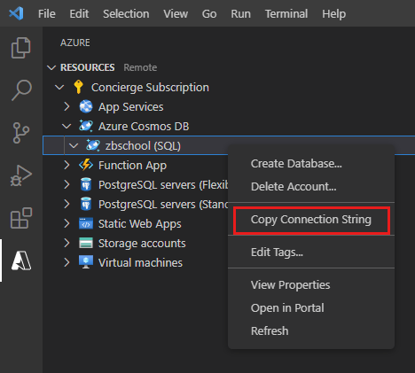

Microsoft provides APIs that enable you to access Cosmos DB from application code. Behind the scenes, these APIs are wrappers around a series of REST calls that send and receive HTTP requests to and from the Cosmos DB service. These APIs are available for a variety of programming languages, including JavaScript.

In this unit, you'll learn how to use the JavaScript API for Cosmos DB to query and manage documents and collections.

## Install the JavaScript API for Cosmos DB

You can install the JavaScript API for Cosmos DB using the Node Package Manager (npm). At a command prompt, in the folder for your Node.js application, run the following command:

```bash
npm install @azure/cosmos
```

## Connect to a Cosmos DB account

The JavaScript API exposes a class named `CosmosClient` that acts as the access point to Cosmos DB. You use a `CosmosClient` object to obtain a handle on databases and collections. Once you have access to a collection, you can query and manipulate documents.

You create a `CosmosClient` object using the constructor. The constructor takes a Cosmos DB connection string as its parameter. The connection string contains the address of your Cosmos DB account, and the security key needed to access the account. You can obtain the connection string for an account using the Cosmos DB pane in Visual Studio Code; right-click the account and select **Copy Connection String**.



In your JavaScript application, use the following code to connect to a Cosmos DB account using the connection string:

```javascript
import * as cosmos from "@azure/cosmos";

const client = new cosmos.CosmosClient("Connection string goes here");
```

## Retrieve documents

Cosmos DB provides two ways to retrieve documents. You can run a query, or you can fetch a document directly using its ID.

### Query documents

The first technique is to run a query. Use the **query** function of a collection and specify a **SELECT** statement that identifies the documents to fetch. You obtain a reference to a collection through the **database** function of a `CosmosClient` object, as follows:

```javascript
const databaseid = "Your database name";
const containerid = "Your collection name";
const containerref = client.database(databaseid).container(containerid);
const containerdata = containerref.items;
```

This code walks down the hierarchy of Cosmos DB objects described in module 2. The **containerdata** object provides access to the documents (items) in the collection.

The following code snippet shows how to run a query against a collection. This example finds the documents for all students that have a specified academic year:

```javascript
var academicyear = ...;
...
const studentquery = {
    query: "SELECT s.id, s.Name.Forename, s.Name.Lastname \
            FROM students s  \
            WHERE s.AcademicYear = @year",
    parameters: [
        {
            name: "@year",
            value: academicyear
        }
    ]
};

const { resources } = await containerdata.query(studentquery).fetchAll();
for (let queryResult of resources) {
    let resultString = JSON.stringify(queryResult);
    process.stdout.write(`\nQuery returned ${resultString}\n`);
}
```

> [!NOTE]
> Many of the functions in the JavaScript API for Cosmos DB operate asynchronously. You can use JavaScript `Promise` objects to schedule tasks when a function completes successfully, and to handle exceptions. You can also use the JavaScript `await` operator (as shown in the code above) to pause execution until the function has completed its work.

In this example, the text of the query is encapsulated in the **studentquery** variable. The query is parameterized; this is good practice, to avoid possible SQL Injection attacks. The **query** function of the **containerdata** variable runs the query and returns a result set. By default, a Cosmos DB query will only retrieve the first 100 documents. In this example, the **fetchAll** function is used to fetch every matching document. The result set is returned as the **resources** property of an object. The `for` loop iterates through the documents in the result set and displays the contents of each document as a JSON string.

### Fetch a document by ID

If you know the ID of a document, the quickest way to retrieve it is to read the document directly from the collection. You use the **read** function to do this. The parameters to **read** are the ID and the partition key of the document. The following example fetches a student document given the student ID and the academic year (the partition key in the sample scenario). The value returned by the **read** function is an object containing a copy of the document in the **resource** property, and an HTTP status code. The status code indicates whether the read was successful; codes in the 200-299 range indicate success, other values indicate a failure. In the event of a failure, the **read** function will also throw an exception. If you want to handle the failure manually, you should be prepared to examine the HTTP status code in an exception handler (this process isn't included in the sample below):

```javascript
var id = ...;
var year = ...;
...
const { resource, statusCode } = await containerref.item(id, year).read();
process.stdout.write(`\nDetails: ${JSON.stringify(resource)}\n`);
```

## Create, update, and delete documents

To add a new document to a collection, use the **create** function of the collection, and provide the document as the parameter. if the create operation is successful, like the **read** function, it returns an object containing a copy of the new document, and the HTTP status code of the request:

```javascript
var student = {
    id: "SU999",
    AcademicYear: "2019",
    Name: {
        Forename: "...",
        Lastname: "..."
    },
    CourseGrades: []
};

const { item, statusCode } = await containerdata.create(student)
```

You can use the **upsert** or **replace** functions to update a document. Strictly speaking, Cosmos DB doesn't actually perform an update operation. Rather, it deletes a document and replaces it with a new one with the same ID. This means that you have to supply the entire document as a parameter. The code below shows an example:

```javascript
var updatedstudent = {
    id: "SU999",
    ...
};

const { item, statusCode } = await containerdata.upsert(updatedstudent);
```

The syntax for the **replace** function is similar. The main difference between **upsert** and **replace** concerns the case where a document with the specified ID doesn't already exist in the collection. In this situation, the **replace** function will throw an exception, but **upsert** will just insert the new document.

Use the **delete** function to remove a document. As with **read**, you must provide the ID and the partition key of the document as parameters, as shown in the following code:

```javascript
var student = {
    id: "SU999",
    AcademicYear: "2019",
    ...
};

const { item, statusCode } = await containerref.item(student.id, student.AcademicYear).delete();
```

If there's no document with a matching ID and partition key, the **delete** function will throw an exception.
