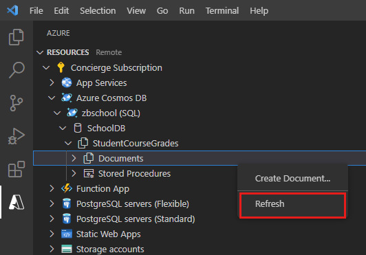
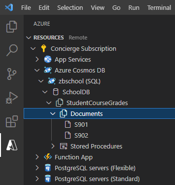

Cosmos DB provides a highly scalable document store suitable for holding a wide range of document types. The SQL API enables you to write applications that can easily query and maintain documents. 

In the sample scenario, you have decided to use Cosmos DB to store the details of courses, students who have taken those courses, and the grades these students achieved. You have previously written and tested code to create course and student objects in memory, and you now need to add functionality to save these documents to Cosmos DB, and to query documents held in Cosmos DB.

In this exercise, you'll extend the JavaScript app that you wrote previously. You'll add code that saves students and course documents to the Cosmos DB collection that you created in the first exercise in this module. You'll also add a query capability that enables users to find the course grades achieved by a specified student in a given academic year, and the grades received by all students that took a particular course.

This exercise runs on your desktop computer.

## Modularize the studentgrades.js script

1. Start Visual Studio Code if it isn't already running.

2. On the **File** menu, click **Open Folder**. Select the **grades** folder containing the code that you created in the previous exercise.

3. In the **Explorer** window, select the **studentgrades.js** script to open it in the editor window.

4. At the end of the file, comment out the code that calls the **test** function (leave the **test** function in place), and add the `export` statement shown below:

    ```javascript
    // test;

    export {Course, Student, getCourseData, getStudentData};
    ```

    You will use the exported types and functions in later tasks in this exercise.

5. Save the file.

## Configure a connection to Cosmos DB

1. In the toolbar on the left-hand side of Visual Studio Code, select the **Azure** icon.

2. In the **Cosmos DB** pane, click **Sign in to Azure** and sign in, if you are not already connected.

    

3. Expand your Azure account, right-click the **\<*your name or initials*\>school** Cosmos DB account, and then click **Copy Connection String**.

    

4. On the **File** menu, click **New File**.

5. Add the following object to the config.js file. Paste the connection string for your Cosmos DB account where indicated in the **connectionString** property:

    ```javascript
    //@ts-check
    var config = {
        connectionString: "YOUR CONNECTION STRING HERE",
        database: "SchoolDB",
        container: "StudentCourseGrades"
    }

    export {config};
    ```

6. Save the file with the name **config.js**.

7. On the **Terminal** menu, click **New Terminal** if you don't currently have a terminal window open.

8. In the **Terminal** window, run the following command to install the Cosmos DB package for JavaScript:

    ```bash
    npm install @azure/cosmos
    ```

9. On the **File** menu, click **New File** to create another file.

10. In the new file, add the following code:

    ```javascript
    //@ts-check
    import {config} from "./config.js";
    import * as cosmos from "@azure/cosmos";
    import * as coursetypes from "./studentgrades.js";

    const client = new cosmos.CosmosClient(config.connectionString);
    const databaseid = config.database;
    const containerid = config.container;
    const containerref = client.database(databaseid).container(containerid);
    const containerdata = containerref.items;
    ```

    The `import` statements enable you to use the exported objects, types and functions in the **config.js** and **studentgrades.js** scripts, as well as the **cosmos** package.

    YOU use the **CosmosClient** object to connect to your Cosmos DB account, using the connection string that you specified in the **config.js** script. The **containerref** object is a reference to the **StudentGrades** collection in the **SchoolDB** database in your Cosmos DB account. You will use the **containerdata** object to access the documents in this collection.

11. Save the file as **cosmosgrades.js**

## Maintain student and course documents in a collection

1. In the **cosmosgrades.js** script, add the following function:

    ```javascript
    function isOK(statusCode)
    {
        return statusCode >= 200 && statusCode <= 299;
    }
    ```

    This function takes an HTTP status code, and returns **true** if the code is in the 200 range. Codes in this range typically indicate that an operation was successful.

2. Add the function shown below to the **cosmosdb.js** script:

    ```javascript
    async function addStudent(student) {
        const { item, statusCode } = await containerdata.create(student);
        isOK(statusCode) && process.stdout.write(`Added student with id: ${item.id}\n`);
    }
    ```

    This function takes a **Student** object and adds it to the collection in the Cosmos DB database. If the insert was successful, the function displays a message indicating that the student document was added.

3. Add the **updateStudent** function show below to the **cosmosdb.js** script:

    ```javascript
    async function updateStudent(student) {
        const { item, statusCode } = await containerdata.upsert(student);
        isOK(statusCode) && process.stdout.write(`Updated student with id: ${item.id}\n`);
    }
    ```

    This function uses the **upsert** operation of the collection to update the student document with the data provided in the *student** parameter. You use this function to modify a student document.

4. Add the function shown below:

    ```javascript
    async function deleteStudent(student) {
        const { item, statusCode } = await containerref.item(student.id, student.AcademicYear).delete();
        isOK(statusCode) && process.stdout.write(`Deleted student with id: ${item.id}\n`);
    }
    ```

    This function removes the document for the specified student from the collection in the Cosmos DB database.

5. Create the following function:

    ```javascript
    async function addCourse(course) {
        const { item, statusCode } = await containerdata.create(course);
        isOK(statusCode) && process.stdout.write(`Added course with id: ${item.id}\n`);
    }
    ```

    This function follows the same pattern as the previous functions. It takes a **Course** object as the argument and uses it to create a document for the course in the database.

6. Create the following function that deletes a course from the Cosmos DB collection:

    ```javascript
    async function deleteCourse(course) {
        const { item, statusCode } = await containerref.item(course.id, course.AcademicYear).delete();
        isOK(statusCode) && process.stdout.write(`Deleted course: ${item.id}\n`);
    }
    ```

## Query and retrieve student and course documents from a collection

1. Add the function shown below to the **cosmosgrades.js** script:

    ```javascript
    async function getCourse(id, year) {
        const { resource, statusCode } = await containerref.item(id, year).read();
        isOK(statusCode) && process.stdout.write(`Course data: ${resource.id}: ${resource.CourseName}: ${resource.AcademicYear}\n`);
    }
    ```

    This function takes a course id and academnic year (the partition key), and uses this information to retrieve the corresponding course document from the Cosmos DB collection.

2. Add the following function to the script:

    ```javascript
    async function getStudent(id, year) {
        const { resource, statusCode } = await containerref.item(id, year).read();
        if (isOK(statusCode)) { 
            process.stdout.write(`Student data: ${resource.id}: ${resource.Name.Forename}, ${resource.Name.Lastname}: ${resource.AcademicYear}\n`);
            resource.CourseGrades.forEach (function(coursegrade) {
                process.stdout.write(`${coursegrade.Course}:${coursegrade.Grade}\n`);
            });
        }
    }
    ```

    This function fetches a student document, given the id and academic year. The details of the student are displayed. The `forEach` loop displays the grades for each course the student has taken, listed in the **CourseGrades** array for the student.

3. Create the following function:

    ```javascript
    async function queryStudents(course) {
        const studentquery = {
            query: "SELECT s.id, s.Name.Forename, s.Name.Lastname, c.Course, c.Grade \
                    FROM students s JOIN c IN s.CourseGrades \
                    WHERE s.AcademicYear = @year AND c.Course = @coursename",
            parameters: [
                {
                    name: "@year",
                    value: course.AcademicYear
                },
                {
                    name: "@coursename",
                    value: course.CourseName
                }
            ]
        };

        const { resources } = await containerdata.query(studentquery).fetchAll();
        for (let queryResult of resources) {
            let resultString = JSON.stringify(queryResult);
            process.stdout.write(`\nQuery returned ${resultString}\n`);
        }
    }
    ```

    This function uses the **query** function of the collection to find the documents for all students that have taken the course specified in the function argument. The function displays the details of each student, and the grade achieved.

## Test the cosmosgrades app

1. Add the **test** function shown below to the **cosmosgrades.js** script:

    ```javascript
    async function test() {
        process.stdout.write("Testing addCourse and getCourse\n\n");
        let course1 = coursetypes.getCourseData();
        await addCourse(course1).then(
            () => getCourse(course1.id, course1.AcademicYear)
        );

        let course2 = coursetypes.getCourseData();
        await addCourse(course2).then(
            () => getCourse(course2.id, course2.AcademicYear)
        );

        process.stdout.write("\n\nTesting addStudent and getStudent\n\n");
        let student1 = coursetypes.getStudentData();
        await addStudent(student1).then(
            () => getStudent(student1.id, student1.AcademicYear)
        );
        process.stdout.write("\n\nTesting addStudent and getStudent\n\n");
        let student2 = coursetypes.getStudentData();
        await addStudent(student2).then(
            () => getStudent(student2.id, student2.AcademicYear)
        );

        process.stdout.write("\n\nTesting updateStudent\n\n");
        student1.addGrade(course1.CourseName, "A");
        student1.addGrade(course2.CourseName, "C");
        await updateStudent(student1).then(
            () => getStudent(student1.id, student1.AcademicYear)
        );

        student2.addGrade(course1.CourseName, "B");
        student2.addGrade(course2.CourseName, "D");
        await updateStudent(student2).then(
            () => getStudent(student2.id, student2.AcademicYear)
        );

        process.stdout.write("\n\nTesting queryStudents\n\n");
        await queryStudents(course1);
        await queryStudents(course2);


        process.stdout.write("\n\nTesting deleteStudent\n\n");
        await deleteStudent(student1).then(
            () => getStudent(student1.id, student1.AcademicYear)
        );
        await deleteStudent(student2).then(
            () => getStudent(student2.id, student2.AcademicYear)
        );


        process.stdout.write("\n\nTesting deleteCourse\n\n");
        await deleteCourse(course1).then(
            () => getStudent(course1.id, course1.AcademicYear)
        );
        await deleteCourse(course2).then(
            () => getCourse(course2.id, course2.AcademicYear)
        );

        process.stdout.write("\n\nDone\n");
    }
    ```

    This function tests each of the functions you have created. It performs the following tasks:

    1. It creates two courses using values specified by the user with the **getCourseData** function you created in the previous exercises. The code adds both courses to the collection in Cosmos DB using the **addCourse** function, and verifies that the courses were added successfully by querying the with the **getCourse** function.

    2. It creates two students, and adds them to the collection using the **addStudent** function. The test verifies that the students were created using the **getStudent** function.

    3. It assigns grades for each course to both students, and then updates the student documents in the collection in Cosmos DB with the **updateStudent** function. The **getStudent** function is run to retrieve and display the details of each student, which should now include the course grade data.

    4. It runs the **queryStudents** function to display the grades for all students that have taken each course.

    5. It removes the student documents from the collection in Cosmos DB with the **deleteStudent** function. The **getStudent** function is used to try and retrieve the student data afterwards. In both cases, the documents should no longer be present, and nothing will be displayed.

    6. It deletes the course documents using the **deleteCourse** function, and calls the **getCourse** function to check that they have been removed.

2. Save the **cosmosgrades.js** file.

3. On the **Debug** menu, click **Open Configurations**.

4. In the **launch.json** file, change the **program** property to reference the **cosmosgrades.js** script, as shown below:

    ```json
    {
        // Use IntelliSense to learn about possible attributes.
        // Hover to view descriptions of existing attributes.
        // For more information, visit: https://go.microsoft.com/fwlink/?linkid=830387
        "version": "0.2.0",
        "configurations": [
            {
                "type": "node",
                "request": "launch",
                "name": "Launch Program",
                "program": "${workspaceFolder}/cosmosgrades.js",
                "console": "externalTerminal",
                "runtimeArgs": ["-r", "esm"]
            }
        ]
    }
    ```

5. Save the **launch.json** file.

6. On the **Debug** menu, click **Start Without Debugging**

    The message **Testing addCourse** and **getCourse** appear in the terminal window.

7. At the first set of prompts, enter the values shown in the following table:

    | Prompt  | Value  |
    |---|---|
    | Course code: | CS201 |
    | Course name: | Computer Science |
    | Academic year: | 2019 |

    The message **Added course with id: CS201** should appear after you've entered the academic year. This is followed by the message **Course data: C201: Computer Science: 2019**.  This is the data displayed by the **getCourse** function, after the course has been added to the Cosmos DB collection.

8. At the next set of prompts, enter the following values:

    | Prompt  | Value  |
    |---|---|
    | Course code: | CS202 |
    | Course name: | Statistics |
    | Academic year: | 2019 |

    The messages **Added course with id: CS202** and **Course data: C202: Statistics: 2019** should appear, indicating that the document for this course has also been added to the Cosmos DB collection.

9. When prompted for the details of the first student, enter the following values:

    | Prompt  | Value  |
    |---|---|
    | Student id | SU998 |
    | Forename | Eeeeee |
    | Lastname | Ffffff |
    | Academic year: | 2019 |

    The messages **Added student with id: SU998** should appear, followed by **Student data: SU998: Eeeeee, Ffffff: 2019** displayed by the **getStudent** function.

10. When prompted for the details of the second student, enter the following values:

    | Prompt  | Value  |
    |---|---|
    | Student id | SU999 |
    | Forename | Gggggg |
    | Lastname | Hhhhhh |
    | Academic year: | 2019 |

    The messages **Added student with id: SU999** and **Student data: SU999: Gggggg, Hhhhhh: 2019** should be displayed.

11. You should then see the following sequence of messages as the remaining functionality is tested:

    ```text
    Testing updateStudent

    Updated student with id: SU998
    Student data: SU998: Eeeeee, Ffffff: 2019
    Computer Science:A
    Statistics:C
    Updated student with id: SU999
    Student data: SU999: Gggggg, Hhhhhh: 2019
    Computer Science:B
    Statistics:D


    Testing queryStudents


    Query returned {"id":"SU998","Forename":"Eeeeee","Lastname":"Ffffff","Course":"Computer Science","Grade":"A"}

    Query returned {"id":"SU999","Forename":"Gggggg","Lastname":"Hhhhhh","Course":"Computer Science","Grade":"B"}

    Query returned {"id":"SU998","Forename":"Eeeeee","Lastname":"Ffffff","Course":"Statistics","Grade":"C"}

    Query returned {"id":"SU999","Forename":"Gggggg","Lastname":"Hhhhhh","Course":"Statistics","Grade":"D"}


    Testing deleteStudent

    Deleted student with id: SU998
    Deleted student with id: SU999


    Testing deleteCourse

    Deleted course: CS201
    Deleted course: CS202


    Done
    ```

12. Close the debug terminal window.

## Verify the documents in the Cosmos DB database

1. Return to the **cosmosgrades.js** script.

2. In the **test** function, comment out the statements that test the **deleteStudent** and **deleteCourse** functions:

    ```javascript
    /*
    process.stdout.write("\n\nTesting deleteStudent\n\n");
    await deleteStudent(student1).then(
        () => getStudent(student1.id, student1.AcademicYear)
    );
    await deleteStudent(student2).then(
        () => getStudent(student2.id, student2.AcademicYear)
    );

    process.stdout.write("\n\nTesting deleteCourse\n\n");
    await deleteCourse(course1).then(
        () => getStudent(course1.id, course1.AcademicYear)
    );
    await deleteCourse(course2).then(
        () => getCourse(course2.id, course2.AcademicYear)
    );
    */
    ```

3. Run the application again, and enter the same data as before.

4. When the app has finished, in Visual Studio Code, in the left-hand toolbar, click the **Azure** icon.

5. In the **Cosmos DB** pane, expand your Azure account, expand the **\<your name or initials\>school** Cosmos DB account, expand the **SchoolDB** database, expand the **StudentCourseGrades** collection, right-click **Documents**, and then click **Refresh**.

    

6. Expand the **Documents** folder. You should see the four documents that you created in the first exercise (**C101**, **C102**, **SU001**, and **SU002**), together with the four documents created by the cosmosgrades.js app:

    

7. Click the **CS201** document. It should look similar to this:

    ```json
    {
        "id": "CS201",
        "CourseName": "Computer Science",
        "AcademicYear": "2019",
        "_rid": "VHU7AIjfokgLAAAAAAAAAA==",
        "_self": "dbs/VHU7AA==/colls/VHU7AIjfokg=/docs/VHU7AIjfokgLAAAAAAAAAA==/",
        "_etag": "\"9f004e6d-0000-1000-0000-5d9f15620000\"",
        "_attachments": "attachments/",
        "_ts": 1570706786
    }
    ```

    The contents of the **id**, **CourseName**, and **AcademicYear** fields should match the input you provided for course **CS201** when you ran the app.

    If time allows, also examine the **CS202** document.

8. Click the **SU998** student document. You should see the details of the student, including the grades for each course in the **CourseGrades** array:

    ```json
    {
        "id": "SU998",
        "AcademicYear": "2019",
        "Name": {
            "Forename": "Eeeeee",
            "Lastname": "Ffffff"
        },
        "CourseGrades": [
            {
                "Course": "Computer Science",
                "Grade": "A"
            },
            {
                "Course": "Statistics",
                "Grade": "C"
            }
        ],
        "_rid": "VHU7AIjfokgNAAAAAAAAAA==",
        "_self": "dbs/VHU7AA==/colls/VHU7AIjfokg=/docs/VHU7AIjfokgNAAAAAAAAAA==/",
        "_etag": "\"9f000e78-0000-1000-0000-5d9f158a0000\"",
        "_attachments": "attachments/",
        "_ts": 1570706826
    }
    ```
