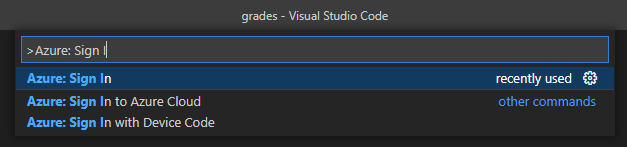
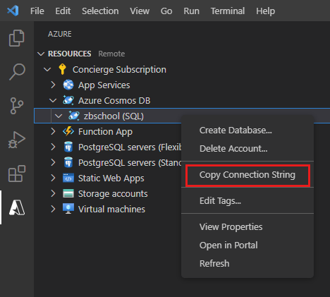

Azure Databases extension provides a highly scalable document store suitable for holding a wide range of document types. The SQL API enables you to write applications that can easily query and maintain documents.

In the sample scenario, you're using Azure Databases extension to store the details of students, and the course grades they achieved. You've written and tested code to create student objects in memory. You now need to add functionality to save these documents to Azure DB, and to query documents held in Azure DB.

In this exercise, you'll extend the JavaScript app you wrote previously. You'll add code that saves student documents to the Azure Databases extension container you created in the first exercise of this module. You'll add a query capability that enables users to find the course grades achieved by a specified student in a given academic year. Then you'll see the grades received by students who took a particular course.

This exercise runs on your desktop computer and uses an Azure sandbox for your resources.

## Configure a connection to Azure Databases extension

The first task is to enable your application to connect to the Azure Databases extension account you created in the first exercise.

1. Start Visual Studio Code if it isn't already running, and open the **grades** folder, holding the **studentgrades.js** file.

2. On the **Terminal** menu, click **New Terminal** if you don't currently have a terminal window open.

3. In the **Terminal** window, run the following command to install the Azure Databases extension package for JavaScript:

    ```bash
    npm install @azure/cosmos
    ```

4. Add the following code to the studentgrades.js file, immediately above the **Student** class. This object wraps the connection, database, and container information you'll use to access documents in the Azure database:

    ```javascript
    let config = {
        connectionString: "YOUR CONNECTION STRING WILL GO HERE SHORTLY",
        database: "SchoolDB",
        container: "StudentCourseGrades"
    }
    ```

5. In the toolbar on the left side of Visual Studio Code, select the **Azure** icon.

6. In the **Azure Databases extension** pane, if you aren't already connected, click **Sign in to Azure**. Sign in with the same credentials you used to set up the sandbox.

    

7. Expand your Azure account, right-click your Azure Databases extensionaccount, and then click **Copy Connection String**.

    

8. Paste the connection string for your Azure DB account where indicated in the **connectionString** property of the **config** object in your code.

9. Add the following code between the **config** object and the **Student** class:

    ```javascript
    const cosmos = require("@azure/cosmos");

    const client = new cosmos.AzureClient(config.connectionString);
    const databaseid = config.database;
    const containerid = config.container;
    const containerref = client.database(databaseid).container(containerid);
    const containerdata = containerref.items;
    ```

    The `require` statement loads the types and functions in the **cosmos** package.

    You use the **AzureClient** object to connect to your Azure DB account. Use the connection string that you specified in the **config.js** script. The **containerref** object is a reference to the **StudentGrades** container in the **SchoolDB** database in your Azure DB account. You'll use the **containerdata** object to access the documents in this container.

10. Save the file.

## Maintain student documents in a container

You'll now use the Azure DB client to insert, update, and delete student documents in the database.

1. Add the following function to your code, directly above the **Student** class:

    ```javascript
    function isOK(statusCode) {
        return statusCode >= 200 && statusCode <= 299;
    }
    ```

    This function takes an HTTP status code, and returns **true** if the code is in the 200 range. Codes in this range typically indicate that an operation was successful.

2. Add the function shown below to the script, after the **isOK** function:

    ```javascript
    async function addStudent(student) {
        const { item, statusCode } = await containerdata.create(student).catch();
        isOK(statusCode) && process.stdout.write(`Added student with id: ${item.id}\n`);
    }
    ```

    This function takes a **Student** object and adds it to the container in the Azure database. If the insert was successful, the function displays a message indicating that the student document was added.

    > [!NOTE]
    > If the **create** method returns an HTTP status code outside of the 200-299 range, it throws an exception. The empty **catch** handler is intended to catch and discard this exception as it's handled by the **isOK** statement.

3. Add the **updateStudent** function shown below to the script, after the **addStudent** function:

    ```javascript
    async function updateStudent(student) {
        const { item, statusCode } = await containerdata.upsert(student).catch();;
        isOK(statusCode) && process.stdout.write(`Updated student with id: ${item.id}\n`);
    }
    ```

    This function uses the **upsert** operation of the container to update the student document with the data provided in the **student** parameter. You use this function to modify a student document.

4. Add the function shown below to the script, after the **updateStudent** function:

    ```javascript
    async function deleteStudent(student) {
        const { item, statusCode } = await containerref.item(student.id, student.StudentNumber).delete().catch();
        isOK(statusCode) && process.stdout.write(`Deleted student with id: ${item.id}\n`);
    }
    ```

    This function removes the document for the specified student from the container in the Azure database.

## Query and retrieve student documents from a container

In this task, you'll add a function that retrieves a student document using its ID. You'll also create a more generalized function that finds all students that have taken a particular course.

1. Add the function shown below to the script, after the **deleteStudent** function:

    ```javascript
    async function getStudent(ID, studentNumber) {
        const { resource, statusCode } = await containerref.item(ID, studentNumber).read().catch();;
        if (isOK(statusCode)) {
            process.stdout.write(`Student data: ${resource.StudentNumber}: ${resource.Forename}, ${resource.Lastname}\n`);
            resource.CourseGrades.forEach (function(coursegrade) {
                process.stdout.write(`${coursegrade.Course}:${coursegrade.Grade}\n`);
            });
            return new Student(resource.id, resource.StudentNumber, resource.Forename, resource.Lastname);
        }
        return null;
    }
    ```

    This function fetches a student document, given the id and the studentNumber (the partition key). The details of the student are displayed. The `forEach` loop displays the grades for each course the student has taken, listed in the **CourseGrades** array for the student. The function returns a **Student** object using the details retrieved from the database. If no matching student is found, the function returns a null reference.

2. Add the following function, after the **getStudent** function:

    ```javascript
    async function queryStudents(courseName) {
        const studentquery = {
            query: "SELECT s.StudentNumber, s.Forename, s.Lastname, c.Course, c.Grade \
                    FROM students s JOIN c IN s.CourseGrades \
                    WHERE c.Course = @coursename",
            parameters: [
                {
                    name: "@coursename",
                    value: courseName
                }
            ]
        };

        const { resources } = await containerdata.query(studentquery).fetchAll();
        for (let queryResult of resources) {
            let resultString = JSON.stringify(queryResult);
            process.stdout.write(`\nQuery returned ${resultString}\n`);
        }
    }
    ```

    This function uses the **query** function of the container to find the documents for all students who have taken the course specified in the function argument. The function displays the details of each student, and the grade achieved.

## Test the app

You can now create and run a test harness that verifies that your code creates student documents correctly.

1. Replace the existing **test** function near the end of the script with the code shown below. Note that this is an asynchronous function:

    ```javascript
    async function test() {
        process.stdout.write("\n\nTesting addStudent and getStudent\n\n");

        // Create a new student
        let student1 = getStudentData();
        await addStudent(student1).then(
            () => getStudent(student1.id, student1.StudentNumber)
        );

        process.stdout.write("\n\n");

        // Create another student
        let student2 = getStudentData();
        await addStudent(student2).then(
            () => getStudent(student2.id, student2.StudentNumber)
        );

        process.stdout.write("\n\n");

        // The first student got an A in Physics and a C in Chemistry
        process.stdout.write("\n\nTesting updateStudent\n\n");
        student1.addGrade("Physics", "A");
        student1.addGrade("Chemistry", "C");
        await updateStudent(student1).then(
            () => getStudent(student1.id, student1.StudentNumber)
        );

        process.stdout.write("\n");

        // The second student got a B in Physics and a D in Mathematics
        student2.addGrade("Physics", "B");
        student2.addGrade("Mathematics", "D");
        await updateStudent(student2).then(
            () => getStudent(student2.id, student2.StudentNumber)
        );

        process.stdout.write("\n\n");

        // Find all students that have taken Physics
        process.stdout.write("\n\nTesting queryStudents\n\n");
        process.stdout.write("Students who have taken Physics\n");
        await queryStudents("Physics");

        // Find all students that have taken Computer Science
        process.stdout.write("\n\nStudents who have taken Computer Science\n");
        await queryStudents("Computer Science");

        // Delete the students created in the first exercise
        process.stdout.write("\n\nTesting deleteStudent\n\n");
        let oldStudent = await getStudent("S101", "101");
        if (oldStudent) {
            await deleteStudent(oldStudent).then(
                () => getStudent(oldStudent.id, oldStudent.StudentNumber)
            );
        }

        process.stdout.write("\n");

        oldStudent = await getStudent("S102", "102");
        if (oldStudent) {
            await deleteStudent(oldStudent).then(
                () => getStudent(oldStudent.id, oldStudent.StudentNumber)
            );
        }

        process.stdout.write("\n\nDone\n");
    }
    ```

    This code tests each of the functions you've created. It does the following tasks:

    1. It creates two students, and adds them to the container using the **addStudent** function. The test verifies that the students were created using the **getStudent** function.

    2. It assigns grades for each course to both students, then updates the student documents in the Azure Databases extension container with the **updateStudent** function. The **getStudent** function is run to retrieve and display the details of each student. These details should now include the course grade data.

    3. It runs the **queryStudents** function to display the grades for all students who have taken each course.

    4. It removes student documents from the container in Azure Databases extension with the **deleteStudent** function. The students removed are those created manually, in the first exercise in this module. The **getStudent** function is used to retrieve the student data afterward. In both cases, the documents should no longer be present, and nothing will be displayed.

2. Save the file.

3. On the **View** menu, click **Terminal** to display the terminal window.

4. In the Terminal window, run the **studentgrages** script:

    ```bash
    node studentgrades.js
    ```

    The messages **Testing addStudent** and **getStudent** appear in the terminal window.

5. At the first set of prompts, enter the values shown in the following table:

    | Prompt  | Value  |
    |---|---
    | Please enter the student's document ID: | S901 |
    | Enter the student's number | 901 |
    | Enter the student's forename: | ABC |
    | Enter the student's last name: | DEF |

    The following messages should appear. This is the data displayed by the **getStudent** function, after the course has been added to the Azure Databases extensioncontainer by the **addStudent** function:

    ```text
    Added student with id: S901
    Student data: 901: ABC, DEF
    ```

6. At the next set of prompts, enter the following values:

    | Prompt  | Value  |
    |---|---|
    | Please enter the student's document ID: | S902 |
    | Enter the student's number | 902 |
    | Enter the student's forename: | TUV |
    | Enter the student's last name: | XYZ |

    The following message should appear, indicating that the document for this student has also been added to the Azure Databases extension container.

    ```text
    Added student with id: S902
    Student data: S902: TUV, XYZ
    ```

7. You should then see the following sequence of messages as the **updateStudent** function is tested:

    ```text
    Testing updateStudent

    Updated student with id: S901
    Student data: 901: ABC, DEF
    Physics:A
    Chemistry:C

    Updated student with id: S902
    Student data: 902: TUV, XYZ
    Physics:B
    Mathematics:D
    ```

    These messages show that the student documents were successfully modified, and the grades for the courses for each student have been added.

8. The next set of messages should appear, as the **queryStudents** function is tested:

    ```text
    Testing queryStudents

    Students who have taken Physics

    Query returned {"StudentNumber":"901","Forename":"ABC","Lastname":"DEF","Course":"Physics","Grade":"A"}

    Query returned {"StudentNumber":"902","Forename":"TUV","Lastname":"XYZ","Course":"Physics","Grade":"B"}


    Students who have taken Computer Science

    Query returned {"StudentNumber":"101","Forename":"AAA","Lastname":"BBB","Course":"Computer Science","Grade":"A"}

    Query returned {"StudentNumber":"102","Forename":"CCC","Lastname":"DDD","Course":"Computer Science","Grade":"C"}
    ```

    The first group of messages lists the students who have taken Physics. These are the two students added earlier in this test.

    The second set of messages shows students who have taken Computer Science. You added these students manually to the database in the first exercise of this module.

9. The final set of messages, testing the **deleteStudent** function, should look like this:

    ```text
    Testing deleteStudent

    Student data: 101: AAA, BBB
    Computer Science:A
    Applied Mathematics:B
    Deleted student with id: S101

    Student data: 102: CCC, DDD
    Computer Science:C
    Deleted student with id: S102

    Done
    ```

    The test fetches student 101 using the **getStudent** function, which displays the details for that student. The student is removed. The test then attempts to retrieve the student again, but this time it should no longer find it, so no further details are printed.

    The same series of operations is performed for student 102.

## Verify the documents in the Azure database

You'll now query the documents in the database directly, using the Azure Azure DB extension for Visual Studio Code. You'll verify that the documents created by the app have been stored in the database.

1. In the **Azure DB** pane, expand your Azure account, expand the **\<your name or initials\>school** Azure DB account, expand the **SchoolDB** database, expand the **StudentCourseGrades** container, right-click **Documents**, and then click **Refresh**.

    :::image type="content" source="../media/7-cosmosdb-refresh.png" alt-text="Screenshot of Azure DB pane in Visual Studio Code. The user has selected the Refresh command." loc-scope="vs-code":::

2. Expand the **Documents** folder. You should see only the documents **S901** and **S902**. The documents that you created in the first exercise (**S101**, and **S102**) should have been deleted:

    :::image type="content" source="../media/7-cosmosdb-documents.png" alt-text="Screenshot of Azure DB pane in Visual Studio Code showing the documents in the StudentCourseGrades container." loc-scope="vs-code":::

3. Click the **S901** document. It should look similar to this:

    ```json
    {
        "id": "S901",
        "StudentNumber": "901",
        "Forename": "ABC",
        "Lastname": "DEF",
        "CourseGrades": [
            {
                "Course": "Physics",
                "Grade": "A"
            },
            {
                "Course": "Chemistry",
                "Grade": "C"
            }
        ],
        "_rid": "CuseAK0zY2wGAAAAAAAAAA==",
        "_self": "dbs/CuseAA==/colls/CuseAK0zY2w=/docs/CuseAK0zY2wGAAAAAAAAAA==/",
        "_etag": "\"03002834-0000-1000-0000-5dcbe24e0000\"",
        "_attachments": "attachments/",
        "_ts": 1573642830
    }
    ```

    The contents of the **id**, **StudentNumber**, **Forename**, and **Lastname** fields should match the input you provided for student **S901** when you ran the app. The course grades were added by the app.

    If time allows, also examine the **S902** document.

You've now used Visual Studio Code to create a Node.js application that can query, insert, update, and delete documents in an Azure database.
