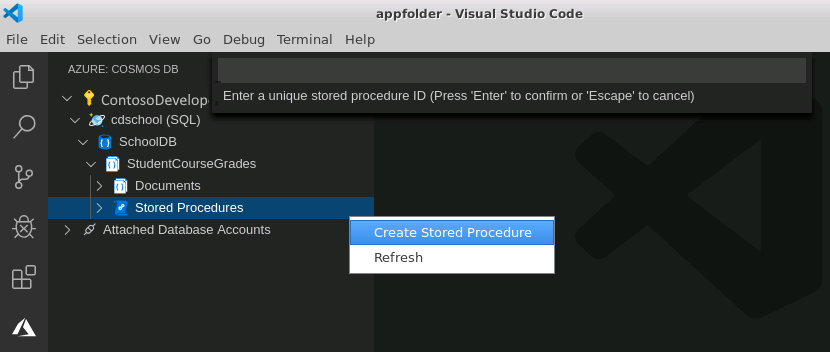
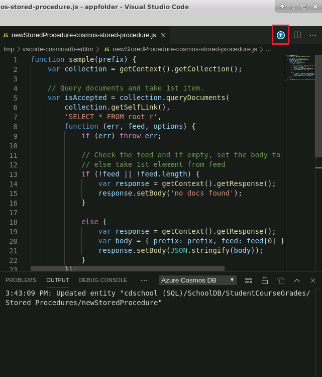

You use stored procedures to manipulate one or more documents in a collection. With a stored procedure, you can create, modify, delete, and query data spanning one or many documents in a single logical operation. Stored procedures run using the Cosmos DB service rather than Node.js on a client. The JavaScript engine in Cosmos DB is optimized to get the best performance for stored procedures that generate many writes to the database.

In this unit, you'll learn how Cosmos DB stored procedures work, and the transactional semantics that they provide for multi-write operations. You'll see how to create a stored procedure and process data by using the JavaScript query API. You'll learn about the bounded execution model used by Cosmos DB. You'll see how to call a stored procedure from a Node.js application, how to pass parameters, and how to return results.

## What is a Cosmos DB stored procedure?

A Cosmos DB stored procedure is a JavaScript function that is run by Cosmos DB rather than by a client application. A stored procedure can read and write documents and perform bulk updates as a single request from a client application. The JavaScript engine is optimized to perform batch processing, such as modifying hundreds of documents at a time. Performing an operation that affects many documents from a client application would typically require many requests and network round-trips. Using a stored procedure, you can perform the same operation as a single client request.

A stored procedure belongs to a collection, and can only affect documents in that collection.

Stored procedures run in an environment that is isolated and sandboxed from other operations. Code running in one stored procedure in a collection in a Cosmos DB database can't inadvertently affect other databases, collections, or server-side operations. When a stored procedure completes execution, its complete contextual environment is removed from its assigned memory-space and can't be read by (or otherwise affect) other code that reuses the same memory address space later.

Although a Cosmos DB stored procedure is written using JavaScript code, the sandboxed environment places restrictions on the operations it can perform. For example, a stored procure can't read or write files, make requests to external services, or send and receive input from sources outside of the calling environment. These restrictions are designed to protect the integrity of your databases (and those of other users) against external, possibly malicious, agents.

## How stored procedures use transactions

All the database operations carried out in the body of a single stored procedure are atomic, meaning that all the operations are treated as a single logical unit of work, also referred to as a transaction. You can use transactions to protect your data from inconsistencies caused by batches that fail part-way through processing; all the operations in a stored procedure must succeed, or if one operation fails then the preceding changes are undone.

Transactions in Cosmos DB only apply to a single partition of a collection. Since all the operations in a stored procedure are treated as a single transaction, it follows that each execution a stored procedure can only act on a single partition. When you run a stored procedure against a partitioned collection, you must supply the partition key for the target partition as an option to the procedure call.

You should consider how you plan to use stored procedures when you're designing your partitioning strategy, since you won't be able to write stored procedures that affect more than one partition in a single execution. Factors you might consider include:

- If you plan to use stored procedures to operate on one document at a time, then you're free to select any partitioning strategy; each document will always be in a single partition.
- If you plan to use stored procedures to create, update, or delete documents in bulk, you can only change documents in one partition at a time. You should consider aligning your partitioning strategy accordingly, and you need to be prepared to execute your stored procedures once for each partition you want to affect.
- If you plan to use stored procedures to aggregate or otherwise summarize document properties, you can't summarize documents from more than one partition in a single stored procedure call. You should consider aligning your partitioning strategy with any aggregations you need to compute, and you need to be prepared to execute your stored procedures once for each partition you want to summarize.

## Access data in a stored procedure

Stored procedures run within the context of the security account with which you connected to Cosmos DB. You don't need to sign in again. Behind the scenes, Cosmos DB implements a stored procedure call as an HTTP request. You can access properties of the request through the context, and you can also use the context to return information from the stored procedure back to the client.

Stored procedures interact with the database through a well-defined object model that provides access to the current collection, context, request, and response objects. The **getContext** function returns a **context** object. You use the **getCollection** function of the **context** object to obtain a reference to the collection containing the stored procedure. The **collection** object returned by the **getCollection** function provides the following functions for manipulating documents in that collection:

- **createDocument**. This method takes a JSON object and adds it as a new document to the collection.
- **replaceDocument**. Use this method to replace a document with a new one. Cosmos DB doesn't support field-by-field modifications of a document. Instead, you overwrite a document with a new one containing the updated values.
- **deleteDocument**. This method takes a reference to a document in the collection and removes the document from the collection.
- **queryDocuments**. Use this method to send a SQL request that retrieves matching documents from the collection.

These functions operate asynchronously. You provide a callback function that runs when the operation completes. The callback function receives three parameters: An object that contains the details of any error that occurred while performing the operation, a reference to the document that was affected by the operation, and an **options** object that contains additional information associated with the operation (this can be empty).

You return a value from a stored procedure by setting the **response** object obtained from the context. The following example, based on the sample scenario, shows the code for a stored procedure that takes the ID of a student, and the academic year. The stored procedure removes the course grade information for that student. The response message from the stored procedure indicates how many student documents were modified (either 0 or 1):

```javascript
function clearStudentGrades(studentID, academicYear){

    var collection = getContext().getCollection();
    var response = getContext().getResponse();

    var docQuery = {
        query: "SELECT * FROM Student s WHERE s.id = @id AND s.AcademicYear = @year",
        parameters: [
            { name: "@id", value: studentID },
            { name: "@year", value: academicYear}
        ]
    };

    // Find the document for the student
    // The queryDocuments function requires a reference to the collection rather than the collection itself.
    // This reference is available through the **getSelfLink** function of the collection
    var collectionLink = collection.getSelfLink();
    var isAccepted = collection.queryDocuments(collectionLink, docQuery, {}, function(err, docs, options) {
        // Callback function that runs when the query returns
        // If no error occurred, and a student object was returned, then clear out the course grades

        // If an error occurred, pass the details back to the client
        if (err)
          throw Error(err);

        // If the list of documents returned by the query is non-empty, then remove the grades from the doc
        if (docs.length > 0)
          tryClearGrades(docs[0], collection, response);

        // If no matching student doc was found, then return a response indicating that no changes were made
        var responseBody = { StudentsUpdated: 0 };
        response.setBody(responseBody)
    });
}

// Function that attempts to remove the course grades from the specified doc
function tryClearGrades(studentDoc, collection, response) {

    studentDoc.CourseGrades = [];

    // Write the updated doc back to the collection.
    // The replaceDocument function requires a document reference rather than a document. 
    // The _self property of a document returns a reference to itself.
    var isAccepted = collection.replaceDocument(studentDoc._self, studentDoc, {}, function(err, doc, options) {
        // Callback function that runs when replaceDocument completes
        if (err)
          throw Error(err);

        // Return the number of docs updated to the client app (should be just 1).
        var responseBody = { StudentsUpdated: 1 };
        response.setBody(responseBody)
    });
}
```

The previous example used the **queryDocument** function to retrieve a document. The JavaScript query API allows you to compose queries using a fluent JavaScript interface. You can build queries programmatically, by passing predicates to function calls, and chaining functions together. These queries can be efficiently parsed by the server-side JavaScript engine. These functions include:

- **filter**. This function applies a predicate to a set of documents, and returns the documents that match. It's similar to the `WHERE` clause in an SQL query.
- **map**. This function applies a projection that maps items to a JavaScript value. It's similar to the `SELECT` clause in an SQL query.
- **sortBy** and **sortByDescending**. These functions sort a set of documents into ascending or descending order by applying a predicate specified as one of the arguments to the function.
- **pluck**. This function retrieves the value of a specified property from a collection of documents.

You can find the full details of these functions online, at [JavaScript query API for Azure Cosmos DB](https://docs.microsoft.com/azure/cosmos-db/javascript-query-api).

## Create a stored procedure using Visual Studio Code

You can create and edit stored procedures from within Visual Studio Code, using the Cosmos DB pane. Sign in to your account, expand your Cosmos DB account, expand your database, expand the collection you want to use, right-click **Stored Procedures**, and then click **Create Stored Procedure**:



At the prompt, enter a name for the stored procedure, and then press Enter. A stored procedure is created with an example function, named **sample**. The function appears in the editor window. YOU can overwrite this function with your own code, and then click the **Update to Cloud** button in the toolbar to save it.



> [!NOTE]
> The function name for the stored procedure does not have to be the same as the stored procedure ID, but it is less confusing if you make them the same.

To edit an existing stored procedure, click the stored procedure name in the Cosmos DB pane. Make your changes in the editor, and then click **Update to Cloud**.

To delete a stored procedure, right-click the stored procedure name in the CosmosDB pane, and then click **Delete Stored Procedure**.

## Bounded execution

To prevent server-side operations affecting performance, all requests to stored procedures operations—including stored procedures—must complete inside a hard-coded server-side timeout, unofficially documented as five seconds. If a stored procedure doesn't finish within this period, the stored procedure will be abandoned, any changes rolled back, and an HTTP 408 error code returned to the client.

To simplify working with the server-side timeout, all the functions relating to creating, reading, updating, and deleting documents supported by the **collection** object return a Boolean value that indicates whether the server-side timeout is about to expire. A return value of **False** indicates that the timeout has almost been reached. By testing the return value, server-side code can determine whether it can continue to run, or whether the operation must complete to avoid being aborted. In the example stored procedure shown earlier, this value was captured by the **isAccepted** variable, although the value was never used (to keep the example code straightforward).

To enable operations that can't run in a single timeout period to complete, you can use a continuation model. In a continuation model:

1. The client calls a stored procedure.
2. The stored procedure runs, checking the Boolean return value of each create, read, update, and delete function until the return value is **False**, or the stored procedure completes
3. If the stored procedure hasn't finished, it returns a continuation indicator to the client. This might be a count of records processed so far, or some other value indicating that the stored procedure hasn't completed its work, but was about to run out of time.
4. The client calls the stored procedure again, adjusting the parameter values (if necessary) to enable the stored procedure to continue where it left off. This cycle repeats until there are no more records to process.

For example, if you've created a stored procedure to update a potentially large number of documents based on parameter values specified by the client, the stored procedure could implement the following logic:

1. Run a query that identifies each document to modify, using the **queryDocuments** function.
2. In the callback function handling the result of **queryDocuments**, create a counter that keeps track of the number of documents updated so far, and initialize it to zero.
3. Iterate through the documents found, as follows:
   1. Increment the counter.
   2. Attempt to update the next document using the **replaceDocument** function.
   3. If the **replaceDocument** function returns false, populate the response body with the value of the counter and finish.

The client application can call the stored procedure, and examine the value returned. If the return value is non-zero, the stored procedure has updated one or more records, but there might be more to process. In this case, run the stored procedure again. Repeat until the value returned is zero. At this point, there are no more documents to process.

## Call a stored procedure from a Node.js application

A Node.js client application runs a stored procedure using a two-step approach. The first step is to obtain a reference to the stored procedure using the **storedProcedure** function of the **scripts** property of the collection. You obtain the collection using the Cosmos DB client, as described in the previous units. The second step is to call the **execute** method of the store procedure reference. The **execute** method takes the partition key and stored procedure parameters as an array of string properties. The stored procedure will run using the data in the specified partition. The data returned in the **response** object of the stored procedure is passed back to the client.

The example below shows how to call the **clearStudentGrades** defined earlier from a Node.js application.

```javascript
async function clearStudentGrades(studentid, year) {
    const storedProcID = "clearStudentGrades";
    const parameters = [studentid, year];

    let storedProcRef = containerref.scripts.storedProcedure(storedProcID);

    const { resource: response } = await storedProcRef.execute(year, parameters);
    process.stdout.write(`\nUpdated ${response.StudentsUpdated}\n`);
}
```
