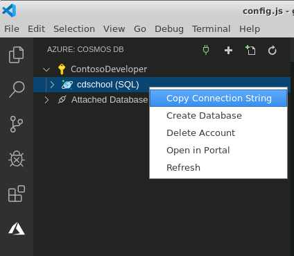
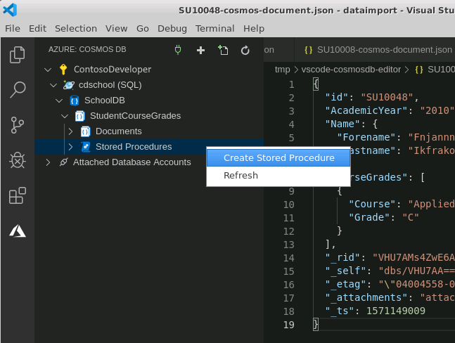

You can use stored procedures with Cosmos DB to perform bulk operations more efficiently than doing the same operations from a client application. For example, if you want to delete or update many documents, you can do so with a stored procedure invoked as a single request from a client. To perform the same actions without a stored procedure would require the client application to find all documents to be updated or deleted, and then send a request to Cosmos DB to change or remove each individual document in turn. 

In the sample scenario, you want to provide a feature that cleans out all documents for a specified year. The most efficient way to do this is with a stored procedure.

In this exercise, you'll create a stored procedure named **DeleteDocumentsForYear** that removes the documents for a specified year. You'll modify the JavaScript app that you wrote previously to call the stored procedure. You'll test the stored procedure using Visual Studio Code.

This exercise runs on your desktop computer.

> [!NOTE]
> This exercise assumes that you have installed Git tools on your desktop computer. If necessary, you can download these tools from the [Git website](https://git-scm.com/downloads)
> 
## Upload sample data

1. Start Visual Studio Code if it isn't already running.

2. On the **Terminal** menu, select **New Terminal** to open a new terminal window.

3. Run the following command to download the sample code and data required by this exercise:

    ```bash
    git clone https://github.com/MicrosoftDocs/mslearn-build-node-cosmos-app-vscode vscode
    ```

    This command clones the GitHub repo to a local directory named **vscode**.

4. In the toolbar on the left-hand side of Visual Studio Code, select the **Azure** icon.

5. In the **Cosmos DB** pane, click **Sign in to Azure** and sign in, if you aren't already connected.

    

6. Expand your Azure account, right-click the **\<*your name or initials*\>school** Cosmos DB account, and then click **Copy Connection String**.

    

7. On the **File** menu, click **Open Folder**, and open the **vscode/dataimport** folder.

8. In the **Explorer** window, select the file **Config.js**.

9. Paste the connection string for your Cosmos DB account where indicated in the **connectionString** property, and then save the file.

10. On the **Debug** menu, click **Start Without Debugging**.

    A new terminal window will open and run the **dataimport.js** script. This script removes your existing **StudentCourseGrades** collection, and creates a new collection with the same name. The script then loads several thousand JSON documents from the file **CourseData.json** into the collection. These documents contain student, course, and grade information, in the same format that you have seen in previous exercises. The script will take a few minutes to run.

    

11. When the import has completed, close the terminal window.

## Create the stored procedure

1. Return to the **Cosmos DB** pane in Visual Studio Code.

2. Expand your Azure account, expand the **\<*your name or initials*\>school** Cosmos DB account, expand the **SchoolDB** database, expand the **StudentCourseGrades** collection, expand the **Documents** folder, and take a couple of minutes to peruse the sample data.

3. Right-click the **Stored Procedures** folder, and then click **Create Stored Procedure**.

    

4. At the **Enter a unique stored procedure ID** prompt, type **DeleteDocumentsForYear**, and then press Enter.

5. The editor window will display the sample code for a new stored procedure. Delete this code.