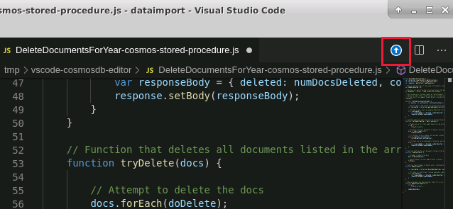
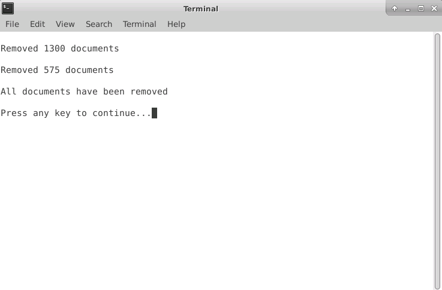

You can use stored procedures with Cosmos DB to perform bulk operations more efficiently than doing the same operations from a client application. For example, if you want to delete or update many documents, you can do so with a stored procedure invoked as a single request from a client. To do the same actions without a stored procedure would require the client application to find all documents to be updated or deleted, and then send a request to Cosmos DB to change or remove each individual document in turn. 

In the sample scenario, you want to provide a feature that cleans out all documents for a specified year. The most efficient way to do this is with a stored procedure.

In this exercise, you'll create a stored procedure named **DeleteDocumentsForYear** that removes the documents for a specified year. You'll modify the JavaScript app that you wrote previously to call the stored procedure. You'll test the stored procedure using Visual Studio Code.

This exercise runs on your desktop computer.

> [!NOTE]
> This exercise assumes that you have installed Git tools on your desktop computer. If necessary, you can download these tools from the [Git website](https://git-scm.com/downloads)
> 
## Upload sample data

1. Start Visual Studio Code if it isn't already running.

2. On the **Terminal** menu, select **New Terminal** to open a new terminal window.

3. Run the following command to download the sample code and data required by this exercise:

    ```bash
    git clone https://github.com/MicrosoftDocs/mslearn-build-node-cosmos-app-vscode vscode
    ```

    This command clones the GitHub repo to a local directory named **vscode**.

4. In the toolbar on the left-hand side of Visual Studio Code, select the **Azure** icon.

5. In the **Cosmos DB** pane, click **Sign in to Azure** and sign in, if you aren't already connected.

    

6. Expand your Azure account, right-click the **\<*your name or initials*\>school** Cosmos DB account, and then click **Copy Connection String**.

    

7. On the **File** menu, click **Open Folder**, and open the **vscode/dataimport** folder.

8. In the **Explorer** window, select the file **Config.js**.

9. Paste the connection string for your Cosmos DB account where indicated in the **connectionString** property, and then save the file.

10. In the terminal window, move to the **vscode/dataimport** folder.

11. Run the dataimport app:

    ```bash
    node -r esm dataimport.js
    ```

    This app removes your existing **StudentCourseGrades** collection, and creates a new collection with the same name. The script then loads several thousand JSON documents from the file **CourseData.json** into the collection. These documents contain student, course, and grade information, in the same format you've seen in previous exercises. The script will take a few minutes to run.

    

## Create the stored procedure

1. Return to the **Cosmos DB** pane in Visual Studio Code.

2. Expand your Azure account, expand the **\<*your name or initials*\>school** Cosmos DB account, expand the **SchoolDB** database, expand the **StudentCourseGrades** collection, expand the **Documents** folder, and take a couple of minutes to peruse the sample data.

3. Right-click the **Stored Procedures** folder, and then click **Create Stored Procedure**.

    

4. At the **Enter a unique stored procedure ID** prompt, type **DeleteDocumentsForYear**, and then press Enter.

5. The editor window will display the sample code for a new stored procedure. Delete this code.

6. Add the following function to the stored procedure:

    ```javascript
    function DeleteDocumentsForYear() {
        var collection = getContext().getCollection();
        var collectionLink = collection.getSelfLink();
        var response = getContext().getResponse();

        // Keep a running total of the number of documents removed
        var numDocsDeleted = 0;

        // Retrieve all docs from the current partition (the data is partitioned by AcademicYear)
        var docQuery = "SELECT * FROM StudentCourseGrades";

        // Run the query to find and remove all matching docs
        // The query might take a long time to run (if there are a lot of docs), and the results could be paged.
        // If the results are paged, Cosmos DB will provide its own continuation token (not to be confused with the continuation token generated by this stored procedure)
        tryFind();

        // OTHER CODE TBD HERE
    }
    ```

    This function will run when the stored procedure is executed. The code initializes the variables **collection** and **collectionLink** to reference the current collection (**StudentCourseGrades**). The data is partitioned by **AcademicYear**. When you run the stored procedure, you'll provide a partition key. The **collection** variable has access to every document in the partition.

    The code also creates a variable named **response** that provides access to the response object for the stored procedure. You'll use this object to return information, including a custom continuation token, back to the client.

    The **docQuery** specifies the query that will be used to find the documents to delete. Remember that Cosmos DB doesn't provide a native mechanism for deleting multiple documents. Instead, you must find each document in turn and remove it.

    The **tryFind** function will run the query and delete the documents. You'll write this function in the next step.

7. After the **//OTHER CODE TBD HERE** comment, but before the closing brace, add the following nested function:

    ```javascript
    function tryFind(continuationToken) {
        var options = { continuation: continuationToken }; // If a continuation taken was passed in by Cosmos DB, use it to continue paging through the query results

        // Run the query, and invoke the callback with the results
        var isAccepted = collection.queryDocuments(collectionLink, docQuery, options, tryFindCallback);

        // If time is up, return a response body that includes the count of documents deleted so far, and our own custom continuation token
        if (!isAccepted) {
            var responseBody = { deleted: numDocsDeleted, continuation: true};
            response.setBody(responseBody);
        }
    }
    ```

    The **tryFind** function runs the query using the **queryDocuments** function of the collection. The results could be paged, if there are more than 100 documents. In this case, the **tryFind** function uses the Cosmos DB continuation passed in as the parameter to fetch the next page. Initially, this parameter is undefined, so the first time this function runs it will fetch the first page. If the query runs successfully, the **tryFindCallback** function is used to process the results and delete each document returned.

    If the return value from the **queryDocuments** functions is false, the stored procedure is out of runtime. In this case, **tryFindCallback** function won't run, and the **tryFind** function will instead create a response that contains the number of documents deleted so far, and a custom continuation token that is set to **true**. When the client receives this response, it knows that the deletion is incomplete, and can call the stored procedure again to continue the process.

8. After the **tryFind** function, add the **tryFindCallback** function shown below:

    ```javascript
    // Callback that runs when the query to find matching docs completes
    function tryFindCallback(err, docs, options) {

        // Handle any errors that might have occurred while running the query
        if (err)
            throw Error(err);

        // If there are still documents to delete (the query returned an array of one or more docs), then try and remove them
        else if (docs.length > 0)
            tryDelete(docs);

        // If the docs array is empty, but we have a Cosmos DB continuation token, then continue querying to retrieve the next page of docs
        else if (options.continuation)
            tryFind(options.continuation);

        // If there are no more documents to delete, and no Cosmos DB continuation token, then we are done
        else {
            var responseBody = { deleted: numDocsDeleted, continuation: false};
            response.setBody(responseBody);
        }
    }
    ```

    As described in the previous unit, the callback for the **queryDocument** function runs when the query completes successfully and the next page of documents has been retrieved. The callback takes three parameters: an error indication (if the query failed), an array of documents, and an options object that may contain the Cosmos DB-generated continuation token if there are more pages after the current one.

    The **tryFindCallback** function checks to make sure that the **docs** array contains at least one document, and then calls the **tryDelete** function to delete each document specified in the array.

    If the array is empty (all the documents have been deleted), but there are more pages available, the function calls **tryFind** again to retrieve them, passing in the Cosmos DB-generated continuation token.

    If the array is empty and there are no more pages, we're done, so the function creates a response indicating how many documents have been removed, and a custom continuation token of **false**.

9. Add the **tryDelete** function immediately after the **tryFindCallback** function:

    ```javascript
    // Function that deletes all documents listed in the array passed in as the parameter
    function tryDelete(docs) {

        // Attempt to delete the docs
        docs.forEach(doDelete);

        // Query and get the next page of docs to delete
        tryFind();
    }
    ```

    Recall that this function is called to delete every document described by the **docs** array passed in as the parameter. This code uses the **forEach** function to iterate through the array and call the **doDelete** function for each document in the array. When the documents have been processed, this function calls **tryFind** again to determine whether there are any more pages of documents available.

10. Add the **doDelete** and **doDeleteCallback** functions shown below. immediately after the **tryDelete** function:

    ```javascript
    // Function that attempts to delete a doc, checking for runtime availability
    function doDelete(doc) {

        var isAccepted = collection.deleteDocument(doc._self, {}, doDeleteCallback);

        // If there is insufficient runtime available, pass back a custom continuation containing the number of docs deleted to the client
        if (!isAccepted) {
            var responseBody = { deleted: numDocsDeleted, continuation: true};
            response.setBody(responseBody);
        }
    }

    // When a document has been deleted, check for errors, and then increment numDocsDeleted
    function doDeleteCallback(err) {
        if (err)
            throw Error(err);

        numDocsDeleted++;
    }
    ```

    The **doDelete** function runs for each document. This function calls the **deleteDocument** function to remove the document. If the removal is successful, the **doDeleteCallback** function runs, and increments the **numDocsDeleted** variable; this variable keeps track of the number of documents that have been removed, and its value is reported in the response messages returned to the client.

    If there's insufficient runtime available to complete the delete operation, this function returns a response message reporting the number of documents deleted so far, and a custom continuation token with the value **false**.

11. Click **Update to Cloud** to save your stored procedure.

    

> [!NOTE]
> The completed JavaScript code for the stored procedure is available in the **vscode/storedproc** folder, in the **DeleteDocumentsForYear.js** JavaScript file.

## Run the stored procedure from a Node.js application

1. On the **File** menu, click **Open Folder**. Select the **grades** folder containing the code that you created in the previous exercises.

2. In the **Explorer** window, select the **cosmosgrades.js** script to open it in the editor window.

3. At the end of the file, comment out the statement that calls the **test** function:

    ```javascript
    //test
    ```

4. Add the following function to the end of the file:

    ```javascript
    async function clearDataForYear(year) {
        const storedProcID = "DeleteDocumentsForYear";

        let storedProcRef = containerref.scripts.storedProcedure(storedProcID);
        let moreToDelete = true;
        do {
            const { resource: response } = await storedProcRef.execute(year);
            process.stdout.write(`\nRemoved ${response.deleted} documents\n`);
            moreToDelete = response.continuation;
        } while (moreToDelete)

        process.stdout.write("\nAll documents have been removed\n");
    }
    ```

    This function runs the **DeleteDocumentsForYear** stored procedure. The partition key specified as the parameter to the **execute** function is the year passed in as the function argument. When the stored procedure has finished, the value of the **deleted** property from the response message is displayed. If the value in the **continuation** field is true, there are more documents to be deleted, and the `while` loop does another iteration, calling the stored procedure again.

5. Add the following statement to the end of the file. This statement tests the **clearDataForYear** function, and deletes the data for the year 2012. You must specify the parameter as a string for the stored procedure to work:

    ```javascript
    clearDataForYear("2012");
    ```

6. On the **Debug** menu, select **Start Without Debugging**. The output in the terminal window should be similar to the image below:

    

    In this example, the **clearDataForYear** function ran the stored procedure twice. The first iteration removed 1300 documents, and the second deleted 575 documents, making 1875 in total.

7. Close the terminal window.

8. On the **Debug** menu, select **Start Without Debugging** again. This time the output should state that the stored procedure deleted zero documents, as they've already been removed.

9. Change the parameter to **"2014"** and run the app again. This time, the app should remove 670 documents in a single iteration.

You've now seen how to use Visual Studio Code to create a Cosmos DB stored procedure, and how to run a stored procedure from a Node.js application.
