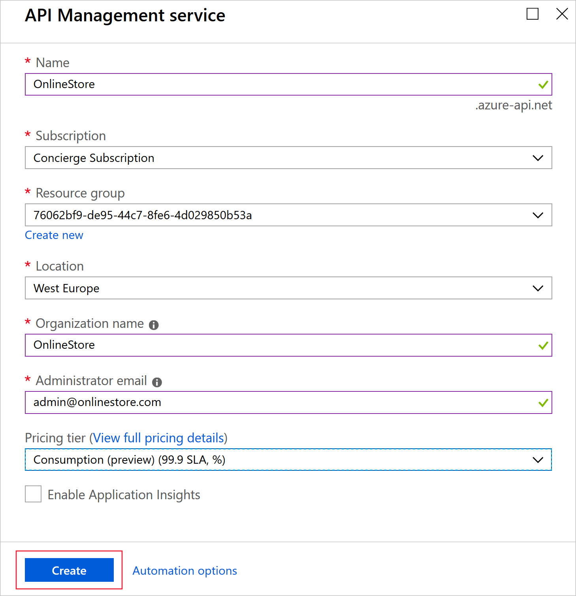

You can add Functions to Azure API Management, to present them to users as parts of a single API.

In your online store company, your developers have created multiple Azure Functions as micro-services. Each function implements a small part of the store's functionality. You want to assemble these functions into single API.

Here, you will create a new API Management instance and then add a Product Details function to it.

## Create functions

In this exercise, you will add an Azure Function to Azure API Management. Later you will add a second Function to the same resource in order to create a single serverless API from multiple Functions. Let's start by using a script to create the Functions:

1. To clone the functions project, in the Cloud Shell on the right, execute this command:

    <!-- TODO: the URL in this git clone command must be updated when the correct location is known -->

    ```bash
    git clone http://github.com/<reponame>
    ```

1. To run the script that sets up the necessary Azure resources, execute these commands:

    ```bash
    cd OnlineStoreFuncs
    bash setup.sh
    ```

## Test the product details function

Now, test the Product Details Function. This is not part of  API Management yet:

1. Sign into the [Azure portal](https://portal.azure.com/learn.docs.microsoft.com?azure-portal=true) using the same account you activated the sandbox with.
1. Click **All Resources** and then click the product function.
1. Under **Functions**, click **ProductDetails**, and then click **Test**.

    

1. In the **HTTP method** drop-down list, select **GET**, and then click **Add parameter**.
1. In the **name** textbox, type **id** and in the **value** textbox, type **3**.
1. Click **Run** and then examine the results in the **Output** box.

    

    The output pain displays the details of a product in JSON format. You can also test the function with IDs 1 and 2 for different products.

1. At the top of the page, click **</> Get function URL**. Notice that the URL is the name of the function within the **azurewebsites.net** domain. Make a note of this URL for later comparison.

## Create a new API Management instance

Now that we have a working Function, let's create the API Management resource:

1. In the Azure portal, select **Create a resource > Integration > API management**, and then click **Create**.
1. In the API Management service window, enter these settings and then click **Create**:

    | Setting | Value |
    | --- | --- |
    | Name | Use a unique name within the **azure-api.net** domain |
    | Subscription | Concierge |
    | Resource group | <rgn>[sandbox resource group name]</rgn> |
    | Location | Choose either **West Europe** or **Southeast Asia** | <!-- NOTE: these are the only two locations that are supported by both the sandbox and the consumption tier -->
    | Organization name | OnlineStore |
    | Administrator email | Use the default value |
    | Pricing tier | Consumption |
    | | | 

    

<!-- NOTE: this is currently resulting in a sandbox policy error. Take it up with MS? -->


<!-- TODO: This seems incomplete. WHat we actually need are:

1. A VS Code project in a Git Hub location that implements the two functions
1. Clone that.
1. Include a script that installs the Azure FUnctions Core Tools by using npm, creates a resource group, storage account, and two function resources in azure.
1. Script or get the students to deploy the functions to azure.
 -->

You must have a function app to host the execution of your functions. The function app provides an environment for serverless execution of your function code. It lets you group functions as a logic unit for easier management, deployment, and sharing of resources. Create a function app by using the az functionapp create command.

For this exercise you will create 2 Function Aps with HTTP trigger Functions. You can use the script below to setup a Function App (currently named as "func-App-instance1). Create a second name by changing the name to something similar such as (func-App-stance2) and running the serverless function app script below

```bash
#!/bin/bash

# Function app and storage account names must be unique.
storageName=mystorageaccount$RANDOM
functionAppName=func-App-instance1$RANDOM

# Create a resource group.
az group create --name myResourceGroup --location westeurope

# Create an Azure storage account in the resource group.
az storage account create \
  --name $storageName \
  --location westeurope \
  --resource-group myResourceGroup \
  --sku Standard_LRS

# Create a serverless function app in the resource group.
az functionapp create \
  --name $functionAppName \
  --storage-account $storageName \
  --consumption-plan-location westeurope \
  --resource-group myResourceGroup
```

Run the following to create HTTP trigger function or alternatively use the Azure Portal to create two Azure Functions

<!-- TODO: This command is not available unless you've installed the Azure Functions Core Tools (which you can do with npm) -->

```bash
func new --name Product --template "HttpTrigger" 
func new --name Order --template "HttpTrigger"
```

<!-- TODO: This might be "Http Trigger" with a space? -->
<!-- TODO: The functions are not published. We have to do that before we can add them to an APIM instance -->

<!-- TODO: show that one of the functions is working in Azure -->

## Create a new API Management instance

1. In the Azure portal, select **Create a resource** > **Integration** > **API management**
    Alternatively, choose New, type API management in the search box, and press Enter. Click Create

1. In the API Management service window, enter settings

    

> [!TIP]
> It usually takes between 20 and 30 minutes to create an API Management service. You can pin the newly created service to the dashboard by selecting Pin

### Import an Azure Function App as a new API

Follow the steps below to create a new API from an Azure Function App

1. In your **Azure API Management** service instance, select **APIs** from the menu on the left

1. In the **Add a new API** list, select **Function App**

    

1. Click **Browse** to select Functions for import

    

1. Click on the **Function App** section to choose from the list of available Function Apps.

    

1. Find the **Function App** you want to import Functions from, click on it and press **Select**

    

1. Select the Functions you would like to import and click **Select**

    

1. Switch to the **Full** view and assign **Product** to your new API. If needed, edit other pre-populated fields
1. Click **Create**
