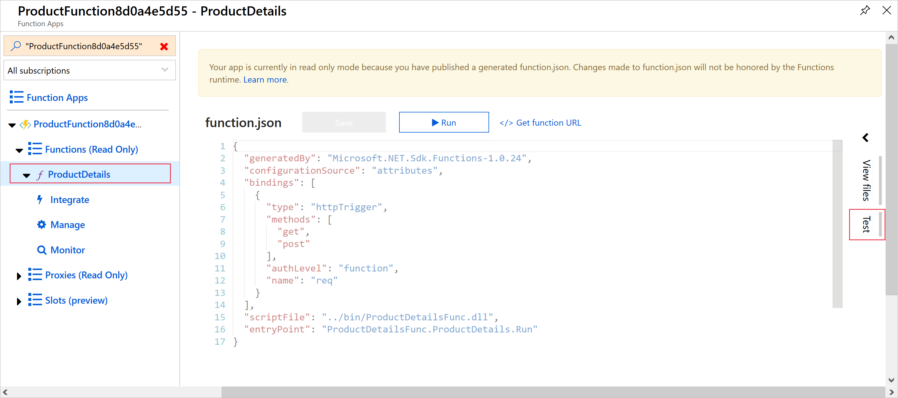
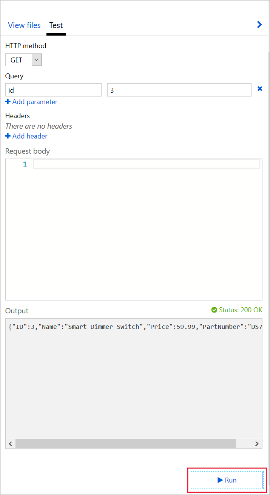
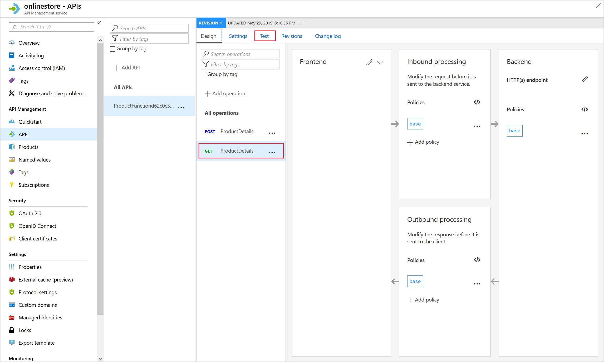
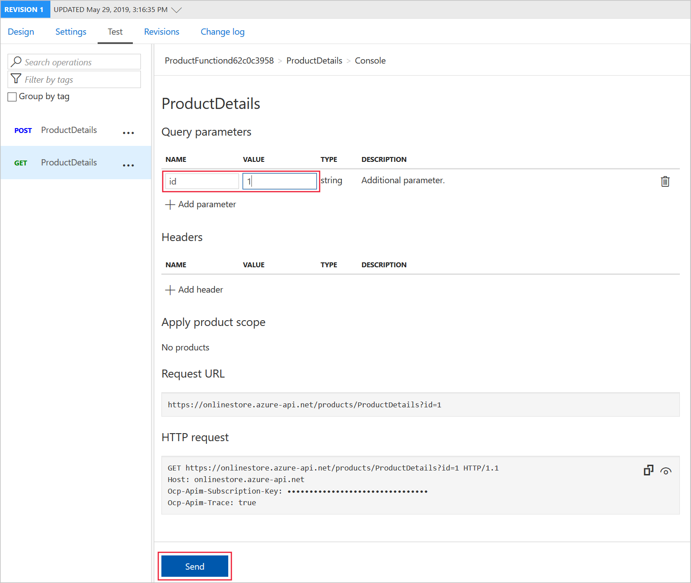

You can add Functions to Azure API Management, to present them to users as parts of a single API.

In your online store company, your developers have created multiple Azure Functions as microservices. Each function implements a small part of the store's functionality. You want to assemble these functions into single API.

Here, you will create a new API Management instance and then add a Product Details function to it.

[!include[](../../../includes/azure-sandbox-activate.md)]

## Create functions

In this exercise, you will add an Azure Function to Azure API Management. Later you will add a second function to the same resource in order to create a single serverless API from multiple functions. Let's start by using a script to create the functions:

1. To clone the functions project, in the Cloud Shell on the right, execute this command:

    <!-- TODO: the URL in this git clone command must be updated when the correct location is known -->
    <!-- TODO: For testing purposes, I expose the code in a repo on my account. We need to update when the real repo is available -->

    ```bash
    git clone https://github.com/AndrewJByrne/bbab38fa-6d69-461a-99be-1b60d8d4b676.git OnlineStoreFuncs
    ```

1. Run the following commands in the Cloud Shell to set up the necessary Azure resources we need for this exercise. 

    ```bash
    cd OnlineStoreFuncs
    bash setup.sh
    ```

    The `setup.sh` script creates the two function apps in the sandbox resource group that we've activated for this module. As the following graphic illustrates, each app hosts a single function - `OrderDetails` and `ProductDetails` respectively. the script also sets up a storage account that the functions need. The functions both have URLs in the **azurewebsites.net** domain. The function names include random numbers for uniqueness. The script takes a few minutes to complete.

    


## Test the product details function

Now, let's test the ProductDetails function, to see how it behaves before we add it to API Management:

1. Sign into the [Azure portal](https://portal.azure.com/learn.docs.microsoft.com?azure-portal=true) using the same account with which you activated the sandbox.
1. Select **All Resources**.
1. From the list of resources, select the App Service with the name beginning with **ProductFunction**. This action loads the Function Apps UI for this app. 
1. Under **Functions**, select **ProductDetails**, and then select **Test**, as highlighted in the following screenshot: 

    
1. In the **HTTP method** drop-down list, select **GET**, and then select **Add parameter**.
1. In the **name** textbox, type *id* and in the **value** textbox, type *3*.
1. Select **Run** and then examine the results in the **Output** box.

    

    The output pane displays the details of a product in JSON format. You can also test the function with IDs 1 and 2 for different products.

1. At the top of the page, select **</> Get function URL**. Notice that the URL is the name of the function within the **azurewebsites.net** domain. Make a note of this URL for later comparison. 

> [!NOTE]
> You can use this URL to test the function in your browser. Append the query string `&id=1` to request a product.

## Create an OpenAPI definition for the function app using Azure API Management

REST APIs are often described using an OpenAPI definition. This definition contains information about what operations are available in an API and how the request and response data for the API should be structured.

Here, we'll create an OpenAPI definition for our function app using Azure API Management so that the function can be called from other apps and services.

1. Select the function app, then in **Platform features**, choose **API Management** and select **Create new** under **API Management**.
1. Use the API Management settings as specified in the following table.

    | Setting | Value |
    | --- | --- |
    | Name | Use a unique name within the **azure-api.net** domain |
    | Subscription | Concierge |
    | Resource group | <rgn>[sandbox resource group name]</rgn> |
    | Location | Choose one of the following locations that supports the Consumption Plan: **West US**, **North Central US**, **West Europe**, **North Europe**, **Southeast Asia**, **Australia East**  | 
    | Organization name | OnlineStore |
    | Administrator email | Use the default value |
    | Pricing tier | Consumption |
    | | | 

1. Choose **Create** to create the API Management instance, which may take several minutes. 
1. Select **Link API**. The **Import Azure Functions** opens with the **ProductDetails** function highlighted. Choose **Select** to continue. 
1. In the **Create from Function App** page, change **API URL suffix** to **products** and select **Create**. The API is now created for the **ProductDetails** function. 

Note that we were able to define our API all from within the function app portal experience. 

## Test the OnlineStore products endpoint

You now have a functional product details API in the API Management instance that you created. Let's test that API, by using the API Management tools in the Azure portal:

1. In the [Azure portal](https://portal.azure.com/learn.docs.microsoft.com?azure-portal=true), select **All resources** and then select your **Azure API Management** service instance.
1. Under **API Management**, select **APIs** and then select the **ProductFunction** API.
1. In the list of operations, select **GET ProductDetails** and then select the **Test** tab.

    

1. Under **Query parameters**, select **Add parameter**.
1. In the **name** textbox, enter *id*.
1. In the **value** textbox, enter *1*, and then select **Send**.

    

1. In the **HTTP response**, notice that the details of a product have been returned in JSON format. Also notice the **HTTP request** was sent to a destination within the **azure-api.net** domain. This location is different to the **azurewebsites.net** domain where the original function app is hosted.
