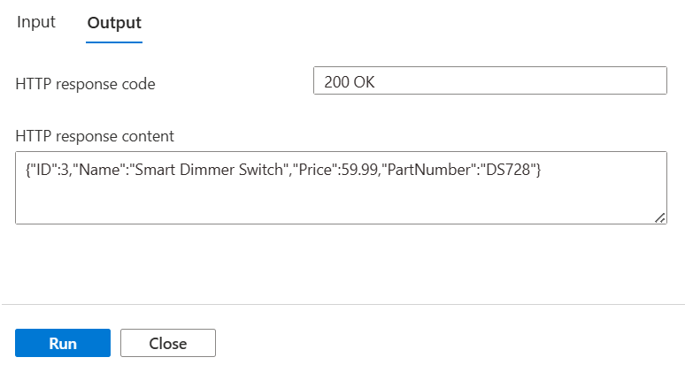

You can add Functions to Azure API Management, to present them to users as parts of a single API.

In your online store company, your developers have created multiple Azure Functions as microservices. Each function implements a small part of the store's functionality. You want to assemble these functions into single API.

Here, you will create a new API Management instance and then add a Product Details function to it.

## Create functions

In this exercise, you will add an Azure Functions app to Azure API Management. Later you will add a second function app to the same API Management instance in order to create a single serverless API from multiple functions. Let's start by using a script to create the functions:

1. To clone the functions project, in the Cloud Shell on the right, run the following command.

    ```bash
    git clone https://github.com/MicrosoftDocs/mslearn-apim-and-functions.git ~/OnlineStoreFuncs
    ```

1. Run the following commands in the Cloud Shell to set up the necessary Azure resources we need for this exercise.

    ```bash
    cd ~/OnlineStoreFuncs
    bash setup.sh
    ```

    The `setup.sh` script creates the two function apps in the sandbox resource group that we've activated for this module. As the following graphic illustrates, each app hosts a single function - `OrderDetails` and `ProductDetails`. The script also sets up a storage account for  the functions. The functions both have URLs in the **azurewebsites.net** domain. The function names include random numbers for uniqueness. The script takes a few minutes to complete.

    

## Test the product details function

Now, let's test the ProductDetails function, to see how it behaves before we add it to API Management.

1. Sign into the [Azure portal](https://portal.azure.com/learn.docs.microsoft.com?azure-portal=true) using the same account with which you activated the sandbox.

1. On the Azure portal menu or from the **Home** page, select **All resources**.

1. Select the App Service whose name begins with **ProductFunction**. The Function Apps UI for this app opens in the portal.

1. Select **Functions** in the menu, and then select **ProductDetails**.

    

1. Select **Code + Test**, and then select **Test/Run**, as highlighted in the following screenshot.

    

    The **Input/Output** panel appears.

1. On the **Input** tab, in the **HTTP method** dropdown, select **GET**, and then under **Query**, select **Add parameter**.

1. In the **Name** field, enter *id*, and in the **Value** field, enter *3*, and then select **Run**.

    

1. Examine the results on the **Output** tab, and then select **Close**.

    

    The output pane displays the details of a product in JSON format. You can also test the function with IDs 1 and 2 for different products.

1. At the top of the page, select **Get function URL**. Notice that the URL is the name of the function within the **azurewebsites.net** domain. Copy this URL for later comparison.

> [!NOTE]
> You can use this URL to test the function in your browser. Append the query string `&id=1` to request a product.

## Expose function app as an API using Azure API Management

Now that we have our function app deployed and tested, we'll expose the functionality as an API using Azure API Management so that the function can be called from other apps and services.

1. On the Azure portal menu, or from the **Home** page, select **All resources**, and select the App Service whose name begins with **ProductFunction**.

1. In the left nav bar, under the **API** section, select **API Management**.

1. Under the **API Management** field, select **Create new**.

    

    The **API Management service** page appears.

1. Enter the following API Management values as specified in the following table, and then select **Create** to create the API Management instance. This may take several minutes.

    | Setting | Value |
    | --- | --- |
    | Name | Use a unique name within the **azure-api.net** domain |
    | Subscription | Concierge Subscription |
    | Resource group | <rgn>[sandbox resource group name]</rgn> |
    | Location | Choose one of the following locations that supports the Consumption Plan: **West US**, **North Central US**, **West Europe**, **North Europe**, **Southeast Asia**, **Australia East**  | 
    | Organization name | OnlineStore |
    | Administrator email | Use the default value |
    | Pricing tier | Consumption |

    

1. After the API Management instance as been created, select **Link API**.

    

    The **Import Azure Functions** page opens with the **ProductDetails** function highlighted.

1. Select **Select** to continue.

    

1. In the **Create from Function App** page, change the **API URL suffix** entry to **products**, and then select **Create**. The API is created for the **ProductDetails** function.

    

Note that we were able to define our API all from within the Azure function app portal experience.

## Test the OnlineStore products endpoint

You now have a functional product details API in the API Management instance that you created. Let's test that API by using the API Management tools in the Azure portal.

1. With the API Management page still open, select the **Test** tab.

1. Select **Get ProductDetails** as the operation that we want to test.

1. Under **Query parameters**, select **Add parameter**.

1. In the **NAME** field, enter *id*, and in the **VALUE** field, enter *1*, and then select **Send**.

    

1. In the **HTTP response** section, notice that the details of a product have been returned in JSON format. Also, notice the **HTTP request** was sent to a destination within the **azure-api.net** domain. This location is different than the **azurewebsites.net** domain where the original function app is hosted.
