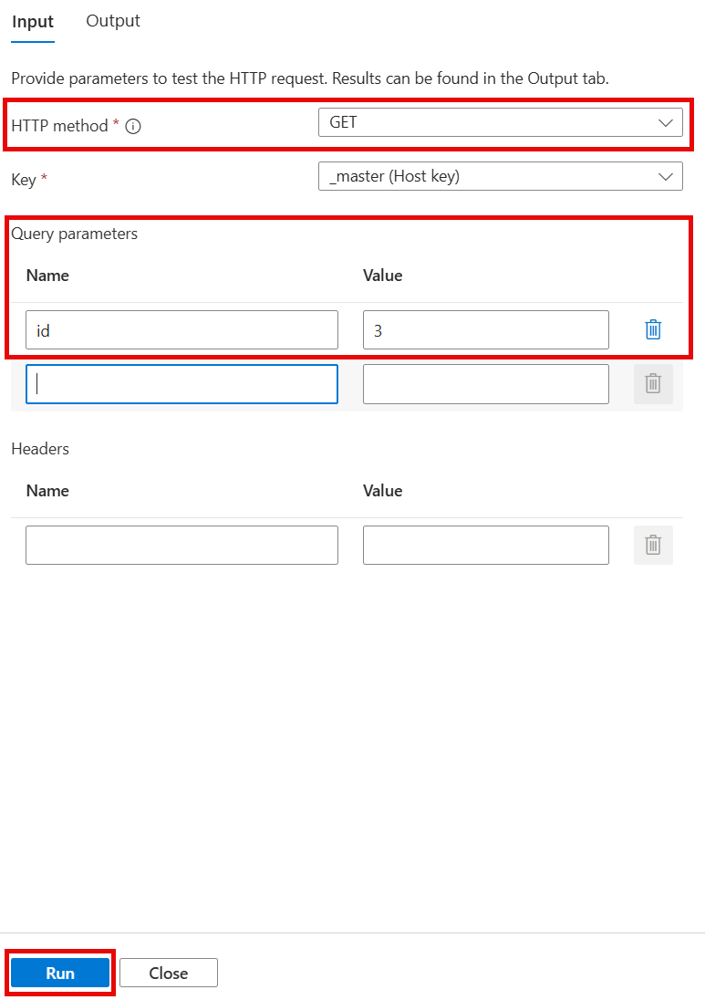
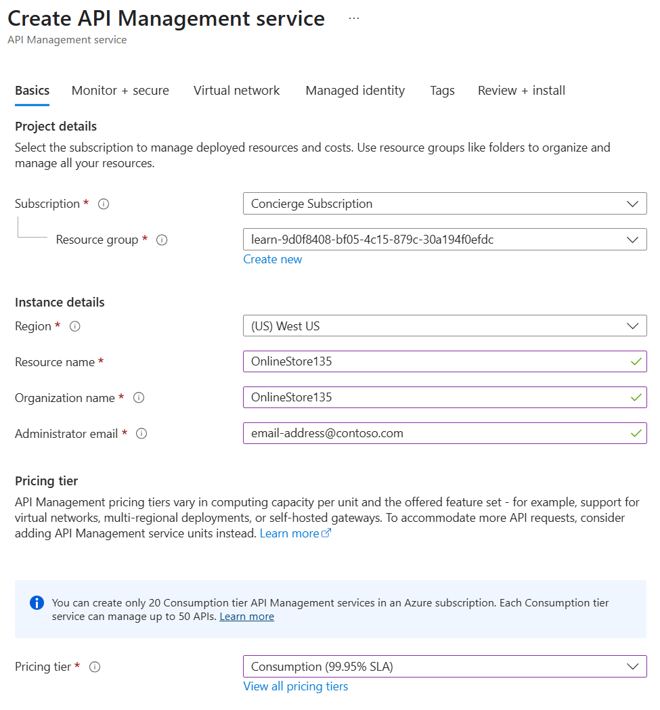

To present Azure Functions to users as parts of a single API, you can add them to Azure API Management.

In your online store company, your developers have created multiple Azure Functions as microservices. Each function implements a small part of the store's functionality. You want to assemble these functions into single API.

In this exercise, you will create a new API Management instance and then add a Product Details function to it.

## Create functions

In the following steps, you will add an Azure Function app to Azure API Management. Later, you will add a second function app to the same API Management instance to create a single serverless API from multiple functions. Let's start by using a script to create the functions:

1. To clone the functions project, run the following command in Azure Cloud Shell on the right.

    ```bash
    git clone https://github.com/MicrosoftDocs/mslearn-apim-and-functions.git ~/OnlineStoreFuncs
    ```

1. Run the following commands in Cloud Shell to set up the necessary Azure resources we need for this exercise.

    ```bash
    cd ~/OnlineStoreFuncs
    bash setup.sh
    ```

    The `setup.sh` script creates the two function apps in the sandbox resource group that we've activated for this module. As the following graphic illustrates, each app hosts a single function - `OrderDetails` and `ProductDetails`. The script also sets up a storage account for  the functions. The functions both have URLs in the **azurewebsites.net** domain. The function names include random numbers for uniqueness. The script takes a few minutes to complete.

    

## Test the product details function

Now, let's test the ProductDetails function to see how it behaves before we add it to API Management.

1. Sign in to the [Azure portal](https://portal.azure.com/learn.docs.microsoft.com?azure-portal=true) using the same account that you used to activate the sandbox.

1. On the Azure portal menu or from the **Home** page, select **All resources**. The **All resources** pane appears.

1. Select the Function App whose name begins with **ProductFunction**. The Function App pane appears for this product function.

1. In the middle menu pane, under **Functions**, select **Functions**. The **Functions** pane appears for your Function App.

    

1. From the list, select **ProductDetails**. The **ProductDetails** pane appears for your function.
  
1. In the left menu, under **Developer**, select **Code + Test**. The **Code + Test** pane appears for your function.

1. On the top menu bar, select **Test/Run**.

    

    The *Test* (Input/Output) pane appears.

1. On the **Input** tab, in the **HTTP method** dropdown, select **GET**, and then under **Query**, select **Add parameter**.

1. In the **Name** field, enter *id*, and in the **Value** field, enter *3*, and then select **Run**.

    

1. Examine the results on the **Output** tab, and then select **Close**.

    

    The output pane displays the details of a product in JSON format. You can also test the function with IDs 1 and 2 for different products.

1. On the top menu bar of the ProductDetails pane for your function, select **Get function URL**. Notice that the URL is the name of the function within the **azurewebsites.net** domain. Copy this URL for later comparison.

> [!NOTE]
> You can use this URL to test the function in your browser. Append the query string `&id=1` to request a product.

## Expose function app as an API using Azure API Management

Now that we have our function app deployed and tested, we'll expose the functionality as an API using Azure API Management so that the function can be called from other apps and services.

1. On the Azure portal menu, or from the **Home** page, select **All resources**. The **All resources** pane appears.

1. Select the Function App whose name begins with **ProductFunction**.

1. In the Function App menu pane, scroll to the **API** category, and then select **API Management**. The **API Management** pane appears for your function app.

1. Under the **API Management** field, select **Create new**.

    

    The **API Management service** pane appears.

1. Enter the following API Management values for each setting.

    | Setting | Value |
    | --- | --- |
    | Name | Use a unique name within the **azure-api.net** domain |
    | Subscription | Concierge Subscription |
    | Resource group | <rgn>[sandbox resource group name]</rgn> |
    | Location | Choose one of the following locations that supports the Consumption Plan: **West US**, **North Central US**, **West Europe**, **North Europe**, **Southeast Asia**, **Australia East**  | 
    | Organization name | OnlineStore |
    | Administrator email | Accept the default value |
    | Pricing tier | Consumption |

    

1. Select **Export** to create the API Management instance. This may take several minutes.

1. After the API Management instance has been created, select **Link API**.

    

    The **Import Azure Functions** pane appears with the **ProductDetails** function highlighted.

    

1. Select **Select** to continue. The **Create from Function App** dialog box appears.

    

1. Change the **API URL suffix** field to *products*, and then select **Create**. Azure creates the API for the **ProductDetails** function. The **API Management** pane for your function app appears.

Note that you were able to define your API, all from within the Azure Function App service.

## Test the OnlineStore products endpoint

You now have a functional product details API in the API Management instance that you created. Let's test that API with the API Management tools in Azure.

1. With the **API Management** pane still open, select the **Test** tab from the interior menu bar.  The ProductDetails Console appears, listing the available operations in the left menu.

    

1. Select **GET ProductDetails** operation in the interior left menu pane.

1. Under **Query parameters**, select **Add parameter**.

1. In the **NAME** field, enter *id*, and in the **VALUE** field, enter *1*, and then select **Send** to generate a request.

    The **HTTP response** is highlighted, showing the details about the product returned in JSON format. Scroll up and notice that the **HTTP request** was sent to a destination in the **azure-api.net** domain. This location is different than the **azurewebsites.net** domain where the original function app is hosted. You can test this API with Query parameter *id=2* or *id=3*.
