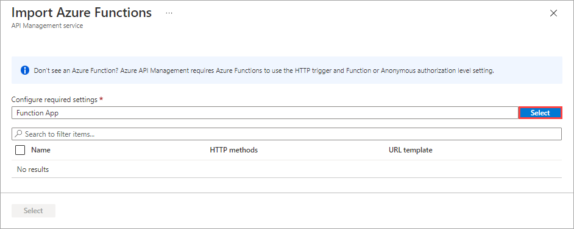

Recall that you want to integrate all of the separate microservices, which are Azure Functions, into a single API. You added the Products function app to a new instance of API Management. Now you want to add another function app to that API.

In this exercise, you add the Orders function app to the API and use the `curl` tool to test the integrated system.

## Test the OrderDetails function

Before we add the Orders function app to the API, let's test the function it hosts - OrderDetails.

1. On the Azure resource menu, or from the **Home** page, select **All resources**. The **All resources** pane appears.

1. Sort the resources by Type, and then select the Function App whose name begins with **OrderFunction**. The Overview pane for the OrderFunction Function App appears.

1. From the list of functions for your function app, select **OrderDetails**. The **OrderDetails** Function Overview pane appears.

1. In the Order Details menu, under **Developer**, select **Code + Test**. The **Code + Test** pane for the OrderDetails function appears, showing the contents of the `function.json` file.

    :::image type="content" source="../media/5-test-order-details.png" alt-text="OrderDetails JSON code, with Code + Test in menu and Test/Run in command bar highlighted.":::

1. On the command bar, select **Test/Run**.  The **Input** parameters tab for your OrderDetails function appears.

1. In the **HTTP method** field, select **GET** from the dropdown list, and then under **Query**, select **Add parameter**, and in the **Name** field, enter *name*, and in the **Value** field, enter *Chiba* (value is case-sensitive), and then select **Run**.

1. A log console opens and displays the status of the request. The **Output** tab displays the HTTP response code and content in JSON format.

    :::image type="content" source="../media/5-order-test-results.png" alt-text="Add a new function option page appears.":::

    Optionally, you can run more requests using name values **Henri** and **Barriclough** to obtain different customer orders.

1. Select **Close** to close the Input Output tabs for Test/Run.

1. On the command bar of the OrderDetails pane, select **Get function URL**. Notice that the URL is the name of the function within the **azurewebsites.net** domain.

## Add a function to an existing API

In this step, we add the Order function to the API Management resource that we created in the preceding exercise. In that exercise, we used the API Management interface from within the function app interface. Here, we navigate to our API Management instance through the Azure portal resource menu, just to demonstrate that both approaches are available.

1. On Azure resource menu, or from the **Home** page, select **All resources**. The **All resources** pane appears.

1. Sort the resources by **Type**, and then select the **OnlineStore** API Management service. The **API Management service** for **OnlineStore** appears.

1. In the menu, under **APIs**, select **APIs**. The APIs pane shows options for defining a new API.

1. Under **Create from Azure resource**, select **Function App**.

    

    The **Create from Function App** dialog box appears.

1. To select your function app, select **Browse**. The **Import Azure Functions** pane appears.

1. On the **Configure required settings** field, select **Select**.

    (../media/5-import-azure-function-app-03-expanded.png#lightbox)

    The **Select Azure Function App** pane appears.

1. Select **OrderFunctionNNNNNNN**, and then select **Select**. The **Import Azure Functions** pane reappears with your OrderDetails function app configured.

1. Ensure that **OrderDetails** is checked, and then, at the bottom of the page, select **Select** to add the function. The **Create from Function App** dialog box appears.

1. Replace the value in the **API URL suffix** field with *orders*. Notice how this change updates the Base URL. Select **Create** to create your API.

    

    The OnlineStore API Management service displays the **Design** tab with all available (GET, POST) APIs for OrderDetails.

## Test the OnlineStore orders endpoint in the portal

Now that we added OrderDetails to our API, let's test it by using the API Management tools in the Azure portal.

1. On the OrderFunctionNNNNNN APIs Design tab, under **All operations**, select **GET OrderDetails**, and then select the **Test** tab.

1. In the **Query parameters** section, select **Add parameter**, and enter *name* in the **NAME** field and *Chiba* and in the **VALUE** field. Select **Send**.

1. The **HTTP response** message tab shows the HTTP request succeeded (HTTP/1.1/ 200 OK), along with a JSON object showing an Order ID, along with the customer name, total price of the order, and shipping status.

1. Scroll up to the **HTTP request** section; notice that the request was sent to a subdomain and subdirectory within the **azure-api.net** domain. This location differs from the **azurewebsites.net** host domain.

## Test the combined API

We can use the `curl` command-line tool to submit requests to our API. cURL is ideal because we can include the correct subscription key with a request. A request also needs the location of the API, which is hosted in Azure API Management and, in this case, consists of the Products and Orders functions.

1. In the Azure resource menu or from Home, select **All resources**.

1. Sort resources by Type, and then select the **OnlineStore** API Management service. The **API Management service** for **OnlineStore** appears.

1. In the **Essentials** section, hover over the **Gateway URL** and select the **Copy to clipboard** icon.

1. In The Azure Cloud Shell to the right, lets define some variables. Run the following command, replacing the `<paste URL here>` placeholder with the **URL** value that you copied to your clipboard, and then press <kbd>Enter</kbd>. This value defines the gateway variable.

    ```bash
    GATEWAY_URL=<paste URL here>
    ```

1. In Azure, on the OnlineStore API Management service menu, scroll down to **API**, and select **Subscriptions**. The **Subscriptions** pane appears for your OnlineStore API Management instance.

1. For the **Built-in all-access subscription**, select the ellipsis **...** on the far right of that row, and then select **Show/hide keys** from the context menu. The primary key and secondary key for the API appears.

1. In the **Primary key** field, select the *Copy to clipboard* icon.

1. In Cloud Shell, run the following command, replacing the placeholder with the value in your clipboard, and then press <kbd>Enter</kbd>.

    ```bash
    SUB_KEY=<paste key here>
    ```

1. Now we can request details of an order and a product by querying the same API Management service:

   1. To request details for a customer named **Henri**, run the following command in Cloud Shell:

      ```bash
       curl -X GET "$GATEWAY_URL/orders/OrderDetails?name=Henri" -H "Ocp-Apim-Subscription-Key:$SUB_KEY"
       ```

       The response contains a JSON code block with order details showing that **Order 56224** was shipped to **Pascale Henri**. You can also try the command with the names *Chiba* and *Barriclough* for different results.

   1. To request the details of a product with an **id** of **2**, run the following command in Cloud Shell:

      ```bash
       curl -X GET "$GATEWAY_URL/products/ProductDetails?id=2" -H "Ocp-Apim-Subscription-Key:$SUB_KEY"
       ```

       The response contains a JSON code block with the details of a product. You can also try the command with **id** values of **1** and **3** for different results.

Notice that both the functions can now be called through endpoints within the **azure-api.net** domain (as defined by the GATEWAY_URL), which is the domain used by Azure API Management. In other Learn modules, you can learn how to apply policies, security settings, external caches, and other features to the functions in an API Management Gateway. A gateway provides you with a central control point, where you can manage multiple microservices without altering their code.
