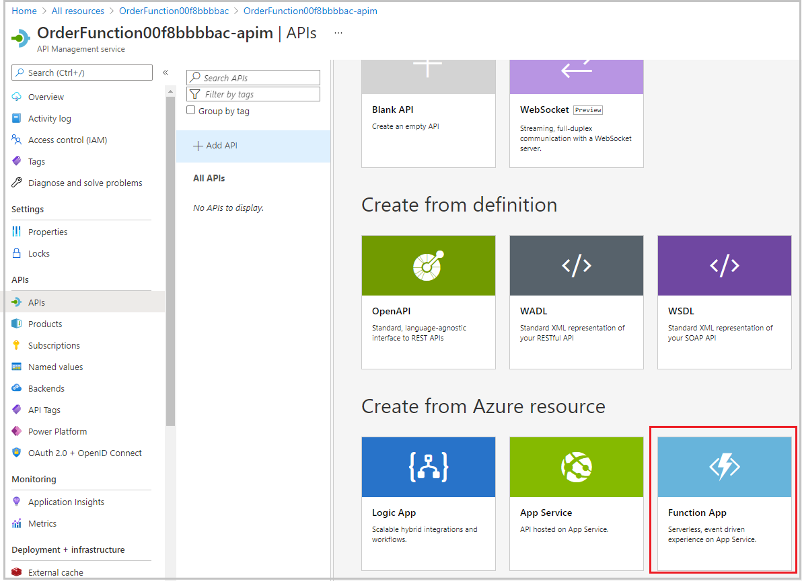
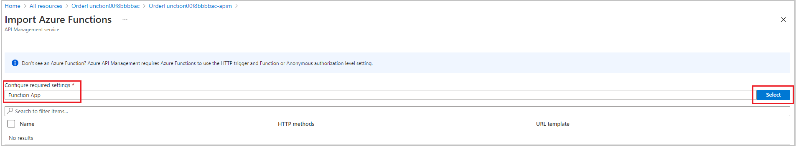
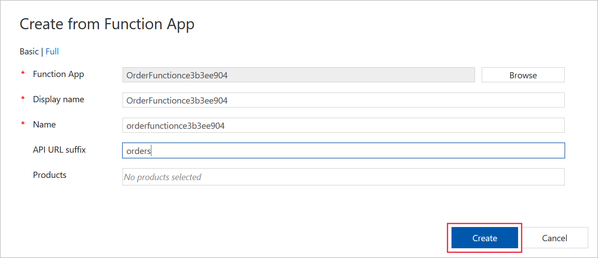

Recall that you want to integrate all of the separate microservices in the Online Store, which are Azure Functions, into a single API. You have already added the Products function to a new instance of API Management. Now you want to add more functions.

In this exercise, you'll add the Orders function app to the API and use the `curl` tool to test the integrated system.

## Test the OrderDetails function

Before we add the Orders function app to the API, let's test the function it hosts, OrderDetails:

1. On the [Azure portal](https://portal.azure.com/learn.docs.microsoft.com?azure-portal=true) menu or from the **Home** page, select **All resources**, and then select the **OrderFunction** Function App.

1. Under **Functions** select **OrderDetails**, and then select **Code + Test**.

    :::image type="content" source="../media/5-test-order-details.png" alt-text="Order details code is displayed.":::

1. In the **HTTP method** dropdown, select **GET**, and then select **Add parameter**.

1. In the **name** text box, enter *name*, and in the **value** text box, enter *Chiba*. The parameter name and value are both case-sensitive.

1. Select **Run**, and then examine the results in the **Output** box.

    :::image type="content" source="../media/5-order-test-results.png" alt-text="Add a new function option page appears.":::

    The output pane displays the details of an order in JSON format. You can also test the function with the names "Henri" and "Barriclough" for different orders.

1. At the top of the page, select **</> Get function URL**. Notice that the URL is the name of the function within the **azurewebsites.net** domain. Make a note of this URL for later comparison.

## Add another function app to our existing API

In this step, we'll add the Order function to the API Management resource that we created in the preceding exercise. In that exercise, we used the API Management interface from within the function app UI. Here, we'll navigate to our API Management instance through the portal main navigation pane, just to demonstrate that both approaches are available.

1. On the [Azure portal](https://portal.azure.com/learn.docs.microsoft.com?azure-portal=true) menu or from the **Home** page, select **All resources**, and then select your **API Management** service instance.

1. Under **API Management**, select **APIs**, and then under **Add a new API**, select **Function App**.

    

1. To select your function, select **Browse**, and then select the **Function App** section.

    

1. In the list of Function Apps, select the **OrderFunction**, and then select **Select**.

1. Ensure that **OrderDetails** is checked, and then select **Select**.

1. In the **API URL suffix** text box, enter **orders**, and then select **Create**.

    

## Test the OnlineStore orders endpoint in the portal

Now that we've added OrderDetails to our API, let's test it by using the API Management tools in the Azure portal.

1. On the [Azure portal](https://portal.azure.com/learn.docs.microsoft.com?azure-portal=true) menu or from the **Home** page, select **All resources**, and then select your **Azure API Management** service instance.

1. Under **API Management**, select **APIs**, and then select the **OrderFunction** API.

1. In the list of operations, select **GET OrderDetails**, and then select the **Test/Run** tab.

1. Under **Query parameters**, select **Add parameter**.

1. In the **name** text box, enter *name*.

1. In the **value** text box, enter *Chiba*, and then select **Send**.

1. In the **HTTP response**, notice that the details of an order have been returned in JSON format. Also notice the **HTTP request** was sent to a destination within the **azure-api.net** domain. This location is different than the **azurewebsites.net** domain where the original function app is hosted.

## Test our combined API

We can use the `curl` command-line tool to submit requests to our API. It's ideal because we can use it to include the correct subscription key with our requests. To submit requests, we also need the location of the API, which is hosted in Azure API Management and consists of the Products and Orders functions.

1. In the [Azure portal](https://portal.azure.com/learn.docs.microsoft.com?azure-portal=true), select **All resources**, and then select your **Azure API Management** service instance.

1. In the **Overview** pane,  select the **Copy to clipboard** icon to the left of the **Gateway URL** value.

1. In the Cloud Shell, enter the following command, paste the **Gateway URL** value that you copied in place of the token, and then press Enter.

    ```bash
    GATEWAY_URL=<paste the URL here>
    ```

1. In  the [Azure portal](https://portal.azure.com/learn.docs.microsoft.com?azure-portal=true), in your **Azure API Management** instance, under **API Management**, select **Subscriptions**.

1. To the right of the **Built-in all-access subscription**, select **...**, and then select **Show/hide keys**.

1. To the right of the **PRIMARY KEY**, select the **Copy to clipboard** icon.

1. In the Cloud Shell, enter the following command, paste the **PRIMARY KEY** value that you copied in place of the token, and then press Enter.

    ```bash
    SUB_KEY=<paste the key here>
    ```

1. To request the details of a product, execute the following command in the Cloud Shell.

    ```bash
    curl -X GET "$GATEWAY_URL/products/ProductDetails?id=2" -H "Ocp-Apim-Subscription-Key: $SUB_KEY"
    ```

    The command returns the details of a product. You can also try the command with IDs 1 and 3 for different results.

1. To request the details of an order, execute the following command, and then press Enter.

    ```bash
    curl -X GET "$GATEWAY_URL/orders/OrderDetails?name=Henri" -H "Ocp-Apim-Subscription-Key: $SUB_KEY"
    ```

    The command returns the details of an order. You can also try the command with the names "Chiba" and "Barriclough" for different results.

Notice that both the functions can now be called through endpoints within the **azure-api.net** domain, which is the domain used by Azure API Management. We can also access them both by using the same subscription key, because that key grants access to the API Management gateway. In other Learn modules, you can learn how to apply policies, security settings, external caches, and other features to all the functions in an API Management Gateway. The gateway provides you with a central control point, where you can manage multiple microservices without altering their code.
