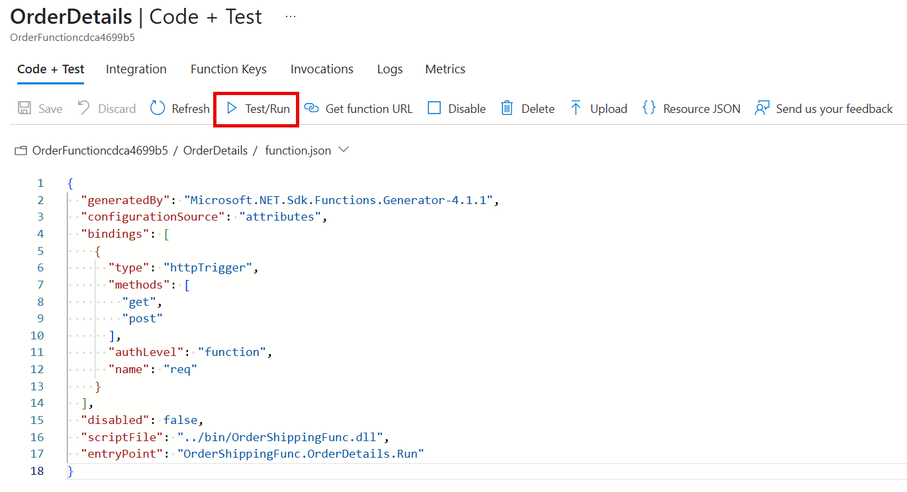
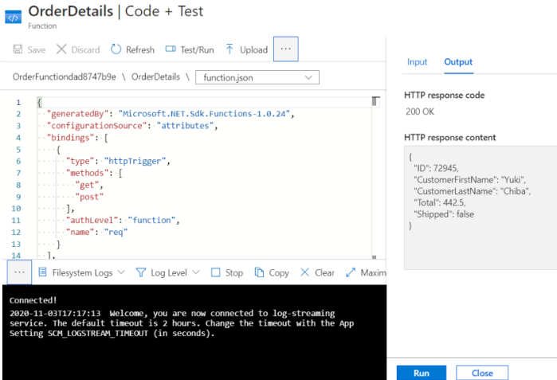

API Management can be used to present multiple Azure Functions as single API.

Recall that you want to integrate all of the separate microservices in the Online Store, which are Azure Functions, into a single API. You have already added the Products function to a new instance of API Management. Now you want to add more functions.

Here, you will add the Orders function to the API and use the `curl` tool to test the integrated system.

## Test the Orders function

Before we add the Orders function to the API, let's test it:

1. In the [Azure portal](https://portal.azure.com/learn.docs.microsoft.com?azure-portal=true), click **All resources** and then click the Order Function.
1. Under **Functions** click **OrderDetails**, and then click **Test**.

    

1. In the **HTTP method** drop-down list, select **GET**, and then click **Add parameter**.
1. In the **name** textbox, type **name** and in the **value** textbox, type **Chiba**.
1. Click **Run** and then examine the results in the **Output** box.

    

    The output pain displays the details of an order in JSON format. You can also test the function with the names "Henri" and "Barriclough" for different orders.

1. At the top of the page, click **</> Get function URL**. Notice that the URL is the name of the function within the **azurewebsites.net** domain. Make a note of this URL for later comparison.

## Append a Function App to an existing API

Now, add the Order function to the API Management resource that you created in the preceding exercise.

1. In the [Azure portal](https://portal.azure.com/learn.docs.microsoft.com?azure-portal=true), click **All resources** and then click your **Azure API Management** service instance.
1. Under **API Management**, click **APIs** and then under **Add a new API**, click **Function App**.

    

1. To select your function, click **Browse** and then click on the **Function App** section.

    

1. In the list of Function Apps, click the **OrderFunction** and then click **Select**.
1. Ensure that **OrderDetails** is checked, and then click **Select**.
1. In the **API URL suffix** textbox, type **orders**, and then click **Create**. 

    


## Test the Orders and Products APIs

<!-- TODO We could have used curl at anytime. The phrasing here makes me think we did something magical to enable that access right now -->
We can now use the `curl` command-line tool to submit requests to our API. To submit requests, we need the location of the API, which is hosted in Azure API Management and consists of the Products and Orders functions. We also need to pass the correct subscription key with each request. 


To test the API:

1. To obtain the API's URL, In the [Azure portal](https://portal.azure.com/learn.docs.microsoft.com?azure-portal=true), click **All resources** and then click your **Azure API Management** service instance.
1. In the **Overview** pane,  select the **Copy to clipboard** button to the left of the **Gateway URL** value. 
1. Back in the Cloud Shell, define a variable to hold our Gateway URL value.  Enter the following command, **Gateway URL**, replacing the token with the value you copied into the clipboard in the preceding step.

    ```bash
    GATEWAY_URL=<paste the URL here>
    ```

1. Back in  the [Azure portal](https://portal.azure.com/learn.docs.microsoft.com?azure-portal=true), in your **Azure API Management** instance, under **API Management**, click **Subscriptions**.
1. To the right of the **Built-in all-access subscription**, click **...** and then click **SHow/hide keys**.
1. To the right of the **PRIMARY KEY**, click the **Copy to clipboard** button.
1. Back in the Cloud Shell, type the following command, paste the **PRIMARY KEY** value that you copied in place of the token, and then press Enter:

    ```bash
    SUB_KEY=<paste the key here>
    ```

1. To request the details of a product, run the following command in the Cloud Shell.

    ```bash
    curl -v GET "$GATEWAY_URL/products/ProductDetails?id=2" -H "Ocp-Apim-Subscription-Key: $SUB_KEY"
    ```
    The command returns the details of a product. You can also try the command with IDs 1 and 3 for different results.

1. To request the details of an order, type the following command and then press Enter:

    ```bash
    curl -v GET "$GATEWAY_URL/orders/OrderDetails?name=Henri" -H "Ocp-Apim-Subscription-Key: $SUB_KEY"
    ```

    The command returns the details of an order. You can also try the command with the names "Chiba" and "Barriclough" for different results.

Notice that both the functions can now be called at the same location within the **azure-api.net** domain. <!-- TODO I'm confused, as a consumer fo this API am I consuming functions or calling endpoints?  We need to get the terminology right. The functions are called through endpoints from a common domain, the gateway URL -->

<!-- TODO We can do more here at the end to reiterate the advantages of this approach-->