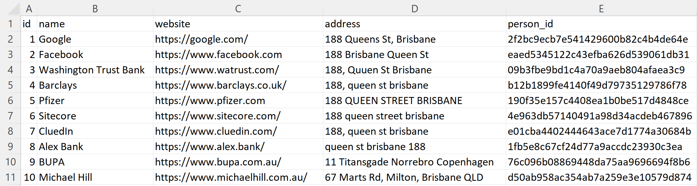
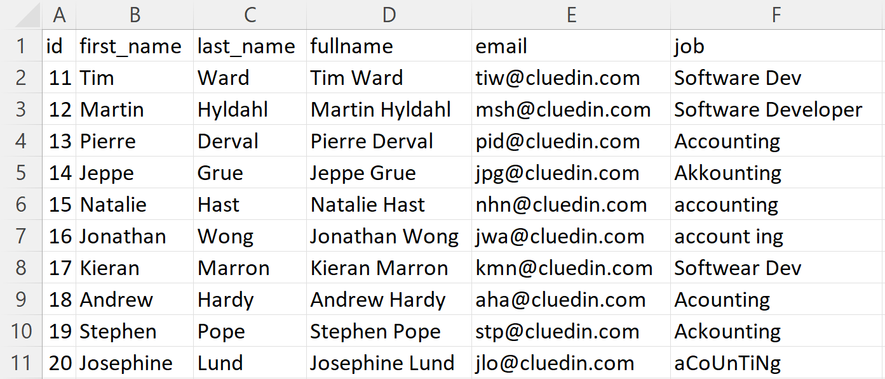
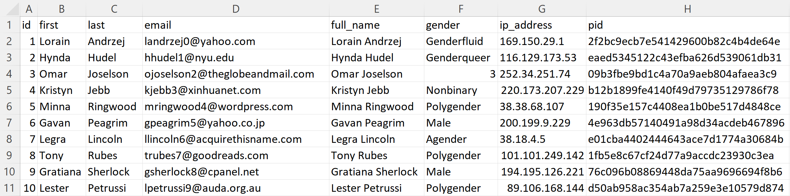
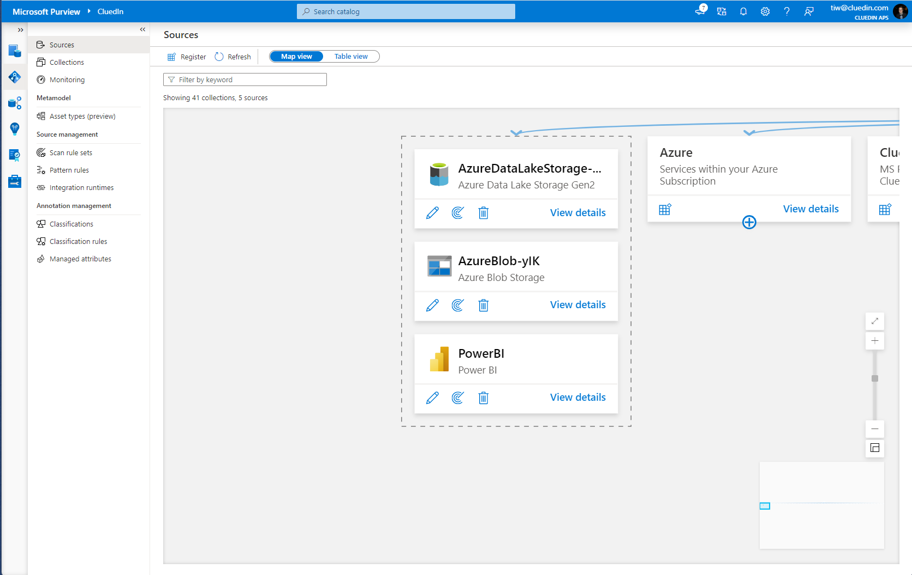
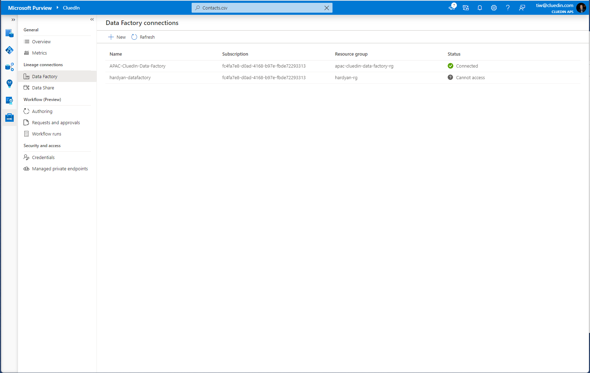
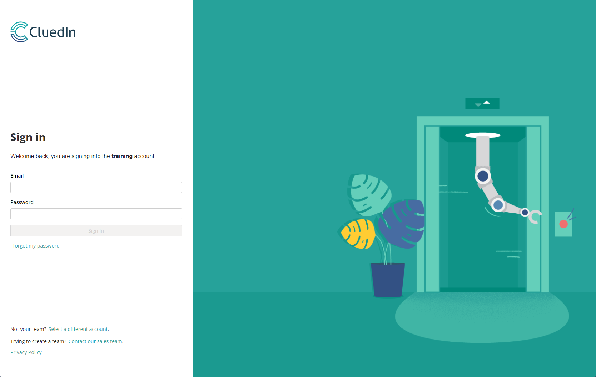
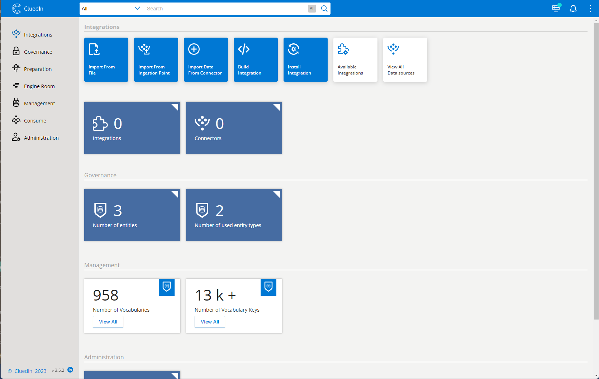
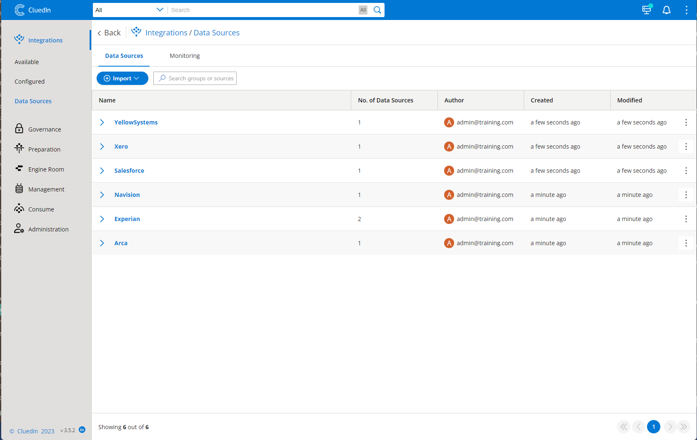

At this point, you should have all resources running and operational as individual technologies. In this part of the learning module, we will be integrating the different pieces together.

## ADLS Gen 2

## Investigating the data

Download the following zip file [CluedIn.zip] and extract it to your local drive. You will find a few folders here, with 7 files and 6 folders. The folders are representing different sources of data, and the files are representing different sample datasets across common Master Data domains. 

### Arca/Companies.csv

Notice in the data, that we have 10 rows of data containing a list of different companies. We have columns for an Id, Name, Website, Address and a Person_Id. 

Notice that the addresses of many of the companies are very similar with e.g. "188, Quuen St Brisbane" and "188 queen street brisbane". These addresses are simply fictitous, but we can clearly see that there is a data quality issue that we are hoping to fix. 

The "person_id" column is referring to the identifier of an Employee of which is somewhere within one of the other files and hence we will be wanting to create what CluedIn calls "Edges" or "Relationships" between this column and the column of another Domain. 

### Experian/Contacts.csv

Notice in the data, that we hav 10 rows of data containing 10 fictitious employees. We have columns for an Id, First_Name, Last_Name, Full_Name, Email, Job. 

We can also clearly see that the Job column has a data quality issue in it where we are receiving data that has different ways to spell the different Job Titles of the employees. 

For the learning module, pay particular attention to Lorain Andrzej, as, as we start to look through the other files, there is no a single identifier that we can use to stitch her record together consistently. Most notable, notice her email address ends with "@wtb.gov.au" and she has an Id value of "1".

### Experian/ContactsAddLater.csv

This file contains more employees, but contains some of the same data quality issues that are present on the Contacts.csv file. 

### Navision/Products.csv

Notice in the data, we have 10 rows of data containing 10 fictitious products. We have columns for a SKU, Name and Size. One thing to notice as you look across the other Products.csv file from YellowSystems (under the YellowSystems folder) is that there is no Identifier that can be used to uniquely stitch the products together and we will need to use a fuzzy merging approach later in the exercise. 

### YellowSystems/Products.csv

Notice that we have 10 rows of data containing the same 10 fictitious products mentioned in the Products.csv file under the Navision folder. However we can see that we don't have a SKU column that we may have been able to use to stitch the products together. Instead we have columns for an ItemId, Name and CompanyId. Most likely, we can use the CompanyId to connect to the companies mentiond in the Companies.csv above. 

### Salesforce/Employees.csv

Notice in this file that we have the same 10 employees however we do have very different identifiers, column names and details. We have columns for FName, LName, Full, Email, Person_Id. If we take a look at Lorain Andrzej in this file, unfortunately we don't have an Identifiter of "1" or an email that ends in "wtb.gov.au" but rather we could assume that the email column and the person_id column could both be used to uniquely identify these employees. 

We can also see that the names of the columns, although similar to those in the Contacts.csv and ContactsAddLater.csv, that they are different. If we were to not address this, it would most likely lead to some quite confused downstream users of the data. 

### Xero/Persons.csv

Finally, notice in the file that we have the same 10 employees however we once again have different identifiers, column names, and details. We have columns for Id, First, Last, Email, Full_Name, Gender, IP_Address and PID. 

Once again, if we look at Lorain, we can see that this time her email ends with "yahoo.com". However we can see that she does have an identifier of "1" and a column called "pid" that has a value that we did see in the Employees.csv file above. It is most likely that we could use different identifiers from each file to stitch this together - however on the surface that would be quite a tricky SQL statement or Phython script to create. 

## Upload the data to the ADLS Gen2

Navigate to the Storage Account that you created in the earlier part of the module and create a new folder called "Raw" to simulate that this is where Azure Data Factory would dump the data from operational systems on a regular basis. Navigate to your Container Storage in the left hand side menu of which you will be taken to a list of filesystems. If you don't already have a filesystem, create a new one called "cluedintrial". Navigate inside the filesystem and create your "Raw" folder. Inside the "Raw" folder, Create subfolders for the folders in the CluedIn.zip file e.g. Arca. To keep things simple, we will manually upload the data in the CluedIn.zip file above using the "Upload" button into their respective folder. 

## Microsoft Purview

1. Let's sign in to Microsoft Purview. You can do this by choosing the Microsoft Purview Account in your resource group and then selecting the Open Microsoft Purview Studio link. This will open Microsoft Purview in a new tab.

1. Select your Data Map on the left hand side menu and select Register. Choose ADLS Gen2 from the selection and in the drop-down, select the instance called Data Governance that was created in the previous step. 

1. Next, set up a scan to scan the files every 1 hour and then trigger an initial scan. This will typically take many minutes to scan the files in the ADLS Gen2 instance.

1. After the scan is complete, you should validate that everything was success by making sure that there are 10 assets in your Microsoft Purview instance.

    >[!NOTE] 
    > A details guide to register your Storage Account in Microsoft Purview and setup a Scan to Run Once over the assets for the learning module is available here: https://learn.microsoft.com/en-us/azure/purview/register-scan-azure-multiple-sources

1. If your scan has run successfully, you should se the Azure Data Lake Storage show up on your Microsoft Purview Data Map. 

    

1. If you search in Microsoft Purview for Contacts.csv then you should find your assets in Microsoft Purview.

    

1. Head over to the settings within Microsoft Purview and create a Data Factory connection to your Azure Data Factory instance. This will not only allow Microsoft Purview to create automated lineage for you based off the ADF scheduled pipelines you have for pulling in the data from the source systems into the raw folder on a regular basis, but also for the lineage that CluedIn will create as part of the process of processing the data as well. 

    

1. Next, you will need to create the credentials in Microsoft Purview so that CluedIn knows how to authenticate with the data sources when it comes time to copy the data from the Storage Accounts in CluedIn for processing. Create a new Key called "CluedInTrial" and use this to setup the credentials to access your Container Storage. 

1. You will also need to setup the right access to CluedIn on the Collections so that they can properly read assets within Microsoft Purview. Under the Role Assignments, make sure that your Service Principal used for this learning module is a Collection Admin, Data Source Admin, Data Reader.

    

## CluedIn

1. You can now open your CluedIn instance by navigating to the CluedIn-AMA Managed Application. You would have also received an email from CluedIn with your Url to your CluedIn studio. Apart from that email, you can find this Url within the CluedIn application in the Azure portal. There will be a Parameters and Outputs menu option in the appliaction. Select that, scroll down to the bottom of the page and you'll see a Url to your own private instance of CluedIn. Copy that into a new browser tab and press enter.

    

1. Sign in with your credentials you used in the installation process and you'll be met with this home screen. 

    

### Connect CluedIn to Microsoft Purview

1. In your CluedIn Studio, head to the Settings section, under Administration. You will notice that it will ask you to fill in different Microsoft Purview details, including the Client Id, Client Secret, Tenant Id and Microsoft Purview Url. For this, you will need to create an Enterprise Application (and you can find a guide to it here: https://learn.microsoft.com/en-us/azure/purview/tutorial-using-rest-apis) in your Azure Active Directory to generate these Client Id and Client Secret. 

    

1. Once you have filled these details in, you will want to toggle on the setting for "Syncing Microsoft Purview Datasources" and "Poll Microsoft Purview Datasources". You will also notice a setting called "Search Filter for Datasources". 

    

1. Effectively, CluedIn will now be polling every 60 seconds to find Microsoft Purview assets that have been tagged with a Glossary Term that matches the filter in "Search Filter for Datasources". You can change this Search filter to something appropriate for you.

### Flagging assets that can sync with CluedIn

1. Now with CluedIn talking to Microsoft Purview, head over the Microsoft Purview and tag all 7 files from the CluedIn.zip with the Glossary Term of "CluedInSource". You will need to wait up to 60 seconds to see the results. 

1. Head to the Datasources section under Integration in CluedIn and you will notice that your 7 files are now showing in CluedIn. However, there will only be the metadata that is actually registered. 

1. Next, we will want to provide CluedIn with the credentials of our Azure Data Factory so CluedIn can also automate the construction of the Azure Data Factory pipelines as to also copy the data from those files in the Storage Account into CluedIn. 

# Connect CluedIn to Azure Data Factory

1. In your CluedIn Studio, head to the Settings section, under Administration. You will notice that it will ask you to fill in different Azure Data Factory details, including a Client Id and Client Secret. 

1. After you have filled in these details, you will want to toggle the setting for "Create Automatic Azure Data Factory Pipelines". You will also notice that there is a setting called "Search Filter for Azure Data Factory Pipelines" in which the default value is "CluedInADF". 

1. Head over to Microsoft Purview and once again, tag all 7 files with a new glossary term called "CluedInADF". You will need to wait up to 60 seconds to see the results. 

1. Head back to the Datasources section under Integration in CluedIn and you will now notice that all of your items in the list now have a new entry under them, in which when you select them will take you through to a preview of the data we have for our scenario. 