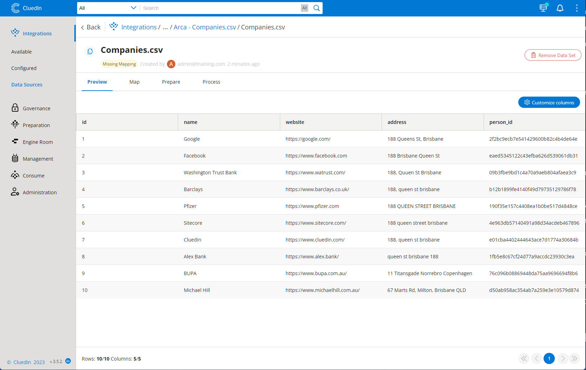
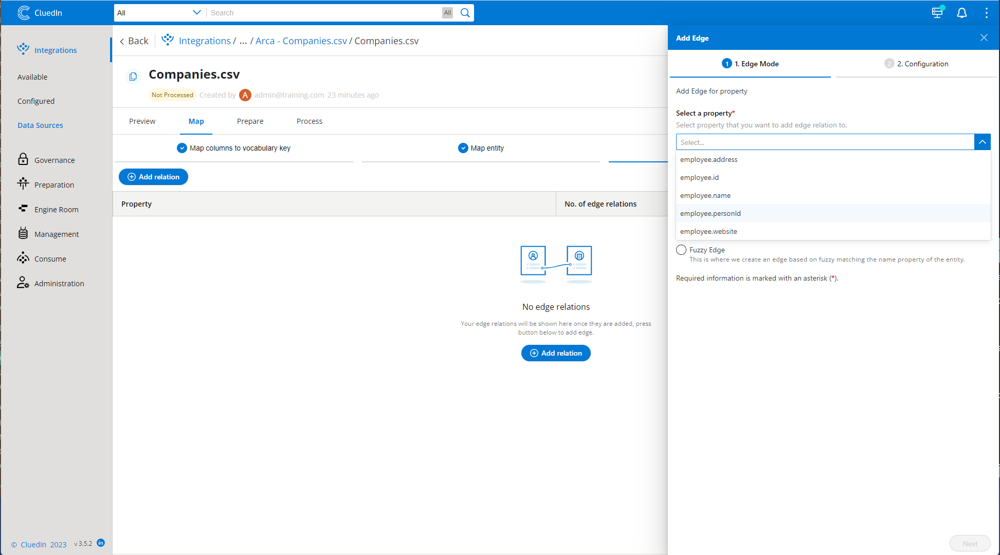

Now that the data has been automatically onboarded into CluedIn in a staging area, we have to now map the data from its current form, into our new desired state. For this, we will map the data in the CluedIn Studio. 

Interestingly, CluedIn does not mandate that we onboard this data in any specific order. Rather, we could randomly onboard the data in any order and CluedIn will always achieve the exact same result in the end. This will dramatically simplify the process as we don't need to do any upfront planning in order to provide referential integrity on the way into the CluedIn platform. 

In saying that, let's now onboard the data in the order within the datasources tab. 

1. Navigate through to the Arca folder, in which you will find an ingestion endpoint called Companies.csv. However it is worth mentioning that this is not a CSV file hosted in CluedIn but rather it is the raw data hosted in the staging area in CluedIn. 

    

    Selecting through to the ingestion point you will be met with a Preview of the 10 rows of data, including the companies that we originally had in our CSV file within the CluedIn.zip file. 

    CluedIn will be asking you to map the data, in which you will need to select the "Create Mapping" button. You will be prompted to choose either an Automated Mapping or a Manual Mapping. 

1. Choose "Automated Mapping".

    

1. On the next part of the wizard, you will be asked to choose 2 pieces, including an Entity Type and a Vocabulary. 

    An Entity Type in CluedIn can be thought of as the Domain of the data we are working with. This is typically some type of Noun such as a Person, Company, Vendor, Dog. 

    Because we are dealing with Companies in our scenario, type in "Company". You will find that the concept of an "Company" doesn't exist within CluedIn already, however this is expected to happen. CluedIn provides all of the Domains in the Microsoft Common Data Model by default and chances are that the domains you need to master won't always fall into the ones that exist. 

1. You will then to choose a Vocabulary. Think of this as the structure or "schema" of the Domain. Once again, as you start to type in "Company" here you will find that you can choose from a large array of existing structures. Let's not use the Vocabularies provided, but rather create a brand new one. 

    

    You will then see a preview of the strucutre that will be created, which is essentially a structure that contains all of the column names of the data in the file. The idea here is simple, in that instead of creating the Model of an Employee upfront before ingesting data, we will instead use the data to create our model and as we start to see more data on Employees, we will evolve and change the model as we need to. Although this might feel a bit "foreign", you will soon find that this approach yields an automated way for us to integrate the data - but it also gets us into the momentum of being able to deal and work with changes in model and making it almost seemless to adapt to changes in data. 

1. Select "Create Mapping" to accept the default names. 

    If you chose "Automated Mapping" as suggested above, CluedIn will provide some automated "smarts" including the automated detection of what could be unique identifiers of the data. 

1. Let's investigate what CluedIn just did in the mapping, but selecting "Edit Mapping" on the lineage view. 

    On the first screen, we can see that CluedIn has mapped the incoming data into a new column or attribute name that includes the name of the domain in it. If this name is currently not something that we would like to keep, you can always select the dropdown of any of the fields and add a new mapping to a name that you would prefer. For some, let's keep the names as they are. Select the "Next" button and you will be taken to the Entity Mapping in which we see how CluedIn will interpret some of the data in its core properties. Notice that the Name of the Entity in CluedIn has automatched to use the Company Name and also notice under the Origin Code Accordian that CluedIn has chosen the Id column as the Origin Code (Primary Key) and it has also chosen that both the Id and the Email most likley can be used as ways to uniquely refer to or lookup each of the employees in this list. It has detected this correctly, but you may find that sometimes we need to change this if the system has not detected this properly. 

    

1. Select "Next" to go to the next section which is called "Edges".

    In this section we will specify if there are columns here that are referring to records that are not Companies, but rather are some type of relationship to another record. This could easily be a relationship to a Domain of the same type (Company) or in this case it seems to be referring to a Person (from the column name person_id). In saying this, we know already that although it is a person, we could also say that it is referring to an "Employee". The good part about CluedIn's mapping process, is that we can go with one type now and we can always come back and change this at a later point once we know more about our data and Cluedin will handle all the cleanup necessary. With this in mind, mapping just because even more easy as we don't even need to get the mapping correct at this point. 

    

    With this mapping in place, you will notice that your "Process" tab now becomes enabled as well as the Process button on this tab due to the fact that we have now mapped the CluedIn data to the point where it has all of its requirements fulfilled. 

1. Select the "Process" button to which you will see these 10 rows of data are submitted to the platform. 

    

    >[!NOTE]
    > For the next part of the learning module, you will need to repeat the process above with the other 6 files with their respective Domains, Vocabularies, Identifiers and more. 

1. Repeat the process above for the files in Experience, Salesforce, Navision and all folders until all data is processed in the platform.