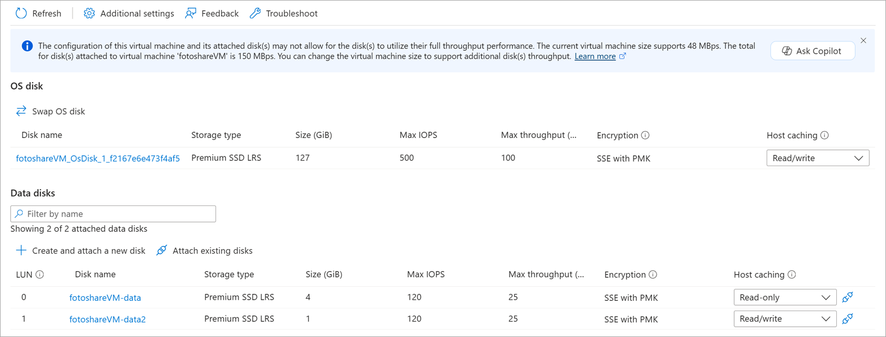

In the previous exercise, we performed the following tasks using the Azure portal:

- View the OS disk cache status.
- Change the cache settings of the OS disk.
- Add a data disk to the VM.
- Change the caching type on a new data disk.

Let's practice these operations using Azure PowerShell.

> [!NOTE]
> We're going to use Azure PowerShell, but you could also use the Azure CLI, which provides similar functionality as a console-based tool. It runs on macOS, Linux, and Windows. If you're interested in learning more about the Azure CLI, check out the **Manage Virtual Machines with the Azure CLI** module.

We're going to use the VM we created in the previous exercise. The operations in this lab assume:

- Our VM exists and is called **fotoshareVM**.
- Our VM lives in a resource group called **<rgn>[sandbox resource group name]</rgn>**.

If you used a different set of names, replace these values with yours.

Here's the current state of our VM disks from the last exercise:


We used the portal to set the **Host caching** field for both the OS and data disks. Keep this initial state in mind as we work through the following steps.

### Set up some variables

First, let's store some resource names so we can use them later.

In Azure Cloud Shell on the right, run the following PowerShell commands:
> [!NOTE]
> Switch your Cloud Shell session to **PowerShell** before trying these commands, if it isn't already.

```powershell
$myRgName = "<rgn>[sandbox resource group name]</rgn>"
$myVMName = "fotoshareVM"
```

> [!TIP]
> You have to set these variables again if your Cloud Shell session times out, so if possible, work through this entire lab in a single session.

### Get info about our VM

1. Run the following command to get the properties of the VM:

    ```powershell
    $myVM = Get-AzVM -ResourceGroupName $myRgName -VMName $myVmName
    ```

1. Let's store the response in our `$myVM` variable. We can pipe the output into the `select-object` cmdlet to filter the display to specific properties:

    ```powershell
    $myVM | select-object -property ResourceGroupName, Name, Type, Location
    ```

    You should get something like the following output:

    ```powershell
    ResourceGroupName Name        Type                              Location
    ----------------- ----        ----                              --------
    <rgn>[sandbox resource group name]</rgn> fotoshareVM Microsoft.Compute/virtualMachines eastus
    ```

### View OS disk cache status

We can check the caching setting through the `StorageProfile` object by running the following command:

```powershell
$myVM.StorageProfile.OsDisk.Caching
```

```output
ReadOnly
```

Let's change it back to the default for an OS disk, which is *ReadWrite*.

### Change the cache settings of the OS disk

1. We can set the value for the cache type using the same `StorageProfile` object by running the following command:

    ```powershell
    $myVM.StorageProfile.OsDisk.Caching = "ReadWrite"
    ```

    This command runs fast, which should tell you it's doing something locally. The command only changes the property on the `myVM` object. If you refresh the `$myVM` variable by reassigning it using the `Get-AzVM` cmdlet, the caching value doesn't change on the VM.

1. To make the change on the VM itself, call `Update-AzVM` by running the following command:

    ```powershell
    Update-AzVM -ResourceGroupName $myRGName -VM $myVM
    ```

    Notice that this call takes a while to complete because we're updating the actual VM, and Azure restarts the VM  to make the change.

    ```output
    RequestId IsSuccessStatusCode StatusCode ReasonPhrase
    --------- ------------------- ---------- ------------
                             True         OK OK
    ```

1. If you refresh the `$myVM` variable again by running the following command, you see the change on the object. If you look at the disk in the portal, you also see the change there.

    ```powershell
    $myVM = Get-AzVM -ResourceGroupName $myRgName -VMName $myVmName
    $myVM.StorageProfile.OsDisk.Caching
    ```

    ```output
    ReadWrite
    ```

### List data disk info

To see what data disks we have on our VM, run the following command:

```powershell
$myVM.StorageProfile.DataDisks
```

```output
Name            : fotoshareVM-data
DiskSizeGB      : 4
Lun             : 0
Caching         : ReadOnly
CreateOption    : Attach
SourceImage     :
VirtualHardDisk :
```

We have only one data disk at the moment. The `Lun` field is important. It's the unique **L**ogical **U**nit **N**umber. When we add another data disk, we give it a unique `Lun` value.

### Add a new data disk to our VM

1. For convenience, let's store our new disk name by running the following command:

    ```powershell
    $newDiskName = "fotoshareVM-data2"
    ```

1. Run the following `Add-AzVMDataDisk` command to define a new empty 1-GB data disk:

    ```powershell
    Add-AzVMDataDisk -VM $myVM -Name $newDiskName  -LUN 1  -DiskSizeinGB 1 -CreateOption Empty
    ```

    You get a response like:

    ```powershell
    ResourceGroupName  : xxxxxxxx-xxxx-xxxx-xxxx-xxxxxxxx
    Id                 : /subscriptions/xxxxxxxx-xxxx-xxxx-xxx-xxxxxxx/resourceGroups/<rgn>[sandbox resource group name]</rgn>/providers/Microsoft.Compute/virtualMachines/fotoshareVM
    VmId               : xxxxxxxx-xxxx-xxxx-xxxx-xxxxxxxxxxx
    Name               : fotoshareVM
    Type               : Microsoft.Compute/virtualMachines
    Location           : eastus
    Tags               : {}
    DiagnosticsProfile : {BootDiagnostics}
    HardwareProfile    : {VmSize}
    NetworkProfile     : {NetworkInterfaces}
    OSProfile          : {ComputerName, AdminUsername, WindowsConfiguration, Secrets}
    ProvisioningState  : Succeeded
    StorageProfile     : {ImageReference, OsDisk, DataDisks}
    ```

1. We gave this disk a `Lun` value of `1` because it isn't taken. We defined the disk we want to create, so it's time to run the `Update-AzVM` command to make the actual change:

    ```powershell
    Update-AzVM -ResourceGroupName $myRGName -VM $myVM
    ```

1. Let's look at our data disk info again by running the following command:

    ```powershell
    $myVM.StorageProfile.DataDisks
    ```

    ```output
    Name            : fotoshareVM-data
    DiskSizeGB      : 4
    Lun             : 0
    Caching         : ReadOnly
    CreateOption    : Attach
    SourceImage     :
    VirtualHardDisk :
    
    Name            : fotoshareVM-data2
    DiskSizeGB      : 1
    Lun             : 1
    Caching         : None
    CreateOption    : Empty
    SourceImage     :
    VirtualHardDisk :
    ```

We now have two disks. Our new disk has a `Lun` of `1` and the default value for `Caching` is `None`. Let's change that value.

### Change cache settings of new data disk

1. We can modify the properties of a virtual machine data disk by running the `Set-AzVMDataDisk` command, as follows:

    ```powershell
    Set-AzVMDataDisk -VM $myVM -Lun "1" -Caching ReadWrite
    ```

1. As always, commit the changes by running the `Update-AzVM` command:

    ```powershell
    Update-AzVM -ResourceGroupName $myRGName -VM $myVM
    ```

Here's a view from the portal of what we accomplished in this exercise. Our VM now has two data disks, and we adjusted all **Host caching** settings. We did all of that with just a few commands using the power of Azure PowerShell.


