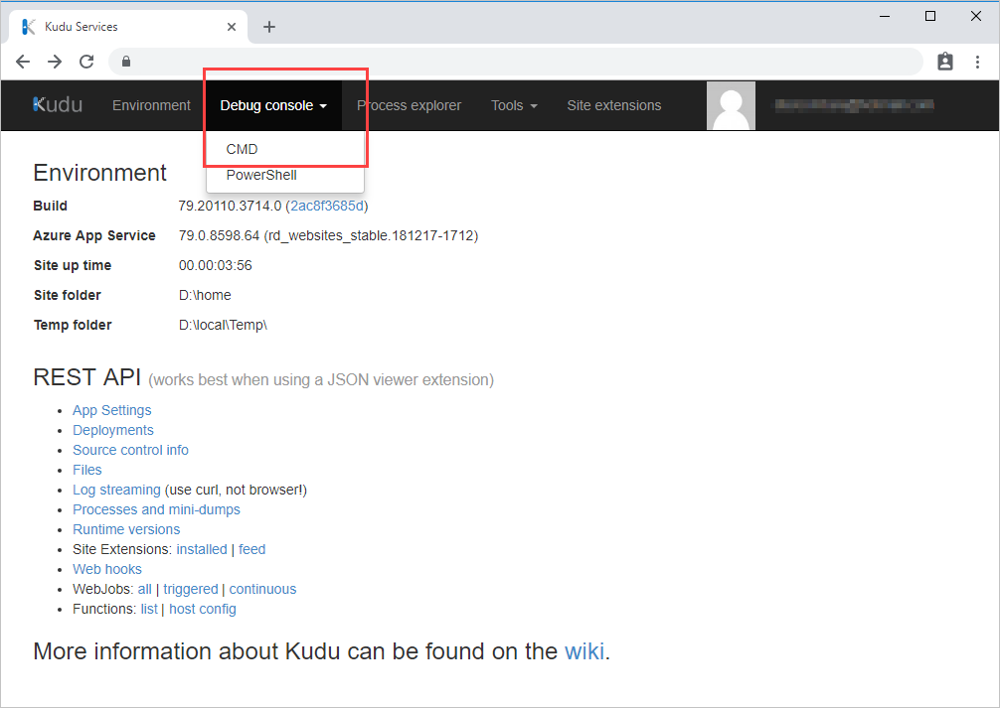
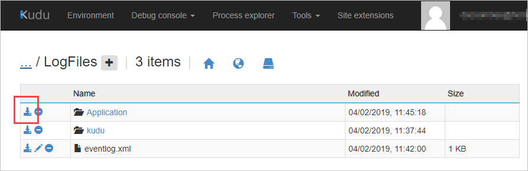
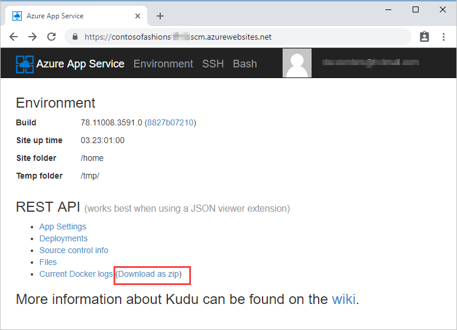
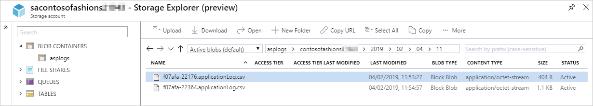

Log files are a great resource for a Web developer, but only if you know how to find and use the logged information. Here, we will look at the methods you can use to retrieve logged information, ready for offline analysis. 

## Log file storage locations 
The Azure infrastructure used to run Windows Web apps is not the same as that for Linux apps, and log files are not stored in the same locations.

### Windows app log files

For Windows apps, file system log files are stored in a virtual drive that is associated with your Web app. This drive is addressable as **D:\Home**, and includes a **LogFiles** folder; within this folder are one or more subfolders:

- **Application** - contains application-generated messages, if **File System** application logging has been enabled.
- **DetailedErrors** - contains detailed Web server error logs, if **Detailed error messages have been enabled.
- **http** - contains IIS-level logs, if **Web server logging** has been enabled.
- **W3SVC\<_number_\>** - contains details of all failed http requests, if **Failed request tracing** has been enabled.

Where storage to a Blob container has been enabled, logs are stored in year, month, date, and hour folders; for example:

```
2019
 01
  10
   08 - log entries for the period 08:00:00 to 08:59:59 on January 10th 2019
   09 - log entries for the period 09:00:00 to 09:59:59 on January 10th 2019
```

Within the hour folder, there will be one or more CSV files containing messages saved within that 60-minute period.

### Linux app log files

For Linux Web apps, the Azure tools currently support fewer logging options than for Windows apps. Redirections to STDERR and STDOUT are managed through the underlying Docker container that runs the app, and these messages are stored in Docker log files. To see messages logged by underlying processes, such as Apache, you will need to open an SSH connection to the Docker container.

## Methods for retrieving log files
How you retrieve log files depends on the type of log file, as well as your preferred environment. For file system logs, you can use the Azure CLI or the Kudu console.

### Azure CLI
To download file system log files using the Azure CLI, first use the following command to copy the log files from the app's file system to your Azure Cloud Shell storage.
   ```azurecli
   az webapp log download --log-file \<_filename_\>.zip  --resource-group \<_resource group name_\> --name \<_app name_\>
   ```
You can then use the file download and upload tool on the Azure Cloud Shell toolbar to download the zipped log files to your local computer, ready for opening in Microsoft Excel, or other applications. 

> [!NOTE]
> The Azure CLI download includes all app logs, except for failed request traces.

### Kudu
All Azure Web apps have an associated Source Control Management (SCM) service site. This site runs the **Kudu** service, and other Site Extensions; it is Kudu that manages deployment and troubleshooting for Azure Web Apps, including options for viewing and downloading log files. The specific functionality available in KUDU, and how you download logs, depends on the type of Web app. For Windows apps you can browse to the log file location, and then download the logs; for Linux apps, there may be a download link.

One way to access the KUDU console, is gone to **https://\<_app name_\>.scm.azurewebsites.net**, and then sign in using _**deployment credentials**_.  

You can also access KUDU from the Azure portal. On the app blade, in the **Development Tools** section, click **Advanced Tools**, and then on the Advanced Tools blade, click **Go** to open a new Kudu Services tab.

To download the log files from Windows apps:

1. Click **Debug Console**, and then click **CMD**.
     
1. Then, in the file explorer section, click **LogFiles**, and then click the **Download** button for the **Application** folder; the logs will be downloaded to your computer as **Application.zip**.

   


For Linux apps, click the download link on the Environment page.

  


### Azure Storage Explorer
To access Windows logs saved to an Azure Blob Storage container, you can use the Azure portal, and **Storage Explorer** to view and download the contents of the log file container. Open the relevant year, month, date, and hour folder, then double-click a CSV file to download it to your computer. 





If you have Microsoft Excel on your computer, the log file will automatically open as a worksheet; otherwise, you can open the file using a text editor such as Notepad.

