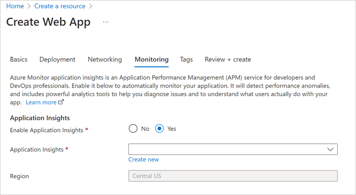

You can enable runtime instrumentation, the type of Application Insights instrumentation that doesn't require you to change your app's code, when the app is first created or at any time afterwards.

Developers at your company want to start gathering instrumentation data about the video application quickly, without having to modify it.

In this unit, you'll learn what Application Insights can do, and how to enable it.

## What is Application Insights?

Application Insights is an Azure service that helps you to monitor the performance and behavior of web applications.

<!-- TODO move the bit about runtime/sdk/client here -->

It mostly captures two kinds of data: *events* and *metrics*. Events are individual data points that can represent any kind of event that occurs in an app. These events can be technical events that occur within the application runtime or those that are related to the business domain of the application or actions taken by users. Metrics are measurements of values, typically taken at regular intervals, that aren't tied to specific events. Like events, metrics can be related to the application's runtime or infrastructure (like the length of a queue) or related to the application's business domain or users (like how many videos are viewed in an hour).

### Application Insights resources

Application Insights is represented in Azure as a resource deployed to one of your subscriptions. Each Application Insights resource you create is a repository for application telemetry data. It includes the various displays and configuration tools that you can view from the Azure portal. To send telemetry data to an Application Insights resource from an app, you need to configure the app with the *instrumentation key* of the Application Insights resource. After the resource starts to receive telemetry data, you can use the Azure portal to explore and analyze it.

### Visualizations

By viewing an Application Insights resource in the Azure portal, you can visualize the telemetry captured from your app in a variety of ways.

- **Live metrics streams**: Charts that display performance values as they vary in near-real time.
- **Metrics explorer**: Tool that shows how metrics vary over time.
- **Alerts:** Messages automatically sent to app admins when target metrics exceed specified thresholds. You can use alerts to ensure your team is aware of critical issues immediately.
- **Profiler**: Shows how a set of requests, like those for a single web page, were delivered. You can use these profiles, for example, to see which page elements load slowly.
- **Application Map**: Displays the components of an application and how they link to each other. You can use the data shown with each component to diagnose performance bottlenecks and failure hotspots.
- **Usage analysis**: Information about your app's users. For example, you can see numbers of unique users and sessions and information about user retention.

These tools are all available in the Azure portal and in Visual Studio. You can also view Application Insights data in Power BI, which you might already be using for business intelligence.

### Runtime instrumentation and build-time instrumentation

There are two ways to configure your app to send data to Application Insights:

- **Runtime instrumentation**: Runtime instrumentation captures telemetry without requiring you to change the web app's source code. You can quickly enable this turnkey solution from the Azure portal when you first create your web app or anytime afterwards. Use this method when you want to set up Application Insights without involving developers or when code management policies prevent you from changing the app's source code. Note that some advanced data displays aren't available when you use only runtime instrumentation.

- **Build-time instrumentation**: With this method, developers add a server-side SDK to the web app's code. For example, in an ASP.NET Core app, a developer could reference a NuGet package to access the SDK. When you instrument your app with the Application Insights SDK, you can enable full functionality and the richest set of visualizations in Application Insights. This type of instrumentation also enables you to add custom events and telemetry to your code to monitor unusual or unique behavior.

You can enable *client-side instrumentation* for an app by including a standard Application Insights JavaScript library in pages delivered to your app's users. Client-side instrumentation captures information about the user experience of the app, including page load times, details of browser exceptions, and performance data about AJAX calls. You can configure Azure App Service web apps to automatically inject the client SDK and capture many client-side metrics. Developers can add JavaScript code to capture data about specific events. Client-side instrumentation enables displays like usage analysis.

In this module, you'll enable runtime instrumentation and client-side instrumentation to begin quickly gathering telemetry about your app without needing to change it.

### Web app requirements

Runtime instrumentation and automatic client-side instrumentation is supported only on Windows web apps. These features rely on capabilities of IIS, the web server technology that powers Windows apps on App Service. The use of Application Insights in Linux apps is fully supported, but you need to modify application code to reference the Application Insights SDK.

Any Windows App Service web app can benefit from the runtime instrumentation techniques described in this module. But web apps created with the ASP.NET or ASP.NET Core frameworks have the best integration with Application Insights. They automatically record framework-specific data, like stack traces and dependency information, in Application Insights.

## Enable runtime instrumentation

You can enable runtime instrumentation for a Windows App Service web app when you create the app or at a later time.

- To enable it when you create the web app, on the web app **Create** pane, select the **Monitoring** tab, and then select **Yes** next to **Enable Application Insights**. This pane will also give you the opportunity to create a new Application Insights resource.

    

- If you choose to create a web app without enabling Application Insights, you can enable it later on the **Application Insights** page of the web app's pane.

Both options open a wizard that will help you create a new Application Insights resource if you don't already have one in your subscription.

## Enable automatic client-side telemetry

To automatically inject the JavaScript SDK and necessary configuration into pages served by your web app, add a new application setting named **APPINSIGHTS_JAVASCRIPT_ENABLED**, and set the value to **true**. <!-- TODO note about windows-only here as well -->