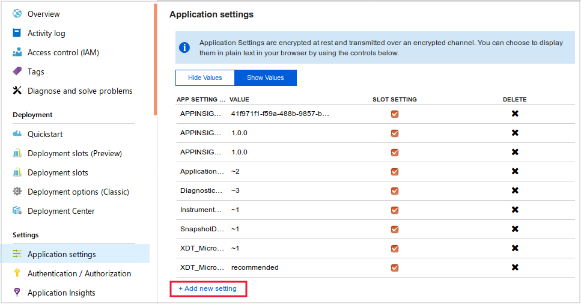

You can enable Application Insights runtime instrumentation when you create an App Service web application or at any time afterwards.

To start gathering information as soon as possible, the developers of the video-sharing app want to enable Application Insights runtime instrumentation.

In this unit, we'll use the Azure portal to enable runtime instrumentation on a web app. We'll create the app without enabling Application Insights and view the limited performance that's collected by default. We'll then enable Application Insights and see the rich analysis that becomes available.

[!include]

## Create an Azure web app

We'll start by creating a web app to monitor. Follow these steps:

1. Sign in to the [Azure portal](https://portal.azure.com/?azure-portal=true).
1. On the Azure portal menu or from the **Home** page, select **Create a resource**.
1. In the **Search the Marketplace** box, enter **Web App**, and then select **Enter**.
1. In the list of results, select **Web App**.
1. On the **Web App** pane, select **Create**.

## Configure the web app

You will need to set up a name, a resource group, a location, and some other properties for your web app. Follow these steps:

1. In the **Subscription** list, select the Azure subscription you'd like to use for this exercise.
1. Under **Resource Group**, select **Create new** and name the new resource group **mslearn-appinsights**.
1. In the **App name** box, enter a unique name for your app. For example, you could use **\<yourname\>;svideoapp**. The name you choose must be unique within the .azurewebsites.net domain.
1. Leave **Publish** at **Code**.
1. Set the **Runtime stack** to **.NET Core 2.1**. This will move the **Operating System** to **Windows**. Leave it at Windows. Notice that when you did this selection, the **Monitoring** tab appeared. We will skip this tab for now.
    > [!NOTE]
    > In this module, you'll enable Application Insights as a separate step, after the web app is created. If you were to enable it here, the end result would be the same.
1. Select your **Region**.
1. Leave the default values for **App Service plan/Location**
1. At the bottom of the pane, select **Review and create**.
1. Review the configuration and select **Create**.
1. When the web app is created, in the Azure portal, search for and select the web app you just created.
1. Scroll down on the **Overview** page. Notice that, even without Application Insights, some statistics appear, like the frequency of 500 errors and the rate of requests.

## Enable Application Insights for the Web App

The limited set of statistics provided in the Azure portal isn't enough to help you diagnose the cause of slow performance in the video app. You want to enable Application Insights to obtain more detailed performance data.

To enable Application Insights on an app, follow these steps:

1. If the Web App's pane isn't already visible, in the Azure portal, search for and select the web app you created earlier in this unit.
1. Under **Settings** on the left, select **Application Insights**.

    

1. On the **Application Insights** page, make sure **Enable** is selected.
1. Under **Change your resource**, in the **Create new resource** box, enter **videoappinsights**.
1. In the **Location** list, select a location, and then select **Apply**. If the **Apply monitoring settings** box appears, select **Yes**.
1. After the changes are applied, in the Azure portal, select **Application Insights** from the left menu and click on **videoappinsights** (blue text).
1. In the **Application Insights** pane, select **Application Dashboard**. Note the charts shown by default in the dashboard. If the charts don't appear within a few seconds, select F5 to refresh the page.

## Inject the Application Insights JavaScript SDK into the web app

Because you can inject the Application Insights JavaScript SDK into the video web app without involving developers, and because this will generate more data for performance analysis, you want to enable client-side monitoring. To do this, follow these steps:

1. If the web app's pane isn't already visible, in the Azure portal, search for and select the App Service you created earlier.
1. Under **Settings** on the left, select **Configuration**. You will be on the **Application Settings** tab.
1. On the **Application Settings** page select **+ New application setting**.

    

1. In the **Enter a name** box, enter **APPINSIGHTS_JAVASCRIPT_ENABLED**.
1. In the **Enter a value** box, enter **true**.
1. At the bottom of the **Application Settings** page, select **OK** and at the top of the **App Services** page select **Save**.
1. In the top-left corner of the **App Service** pane, select **Overview**, select **Restart**, and then select **Yes**.
