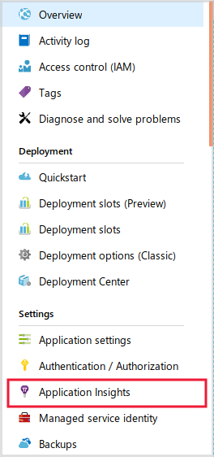

Application Insights runtime instrumentation can be enabled when you create an App Service web application, or at any time afterwards.

To start gathering instrumentation as quickly as possible, the developers of the video-sharing app want to enable Application Insights runtime instrumentation.

Here, you'll enable runtime instrumentation in the Azure portal on a web app. We'll create the app without enabling Application Insights and view the limited performance collected by default. Then, we'll enable Application Insights and see the rich analyses that become available.

[!include]

## Create an Azure Web App

You must begin by creating a web app to monitor. Follow these steps:

1. Go to the [Azure portal](https://portal.azure.com/learn.docs.microsoft.com?azure-portal=true).
1. In the navigation on the left, click **Create a resource**.
1. In the **Search the Marketplace** textbox, type **web app** and then press Enter.
1. In the list of results, click **Web App**.
1. In the **Web App** blade, click **Create**.

## Configure your Web App

Your web app needs a name, a resource group, a location, and some other properties configured. Follow these steps:

1. In the **App name** textbox, type a unique name for your app. For example, you could use **&lt;yourname&gt;svideoapp**. The name you choose must be unique within the **.azurewebsites.net** domain.
1. In the **Subscription** drop-down list, select the **Concierge subscription**.
1. Under **Resource Group**, select **Use existing** and then select the sandbox resource group, <rgn>[Sandbox resource group]</rgn>.
1. Leave the **OS**, **Publish**, **App Service plan/Location** and **Application Insights** options at their defaults.
    > [!NOTE]
    > In this module, you will enable Applications Insights as a separate step, after the web app has been created. If you were to enable it here, the end result would be the same.
1. At the bottom of the blade, click **Create**.
1. When the web app has been created, in the navigation on the left, click **All resources**.
1. In the list of resources, click the web app you just created.
1. Scroll down in the **Overview** page. Notice that, even without Application Insights, some statistics, such as the frequency of 500 errors and the rate of requests, are displayed.

## Enable Application Insights for the Web App

To diagnose the cause of slow performance in the video app, the limited set of statistics provided in the Azure Portal has not been sufficient. You want to enable Application Insights in order to obtain more detailed performance data.

To enable Application Insights on an app, follow these steps:

1. If the web app's blade is not already displayed, then in the navigation on the left, click **All resources** and then click the web app you created above.
1. Under **Settings** on the left, click **Application Insights**.

    

1. On the **Application Insights** page, click **Turn on site extension**.
1. Under **Create a new resource**, in the **New resource name** textbox, type **videoappinsights**.
1. In the **Location** drop-down list, select a location, and then click **Apply**. If the **Apply monitoring settings** box appears, click **Yes**.
    [!include]
1. When the changes have been applied, in the navigation on the left, click **All resources** and then, in the list of resources, click **videoappinsights**. 
1. In the **Application Insights** blade, click **Application Dashboard**. Note the range of charts shown by default in the dashboard. If the charts do not appear within a few seconds, press F5 to refresh the page.

## Inject the Application Insights JavaScript SDK into the Web App

Since you can inject Application Insights JavaScript SDK into the web app without involving developers, and since this will generate more data for performance analysis, you want to enable client-side monitoring. To do this, follow these steps:

1. If the web app's blade is not already displayed, then in the navigation on the left, click **All resources** and then click the web app you created above.
1. Under **Settings** on the left, click **Application Settings**
1. In the **Application Settings** page, scroll down to the **Application settings** section, click **Show values**, and then click **+ Add new setting**.    
    

1. In the **Enter a name** textbox, type **APPINSIGHTS_JAVASCRIPT_ENABLED**.
1. In the **Enter a value** textbox, type **true**.
1. At the top of the **Application Settings** page, click **Save**.
1. At the top left of the **App Service** blade, click **Overview**, click **Restart** and then click **Yes**.
