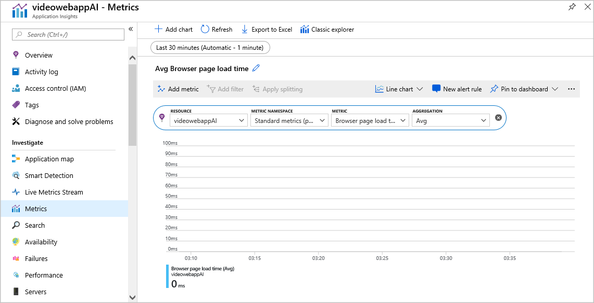

The Azure portal provides many types of visualizations for viewing web app data captured by Application Insights.

You need to analyze the data captured about the video-sharing app so you can determine the cause of poor performance.

In this unit, you'll learn how to navigate the data in the Application Insights resource and dashboards. You'll also learn how to drill into a specific aspect of the web app's behavior by creating a custom chart.

## Tools for data visualization

Now that you've enabled an Application Insights resource to gather metrics from the web app, you can view and analyze that data to diagnose issues if they arise. There are several tools you can use to display that data:

- **The Azure portal.** You can find a variety of tools by going to the Application Insights resource in the portal. These tools include a set of common performance charts on the **Overview** page, an **Application map**, and **Performance** and **Failures** pages. There's also an Application Insights dashboard that contains a common set of charts. You can use the **Metrics** page to design new charts and add them to dashboards.
- **Power BI.** This tool is often used by business analysts to investigate business values like sales and profit margins. You can connect Power BI to an Application Insights resource and use it to display web app telemetry data.
- **Visual Studio.** Developers can connect Visual Studio to Application Insights to view the same charts and visualizations that are shown in the Azure portal. It's convenient to see code and performance data in one tool.
- **Custom tools.** Application Insights includes a comprehensive API for accessing telemetry and analytics. Custom tools and applications can use the API to power their own visualizations. For example, if you have a custom mobile app that your business decision makers use to view sales data, you can add a visualization of web site performance statistics to the app.

In this module, we'll view data in the Azure portal.

## Custom charts

There are many useful charts and diagrams in an Application Insights resource and in the dashboard, but sometimes you'll need to create a custom chart. On the Application Insights resource blade, you can create your own chart on the **Metrics** page. For example, you can:

- Specify a time period for the chart. This could be the last 30 minutes or the last 30 days, or somewhere in between. You can also specify a start and end time for the period that interests you.
- Specify the type of chart. You can choose line, area, bar, or scatter.
- Specify a metric to display. This metric will be shown on the vertical axis.
- Specify an aggregation method. This option specifies whether the chart will show the average, minimum, maximum, sum, or count for the chosen metric at each plotted point.
- Specify a filter. Data that doesn't satisfy the filter won't be displayed. Use filters when you need to focus on a specific data set.

   

After you create the chart you need, you can pin it to an Application Insights dashboard to save it and then publish the dashboard to share it with other users and stakeholders.

## Go to the Application Insights resource and dashboard

The Application Insights resource is separate from the App Service resource that contains the instrumented web app. In the Azure portal, you can see both resources on the **All resources** blade and select them to see their details or make configuration changes.

When you enable runtime instrumentation in a web app, a link appears in the Azure portal that takes you from the web app resource to the Application Insights resource that receives the data. From the web app, you can go to the **Application Insights** page and select **View Application Insights data** to go to the Application Insights resource and make configuration changes. From there, select **Application Dashboard** on the **Overview** page to see the dashboard for that resource.

Another way to view the Application Insights dashboard is to select **Dashboard** in the main left navigation pane in the Azure portal. If more than one dashboard is stored for your user account, you might need to switch to the Application Insights dashboard you want by selecting it in the drop-down list in the upper-left corner:

